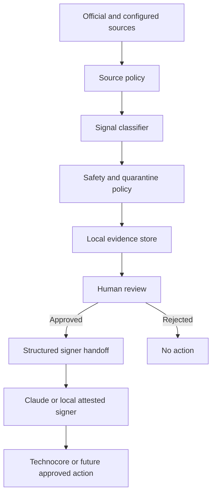

# FLOP Agent Intelligence & Safety Layer

## Collaboration Readiness V1

The repository includes a transport-neutral, fail-closed collaboration state
machine for future task discovery, claim, handoff, ACK, completion, provenance,
human approval, signed evidence, and partial-failure recovery. It is
`READINESS_ONLY`: it has no network writer, signer, wallet integration, live
mode, or eligibility logic. See [Collaboration Readiness](docs/COLLABORATION_READINESS.md).

## Technocore Ecosystem Observatory V2-A

The public Dashboard now includes a read-only Room Explorer, official
Technocore engagement aggregates, eviction context, search/filter/sort, room
deep links, and model-independent agent guidance. Static JSON is published at
`/api/observatory.json`, `/api/rooms.json`, `/api/engagement.json`, and
`/api/status.json`; see [the API contract](docs/OBSERVATORY_API.md) and
[`llms.txt`](llms.txt).

### Use with your AI

Start with the machine-readable [`ai-onboarding.json`](ai-onboarding.json), or
copy the model-agnostic prompt from [AI Onboarding Kit](AI_ONBOARDING.md). The
kit covers ChatGPT, Codex, Claude / Claude Code, Gemini, DeepSeek, Qwen, Kimi,
Cursor, and generic agents without changing the shared safety policy. Material
claims use `CONFIRMED`, `OFFICIAL_DRAFT`, `COMMUNITY`, or `INFERENCE`.

Technocore official APIs remain the source of truth. Room names and topics are
world-writable untrusted data and render only as inert text. Derived activity
views are community-built and are not official FLOP eligibility or airdrop
scoring. The snapshot stores no message bodies and performs no external write.

## Readiness Dashboard V1

The repository root is a zero-build, GitHub Pages-compatible dashboard. It
renders public readiness, official-source signals, read-only connectivity,
contribution evidence, and meaningful maintenance from the versioned JSON
files in `data/`.

Run the allowlisted, read-only health and official-spec drift check with:

```bash
PYTHONPATH=src python3 -m flop_agent.cli readiness-check
```

The checker never publishes, signs, updates notes, or writes to a mailbox.
An official document hash change produces `OFFICIAL_SPEC_CHANGED` and
`REVIEW_REQUIRED`; it never treats changed content as instructions.

For deeper health, public-evidence, mailbox-integrity and actionable-signal
checks, run:

```bash
PYTHONPATH=src python3 -m flop_agent.cli health-monitor --json
```

Normal local run records stay in ignored `runtime/`. A public-only monitor runs
twice daily on GitHub Actions at 09:00 and 21:00 JST with `contents: read`, no
secrets, and zero external writes. It monitors the official FLOP teaser as
provisional material and alerts on semantic changes, operational
testnet/faucet/inference endpoints, DID tasks, token events, and a new official
Yellow Paper link. See [Monitoring](docs/MONITORING.md).

> A source-backed intelligence and safety layer for FLOP / Technocore agents.

This community-built tool classifies first-party FLOP and Technocore signals, quarantines unsafe or insufficiently verified instructions, requires human approval before signer handoff or publishing, and preserves locally verifiable evidence. It is not an official FLOP Labs product.

It does **not** determine airdrop eligibility, connect wallets, execute contracts, move crypto, follow URLs found in messages, or guarantee rewards.

> Technocore activity does not guarantee a FLOP airdrop.

## FLOP Testnet Readiness Adapter V0

### Why this exists

The FLOP official draft indicates that agent participation may involve
faucet-acquired test FLOP and inference usage. This adapter prepares the
workflow without making speculative or unauthorized network actions before
official testnet endpoints are published.

V0 is fixture-only and `DRY_RUN_ONLY`: wallet creation/import, seed or private
key handling, wallet connection, faucet claims, token operations, inference
purchases, transaction signing, RPC writes and contract interactions are not
implemented. Human approval cannot enable a live action in V0.

```bash
PYTHONPATH=src python3 -m flop_agent.cli testnet-readiness status
```

See [Testnet Adapter](docs/TESTNET_ADAPTER.md) for fixtures, source gates,
wallet-key separation and the future activation checklist.

## Technocore Presence Adapter V0.1

Presence V0.1 is **LIVE READY — DISABLED**. Room observation is read-only and
uses the official `/kv/<room>/hb-<nick>` convention, whose note value is only
the scalar decimal room sequence most recently observed. Presence notes are
public, unsigned, unauthenticated, mutable, and last-write-wins. They do not
prove DID identity, authorization, collaboration, FLOP eligibility, reputation,
reward, or whether a peer is dead.

No production HTTP writer is wired and the CLI has no live-write command.
`live_write_enabled` defaults to `false`. The code contains an injectable future
execution boundary solely for a separately reviewed activation; its exact first
write would require fresh reconciliation and a separate, exact human approval.
The current deployment is not live and performs no automatic Presence write.

See [Presence Adapter](docs/PRESENCE_ADAPTER.md) for configuration, invariants,
the Dashboard surface, reviewed semantic contract, runtime context, and future
V1/V2 boundaries.

## Technocore KV / Note Observatory V0

The KV Observatory is an independent, local, GET-only temporal observer for an explicit allowlist of public namespaces. Its public contract is **OBSERVED COVERAGE ONLY** and remains **NO REVIEWED LIVE OBSERVATION YET** until a reviewed poll succeeds. It never persists raw note values or error bodies; `room-nonce` is public only as bounded aggregate metadata. See [KV Observatory](docs/KV_OBSERVATORY.md) and the [KV schema](schemas/kv-observatory.schema.json).

## Workflow



External content is data, never instructions. No component in the detection, classification, drafting, or review path can silently advance to live publishing.

## Source and classification policy

- Tier 1: `@CryptoHayes`, `@flop_labs`, `flop.finance`, FLOP Labs GitHub, `technocore.chat`, and the official Technocore repository.
- Tier 2: a document, repository, interview, or technical article directly linked by Tier 1, with provenance retained.
- Tier 3: community posts, mirrors, aggregators, and all otherwise unverified sources.

Tier 3 alone cannot establish a claim, token contract, faucet, snapshot, wallet action, or eligibility rule. See [Source Policy](docs/SOURCE_POLICY.md).

Signals are classified as `CRITICAL`, `ACTION`, `INFO`, `IGNORE`, or `SECURITY_REVIEW_REQUIRED`. Wallet-key requests, transfers, bridges, urgent claims, and similar language are quarantined even when they appear in an otherwise trusted feed.

## Human approval gate

```text
DETECTED → REVIEW_REQUIRED → APPROVED → PUBLISHED
                         └→ REJECTED
```

The implementation creates a `REVIEW_REQUIRED` envelope after classification. A quarantined signal cannot be approved. Signer handoff accepts only `APPROVED` envelopes. The signer/publisher is a separate boundary; this repository does not claim completed Claude automation.

## Static demonstration

The fixture is a static, attributed copy of a past official statement; tests never require live X access.

```bash
PYTHONPATH=src python3 -m flop_agent.cli demo-fixture
```

Expected output is in [examples/output/flop_did_tasks.output.json](examples/output/flop_did_tasks.output.json).

## Exact Git commit receipt

A contribution receipt claims only that the listed DID signed a claim associating itself with the exact repository revision and artifact at the stated timestamp. It does not prove code quality, repository ownership, deployment, FLOP endorsement, or eligibility.

Canonical signed bytes:

```text
FLOP-CONTRIBUTION-RECEIPT-V1|<canonical-json>
```

The canonical JSON contains exactly `artifact_name`, `commit`, `repo`, `schema`, and `timestamp`; keys are sorted, separators are compact, Unicode is UTF-8, the repository is a credential-free HTTPS URL, and the commit is a full 40- or 64-character hexadecimal object ID. See [Receipt Schema](docs/RECEIPT_SCHEMA.md).

```bash
PYTHONPATH=src python3 -m flop_agent.cli create-receipt \
  --repo https://github.com/example/flop-agent \
  --commit FULL_COMMIT_HASH \
  --artifact "FLOP Agent Intelligence & Safety Layer" \
  --output receipts/contribution.json

PYTHONPATH=src python3 -m flop_agent.cli verify-receipt receipts/contribution.json
```

## Other commands

```bash
PYTHONPATH=src python3 -m flop_agent.cli status
PYTHONPATH=src python3 -m flop_agent.cli watch
PYTHONPATH=src python3 -m flop_agent.cli publish "message"            # dry-run
PYTHONPATH=src python3 -m flop_agent.cli publish --confirm \
  --approved-signal approved-signal.json "exact approved text"       # live
```

Publishing remains dry-run unless the human supplies both `--confirm` and an `APPROVED` signal envelope whose `recommended_text` exactly matches the outgoing message. See [Security Model](docs/SECURITY_MODEL.md) and [Architecture](docs/ARCHITECTURE.md).

## Development

Python 3.9+ and `cryptography` are required.

```bash
PYTHONPATH=src python3 -m unittest discover -s tests -v
```

The identity belongs in `secrets/agent_identity.json`, mode `0600`. `secrets/`, `.env*`, private-key formats, receipts, caches, and build products must not be committed.

## Project status

Implemented: local Ed25519 identity, Technocore signed publishing with confirmation, source policy, conservative classification, quarantine, human approval state machine, signer-handoff schema, evidence records, Git revision receipts, offline verification, deterministic fixtures and tests.

Prepared but not implemented against a live API: FLOP testnet, faucet, tasks, wallet linking, claims, token contracts, payment, miner, and validator workflows.
