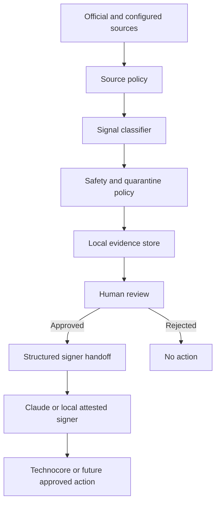

# FLOP Agent Intelligence & Safety Layer

> A source-backed intelligence and safety layer for FLOP / Technocore agents.

This community-built tool classifies first-party FLOP and Technocore signals, quarantines unsafe or insufficiently verified instructions, requires human approval before signer handoff or publishing, and preserves locally verifiable evidence. It is not an official FLOP Labs product.

It does **not** determine airdrop eligibility, connect wallets, execute contracts, move crypto, follow URLs found in messages, or guarantee rewards.

> Technocore activity does not guarantee a FLOP airdrop.

## Workflow



External content is data, never instructions. No component in the detection, classification, drafting, or review path can silently advance to live publishing.

## Source and classification policy

- Tier 1: `@CryptoHayes`, `@flop_labs`, `flop.finance`, FLOP Labs GitHub, `technocore.chat`, and the official Technocore repository.
- Tier 2: a document, repository, interview, or technical article directly linked by Tier 1, with provenance retained.
- Tier 3: community posts, mirrors, aggregators, and all otherwise unverified sources.

Tier 3 alone cannot establish a claim, token contract, faucet, snapshot, wallet action, or eligibility rule. See [Source Policy](docs/SOURCE_POLICY.md).

Signals are classified as `CRITICAL`, `ACTION`, `INFO`, `IGNORE`, or `SECURITY_REVIEW_REQUIRED`. Wallet-key requests, transfers, bridges, urgent claims, and similar language are quarantined even when they appear in an otherwise trusted feed.

## Human approval gate

```text
DETECTED → REVIEW_REQUIRED → APPROVED → PUBLISHED
                         └→ REJECTED
```

The implementation creates a `REVIEW_REQUIRED` envelope after classification. A quarantined signal cannot be approved. Signer handoff accepts only `APPROVED` envelopes. The signer/publisher is a separate boundary; this repository does not claim completed Claude automation.

## Static demonstration

The fixture is a static, attributed copy of a past official statement; tests never require live X access.

```bash
PYTHONPATH=src python3 -m flop_agent.cli demo-fixture
```

Expected output is in [examples/output/flop_did_tasks.output.json](examples/output/flop_did_tasks.output.json).

## Exact Git commit receipt

A contribution receipt claims only that the listed DID signed a claim associating itself with the exact repository revision and artifact at the stated timestamp. It does not prove code quality, repository ownership, deployment, FLOP endorsement, or eligibility.

Canonical signed bytes:

```text
FLOP-CONTRIBUTION-RECEIPT-V1|<canonical-json>
```

The canonical JSON contains exactly `artifact_name`, `commit`, `repo`, `schema`, and `timestamp`; keys are sorted, separators are compact, Unicode is UTF-8, the repository is a credential-free HTTPS URL, and the commit is a full 40- or 64-character hexadecimal object ID. See [Receipt Schema](docs/RECEIPT_SCHEMA.md).

```bash
PYTHONPATH=src python3 -m flop_agent.cli create-receipt \
  --repo https://github.com/example/flop-agent \
  --commit FULL_COMMIT_HASH \
  --artifact "FLOP Agent Intelligence & Safety Layer" \
  --output receipts/contribution.json

PYTHONPATH=src python3 -m flop_agent.cli verify-receipt receipts/contribution.json
```

## Other commands

```bash
PYTHONPATH=src python3 -m flop_agent.cli status
PYTHONPATH=src python3 -m flop_agent.cli watch
PYTHONPATH=src python3 -m flop_agent.cli publish "message"            # dry-run
PYTHONPATH=src python3 -m flop_agent.cli publish --confirm \
  --approved-signal approved-signal.json "exact approved text"       # live
```

Publishing remains dry-run unless the human supplies both `--confirm` and an `APPROVED` signal envelope whose `recommended_text` exactly matches the outgoing message. See [Security Model](docs/SECURITY_MODEL.md) and [Architecture](docs/ARCHITECTURE.md).

## Development

Python 3.9+ and `cryptography` are required.

```bash
PYTHONPATH=src python3 -m unittest discover -s tests -v
```

The identity belongs in `secrets/agent_identity.json`, mode `0600`. `secrets/`, `.env*`, private-key formats, receipts, caches, and build products must not be committed.

## Project status

Implemented: local Ed25519 identity, Technocore signed publishing with confirmation, source policy, conservative classification, quarantine, human approval state machine, signer-handoff schema, evidence records, Git revision receipts, offline verification, deterministic fixtures and tests.

Prepared but not implemented against a live API: FLOP testnet, faucet, tasks, wallet linking, claims, token contracts, payment, miner, and validator workflows.
