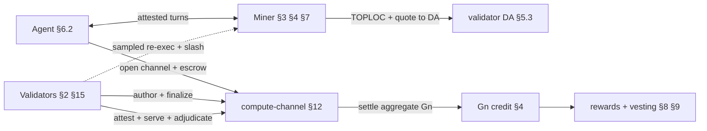
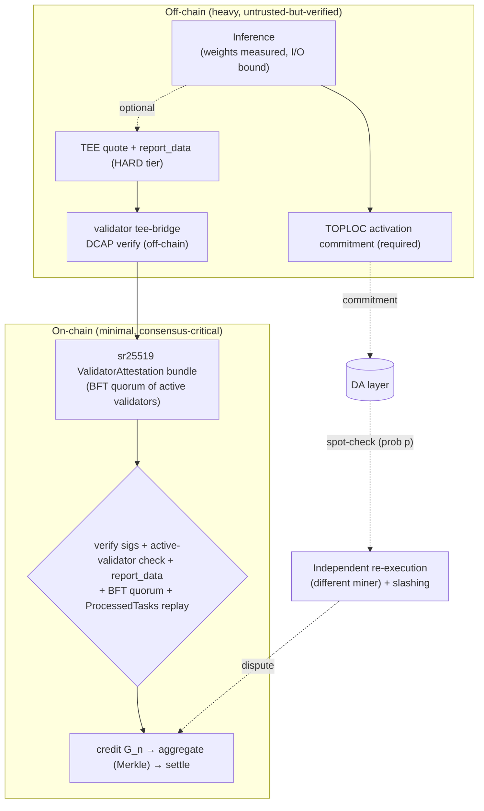
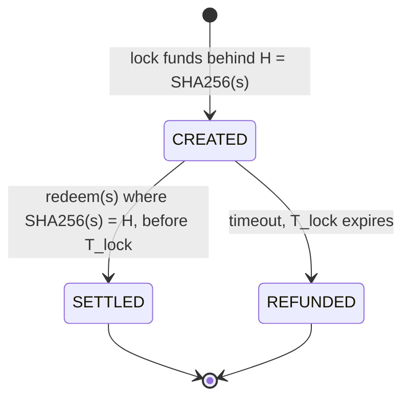

<!-- Published mirror of the FLOP yellowpaper — generated by scripts/publish_yellowpaper.py from flop-labs/flop-core@c65e3fc5. Do not edit here. -->
> **Published mirror — 0.5.0 (draft)** (source `flop-core@c65e3fc5`). This file is generated; corrections are made upstream and re-published. Three publish-time transforms are applied to the spec: Appendix H's `Code path · tracker` column is removed, local links are retargeted to published paths/anchors or flattened when their file is unpublished, and machine-readable `<!-- cite: -->` gate comments are stripped. No normative text is altered. Tracker references of the form `#NNN` point at FLOP's internal engineering tracker, not at issues in this repository. Feedback: open an issue.

<div class="cover">
  <p class="kicker">FLOP Network · Yellow Paper</p>
  <h1 class="mission">Normative specification of the <em>FLOP protocol</em>.</h1>
  <div class="meta">
    <span>Version<b>0.5.0 (draft)</b></span>
    <span>Status<b>Implementation spec — iterating</b></span>
    <span>Updated<b>2026-09-24</b></span>
  </div>
</div>

> The **implementation specification** of the FLOP Network: notation, message and storage formats,
> extrinsic interfaces, state machines, algorithms, and protocol invariants. This is the authoritative
> reference an implementer builds against. It is the math/spec companion to the
> Whitepaper (conceptual) and Litepaper (overview).
>
> **How to read this document — see [§0](#0-conformance--reading-guide) first.** The section bodies are
> **normative** and describe the *target protocol* using RFC 2119 keywords (**MUST**/**SHOULD**/**MAY**).
> Everything an implementer needs to satisfy conformance lives in the numbered sections and in
> Appendices A (parameters), F (message & storage formats), and G (extrinsic index). Everything that is
> *not* a requirement — design rationale, decision provenance, prior art, formal-proof citations — is
> confined to the **Rationale & sources** trailer at the end of each section, and to Appendix B.
> **Implementation status** (what is built vs. designed) is *not* carried in the normative body; it lives
> in one place, the [Conformance & Status Matrix (Appendix H)](#appendix-h--conformance--implementation-status-matrix).
> **Unresolved values/mechanisms** are numbered stubs in
> [Appendix E — Open Specification Items](#appendix-e--open-specification-items); the body references a
> stub rather than restating an open debate.
>
> **Decision provenance.** Ratified positions are recorded once in
> [`decisions/v0.4.md`](decisions/v0.4.md) (`D-04xx`, MADR-shaped, immutable once merged, superseded by
> ID in later versions). Where a normative rule cites a `D-id`, the citation is *provenance only* — the
> rule itself is stated in full in the body; the reader never needs the decision record to implement.

---

## 0. Conformance & Reading Guide

**Normative keywords.** The keywords **MUST**, **MUST NOT**, **REQUIRED**, **SHALL**, **SHALL NOT**,
**SHOULD**, **SHOULD NOT**, **RECOMMENDED**, **MAY**, and **OPTIONAL** are to be interpreted as in
RFC 2119 / RFC 8174 when, and only when, they appear in capitals. Lower-case uses carry no normative
weight. A statement with no keyword is descriptive context, not a requirement.

**What is normative.** The numbered section bodies (§1–§15), Appendix A (Parameter Reference),
Appendix F (Message & Storage Formats), and Appendix G (Extrinsic Index) are normative. Appendices B
(Sources), C (Miner Lifecycle — a worked walkthrough), D (Fee & Revenue Map — a derived summary),
E (Open Items), and H (Conformance & Status Matrix) are informative except where they restate a
normative rule and cite its home section.

**Section skeleton.** Each protocol section is organized as:
1. **Requirements** — the normative rules (MUST/SHOULD/MAY).
2. **Data structures** — field · type · encoding · constraint (or a pointer into Appendix F).
3. **Interfaces** — extrinsics/functions: signature · origin · preconditions · errors · events (or a
   pointer into Appendix G).
4. **State machine** — states and a transition table, where the section defines one.
5. **Rationale & sources** *(non-normative)* — why the design is as it is, decision IDs, prior art, and
   formal-proof citations. An implementer MAY ignore this trailer.

Not every section needs every part; a part is present only where it carries content.

**Reading the parameters.** Every protocol constant is named in Appendix A, which is generated from
`params/flop-protocol-params.yaml` (the single machine-checked source, gated by
`scripts/check_params.py`). A parameter named in the body links to its generated `#param-<name>` anchor.
Concrete figures appearing inline are worked examples; the value of
record is always Appendix A.

**Implementation status is out of band.** This specification describes the protocol FLOP targets, not a
snapshot of the codebase. The build state of each requirement — implemented, in progress, or designed —
is tracked only in [Appendix H](#appendix-h--conformance--implementation-status-matrix), together with
the code path and any tracking issue. The body contains no `[LIVE]`/`[PARTIAL]`/`[PLANNED]` tags and no
commit/PR references, so a requirement's wording does not change as code lands.

**Trust-domain principle.** FLOP's verification architecture rests on an explicit rule that recurs
throughout §3, §7, §11, and §12: **a fallback verification layer MUST occupy a different trust domain
from the fast path it backs.** In particular, protocol soundness **MUST NOT** rest on any single
hardware root of trust. TEE attestation is one assurance tier (§3.3) and is **OPTIONAL**, not a
precondition for participation or settlement; the mandatory execution-integrity floor is the
TEE-independent stack of activation commitments, sampled re-execution, and slashing (§3.4–§3.5). This is
ratified as `D-0432`; the non-TEE (SOFT) tier's end-to-end definition is the open item
[E.33](#appendix-e--open-specification-items).

**Terminology and clocks.** §1 fixes the notation, the role glossary, and the canonical protocol-clock
table with its coupling invariants. All durations assume 1-second blocks.

### 0.1 System architecture (informative reading map)

FLOP is a **verified-inference settlement layer**: a Substrate/FRAME chain where autonomous agents pay
miners for attested inference, validators finalize and police it, and the token economy is gated on
*useful, verified, demanded* work. The actors:

| Actor | Does | Specified in |
|-------|------|--------------|
| **Agent** | opens sessions, pays escrow, consumes inference; often a capped delegate | §6.2, §12 |
| **Miner** | runs the model, streams attested turns, earns settlement + work-gated rewards | §3, §4, §7, §8, §12 |
| **Validator** | authors (BABE) + finalizes (AlephBFT), attests proofs, hosts DA | §2, §3.6, §5.3, §15 |
| **Publisher** | registers a model + its measured root; leases weight storage | §3.3, §5.3 |
| **Delegator** | backs a miner/validator stake for a reward share | §6.1, §15 |

**End-to-end happy path** (one paid session):



**How the sections compose** (what each depends on):

- **§2 Consensus** is the base: BABE authors, AlephBFT finalizes. Every irreversible action anywhere
  reads its **finalized prefix** — settlement (§12), HTLC refund (§10), slashing (§11), DA prune (§5.3).
- **§15 Validators** is the staked set that *runs* §2, performs §3.6 attestation, and hosts §5.3 DA;
  its committee gate (§2.3) needs §3's verified-work signal.
- **§7 Calibration** produces `B_p` / serving caps consumed by **§4 metering**, **§6.1 miner stake**,
  **§8 vesting**, and the **§11** settlement gate.
- **§3 Verification** decides *what may be credited*; it consumes §7 caps, §5.3 DA (evidence), and §12
  transcripts. **§4 Metering** defines the `G_n` unit that §8, §9, §11, and §12 all key on.
- **§12 Sessions** is the settlement hot path — it reads §2 finality, §3 verification, §4 `G_n`, §5.3
  DA, §7 caps — and feeds §8/§9 (economics). **§5.3 DA** stores the evidence §3/§12 disputes fetch.
- **§9 Emission / §8 Vesting** are the economic outputs, gated on demanded+verified §4 work; **§10 HTLC**
  moves value cross-chain in/out. **§14 Governance** controls parameters/upgrades over all of the above.
- **§11 Invariants** and **§13 Failure semantics** cross-cut every section; **§6** supplies the
  accounts, keys, and escrow primitive the whole system is built on (crypto/accounts: §6.5).

Appendices are reference surfaces: **A** parameters · **F** message/storage formats · **G** extrinsics ·
**H** conformance/status · **I** runtime composition (pallet indices). A companion
[`yellowpaper-attribution.md`](yellowpaper-attribution.md) maps each requirement to its proof + code.

---

## 1. Notation, Conventions & Glossary

Quantities are exact integers on-chain unless noted; rationals use fixed-point (parts-per-million,
`ppm`, or parts-per-thousand, `ppt`). FLOP balances carry 18 decimals, so the **base unit** is
10⁻¹⁸ FLOP and all on-chain balances are integer counts of it; the base unit has no separate
name and amounts are written either in FLOP or as a count of base units. `‖` denotes concatenation; `SHA256` and `blake2_256` denote the respective
32-byte hashes.

### 1.1 Glossary — roles vs software

A **node** is software; every other term below is a *staked or delegated role*. Validators and miners
each run a node plus role-specific services. The terms are used in exactly these senses throughout.

| Term | Definition |
|------|-----------|
| **Node** | The software process (`relay-node` / `zkv-service` + role services). Not a role: both validators and miners run nodes. |
| **Validator** | Staked consensus role: authors blocks (BABE), runs BFT finality on the sampled committee (§2), stores and serves DA shards under serve-or-slash (§5), and attests miners' proofs (§3.6) and checker verdicts (§3.5). Requires no GPU or TEE and never executes inference (§15.1). Earns the validator block-reward share. Minimum self-stake per Appendix A ([`validator_min_stake`](#param-validator_min_stake), compounding; value-coupled floor `max(baseline, k·V_booked)`). |
| **Miner** (compute provider) | Staked compute role: executes inference and earns session-settlement revenue plus work-gated rewards (§4, §8). Minimum self-stake [`min_miner_self_stake`](#param-min_miner_self_stake) plus a capacity-proportional term (§6.1). *Nothing is "mined"; the name is colloquial.* |
| **Agent** | The compute consumer: an autonomous account (often delegated via session keys, §6.2) that opens sessions, pays fees, and holds FLOP. |
| **Validator Leader** | Rotating per-epoch sub-role of a validator: issues encrypted Ghost Tasks (§8.1). Not a distinct stake or a permanent privilege. |
| **Delegator** | FLOP holder backing a validator's or miner's stake for a share of its rewards (miners: ≤10× self-stake). |
| **Publisher** | Account that registers a model: pays the weights-storage lease deposit and the registry deposit; need not be the model's author. |

*Attestation authority.* There is **no separate oracle role.** Active validators verify TEE quotes
off-chain and submit signed `ValidatorAttestation` bundles; a BFT quorum of active validators
(§3.6, §13.3) is the on-chain attestation authority.

| Symbol | Definition |
|--------|-----------|
| `F_eff` | **Effective-FLOPs** — deterministic reference-work accounting from execution inputs (§4); distinct from physical instruction counts. |
| `G_n` | `F_eff / 10⁹`; the metered/billed unit. |
| `P`, `P_active`, `N`, `n_ctx`, `d` | params; active params (MoE); tokens generated; context length; hidden dim. |
| `G_n_max`, `B_p`, `R_p`, `E_c` | calibration max; Pledge Baseline; capped work-vesting Pledge Ratio `min(G_n_actual/B_p, 1)`; Efficiency Coefficient. |
| `C_emp`, `C_effective`, `u_min` | empirical calibration cap; tier-dependent activated cap; minimum calibration utilization in ppm (§7). |
| `model_hash` | **measured** commitment to loaded weights (dm-verity Merkle root). |
| `report_data` | TEE-quote binding value, exactly 64 B: a `SHA256` digest of the attested task fields, zero-padded; derived per `report_data` v1 in [Appendix F.1](#f1-identity--binding-preimages). |
| `output_hash` | commitment to the inference output, bound into `report_data` and the signed `ValidatorAttestation`. |
| `task_hash` | direct-rail task identity (H256), domain-tagged and bound to the deployment's `genesis_hash`; derived per `task_hash` v1 in [Appendix F.1](#f1-identity--binding-preimages). |
| `p` | challenge sampling probability (optimistic verification). |
| `H`, `s`, `T_lock` | Hashlock `SHA256(s)`; preimage; HTLC timelock. |

### 1.2 Protocol clocks — canonical table

Every time constant that a security argument depends on, in one place. **Coupling invariants** are the
rules that keep the clocks consistent; enforced couplings are checked in code, principled ones are
review rules. All durations assume 1-second blocks. Values of record are in Appendix A.

| Clock | Value | What it clocks | Coupling / invariant |
|---|---|---|---|
| Block time | **1 s** (BABE authoring) | inclusion, weight budgets | — |
| Finality | AlephBFT, seconds behind head | every irreversible action (payout, expiry, slash, prune) reads `FinalizedPrefix`, never the tip | **a finality stall MUST freeze economic deadlines by construction** (§13 F1); operational clocks may continue only when they release no funds |
| BABE epoch / committee session | epoch **1 h** prod (`EpochDurationInBlocks`; 1 min fast-dev); committee session **900 blocks** in every build (`AlephEpochBlocks`, ~15 min; four per epoch in production, one per 15 epochs in fast-dev) | BABE randomness epoch; `pallet_aleph` re-snapshots the PoUI-gated finality committee each session | 900-block sessions give 35,040 draws/yr; in production the four sessions of an epoch are all drawn from that epoch's randomness (R15.4b); couples the committee-capture bound to eligible-set concentration (§15) |
| PoUI rate-limit window | **1 day** ([`poui_submission_window_blocks`](#param-poui_submission_window_blocks) = 86,400; [`poui_max_submissions_epoch`](#param-poui_max_submissions_epoch) = 10 submissions/window) | per-miner submission rate reset | block-aligned; unrelated to the BABE epoch |
| `force_open` ack window | **~10 min** ([`channel_ack_window_blocks`](#param-channel_ack_window_blocks) = 600) | miner ratification of a permissionless open | missed ack ⇒ reputation, not slash; dust floor gates the counter |
| Dispute response window | **~2 h** ([`channel_dispute_response_window_blocks`](#param-channel_dispute_response_window_blocks) = 7,200) | miner's window to answer a named contested turn | miss ⇒ fraud default |
| Attestation-outage pause cap | **4 h** ([`attestation_outage_pause_cap_blocks`](#param-attestation_outage_pause_cap_blocks) = 14,400) | max per-channel pause of attestation-dependent clocks (§13 O1) | scoped pause, never a global halt |
| Calibration burst | **10 min** ([`calibration_min_burst_blocks`](#param-calibration_min_burst_blocks) = 600) | miner aggregate-host entry measurement | active renewable cap gates serving (§7) |
| Challenge / dispute window | **7 days** ([`channel_dispute_window_blocks`](#param-channel_dispute_window_blocks) = 604,800) | force-settle contestation | **challenge window plus a response window and its one R13.0b extension MUST be ≤ DA retention** — enforced by `integrity_test` at build time. Covers time-to-*open* only; a rightsize to ~1 d is analysed and deferred |
| Miner unbonding | **7 days** ([`miner_unbonding_blocks`](#param-miner_unbonding_blocks)) | miner stake exit | blocked while sessions/disputes active; MUST be ≥ dispute window so stake outlives contestation |
| DA retention (Ephemeral) | **14 days** ([`da_ephemeral_retention_blocks`](#param-da_ephemeral_retention_blocks)) | transcript/quote retrievability | **MUST be ≥ challenge window** (enforced); loss beyond threshold ⇒ degraded fail-closed refund, no default verdict (§13.0) |
| Checkpoints | **daily**; light-client freshness **21 days** | weak-subjectivity anchors | high-value exits SHOULD cool until the next checkpoint (§15) |
| Validator unbonding | **21 days** ([`validator_unbonding_blocks`](#param-validator_unbonding_blocks)) | validator/delegator stake exit | any governance change raising obligations SHOULD have enactment delay ≥ this (E.9) |
| Session key lifetime | **≤ 864,000 blocks** (`SessionKeysMaxDuration`; ~10 days at uninterrupted 1 s target cadence) | delegated agent authority | budget + pallet-scope bound the blast radius. *(The "60 day" figure in some code comments is a stale 6 s-block reading; see [`session_key_expiry_days`](#param-session_key_expiry_days).)* |
| Halving era | **~730 days** ([`halving_interval_blocks`](#param-halving_interval_blocks); 5 halvings + floor) | emission steps; the Labs/Foundation subsidy halves with the reward and terminates at the era-5 floor | per-halving anti-exodus boundary conditions hedge the 96→48 participant step |

**Reading rule (normative review gate).** A shorter clock **MUST NOT** be able to strand a longer one it
secures: disputes fit inside retention, stake outlives disputes, checkpoints outlive exits, enactment
outlives unbonding. Any change to one of these values MUST re-check the coupling column.

### 1.3 Acronyms & technical terms

Every acronym and non-obvious technical term used in this spec, expanded once. Protocol-internal
identifiers (`open_channel`, `report_data`, …) are defined at their point of use and in Appendices F–G;
the roles/symbols are §1.1.

**Consensus & runtime**

| Term | Expansion / meaning |
|------|--------------------|
| **BABE** | *Blind Assignment for Blockchain Extension* — the Substrate slot-based block-authoring engine |
| **AlephBFT** | the asynchronous BFT atomic-broadcast finality protocol FLOP adopts (Aleph, AFT 2019) |
| **BFT** | *Byzantine Fault Tolerant/Tolerance* — AlephBFT safety assumes strictly `< ⅓` Byzantine committee seats |
| **DAG** | *Directed Acyclic Graph* — the unit graph a committee orders |
| **BFT-DAG** | a DAG ordered by a Byzantine-agreement protocol (deterministic finality) |
| **VRF** | *Verifiable Random Function* — the BABE epoch randomness seeding committee sampling |
| **FRAME** | Substrate's runtime framework (the pallet/runtime programming model); the execution/state layer |
| **WASM** | *WebAssembly* — the on-chain runtime bytecode swapped by `set_code` |
| **SCALE** | Substrate's canonical binary codec for storage/extrinsic payloads |
| **Perbill** | Substrate parts-per-billion fixed-point type (e.g. the attestation threshold) |
| **RPC / P2P** | remote-procedure-call interface / peer-to-peer networking |
| **FinalizedPrefix** | the engine-agnostic interface exposing the AlephBFT-finalized block prefix |

**PoUI & verification**

| Term | Expansion / meaning |
|------|--------------------|
| **PoUI** | *Proof of Useful Inference* — FLOP's work-verification/reward mechanism |
| **TEE** | *Trusted Execution Environment* — hardware-isolated confidential execution (optional HARD tier, §3.3) |
| **CC** | *Confidential Computing* — NVIDIA GPU CC mode (VRAM encryption + attestation) |
| **CVM** | *Confidential Virtual Machine* — the attested host VM |
| **TDX** | *Intel Trust Domain Extensions* — the host CPU TEE |
| **DCAP** | *Data Center Attestation Primitives* — Intel's quote-verification stack (`dcap-qvl` = its verify library) |
| **dstack** | the confidential-computing attestation/verifier stack the runtime uses on-chain |
| **MRTD / RTMR** | *Measurement of Root of Trust for Domain* / *Runtime Measurement Registers* (RTMR0–3) in a TDX quote |
| **dm-verity** | Linux device-mapper block-integrity target; its Merkle root is the measured `model_hash` |
| **EROFS** | *Enhanced Read-Only File System* — the packed read-only weight image dm-verity protects |
| **VRAM** | GPU video memory (encrypted under CC) |
| **TOPLOC** | the activation-commitment verification scheme (arXiv:2501.16007); the mandatory Tier-2 floor |
| **RA-TLS** | *Remote-Attestation TLS* — the attested transport binding a session to an enclave key |
| **ZK / zkVerify** | *Zero-Knowledge* proofs / the settlement proof-aggregation layer (Groth16/PLONK/STARK/RISC0/EZKL verifiers) |
| **GEMM** | *General Matrix Multiply* — the re-executed leaf in Freivalds-spot-checked disputes |
| **Freivalds** | Freivalds' `O(n²)` probabilistic matrix-product verification |
| **KAT** | *Known-Answer Test* — pinning the op-count engine against analytic counts |
| **SDC** | *Silent Data Corruption* — undetected hardware compute errors (a drift signature) |
| **MLPerf** | the industry ML benchmark suite (the plausibility-ceiling reference) |
| **CUPTI / DCGM / nvml** | NVIDIA CUDA-profiling / data-center-GPU-manager / management-library counters read in-enclave |
| **MoE** | *Mixture of Experts* — models billed on *active* params |
| **LLM** | *Large Language Model* |
| **QKV / FFN** | attention Query/Key/Value projections / transformer Feed-Forward Network (op-count terms) |
| **FP16 / INT8 / INT4** | 16-bit floating-point / 8- / 4-bit integer numeric precisions |
| **SKU** | *Stock-Keeping Unit* — here, a specific attested GPU model (the HARD-tier ceiling) |
| **EWMA** | *Exponentially-Weighted Moving Average* — the drift/latency baseline |
| **SLA** | *Service-Level Agreement* — session latency policy |

**Data availability & storage**

| Term | Expansion / meaning |
|------|--------------------|
| **DA** | *Data Availability* — the sovereign validator-hosted storage layer (§5.3) |
| **RS / Reed–Solomon** | the rate-½ erasure code (`R`=6 shards, any `k`=3 reconstruct) |
| **Merkle** | Merkle hash tree/root (transcript accumulator, dm-verity, aggregation) |
| **SHA256 / blake2_256 / keccak256** | the 32-byte hash functions used for binding / identity / aggregation |
| **Ghost Task** | encrypted fixed-seed known-answer canary task (liveness + correctness + demand floor, §8.1) |

**Economics, governance & crypto**

| Term | Expansion / meaning |
|------|--------------------|
| **VFY** | **not a FLOP unit** — the name of a runtime *constant* equal to one whole token (`VFY = 10¹⁸` base units), inherited from the zkVerify runtime FLOP is built on. It appears only where Appendix A mirrors a code literal; protocol amounts are denominated in FLOP or in base units, never in VFY |
| **HTLC** | *Hashed Timelock Contract* — the atomic-swap primitive (§10); **MAD-HTLC** is the fee-bribery attack model |
| **MEV** | *Maximal Extractable Value* — ordering/timing value extraction (here, MEV-on-compute) |
| **FIP** | *FLOP Improvement Proposal* — a numbered off-chain design doc bound to a referendum |
| **OpenGov** | the Substrate/Polkadot on-chain governance framework FLOP adopts |
| **MADR** | *Markdown Architectural Decision Record* — the format of the `D-04xx` decision log |
| **FOCIL** | *Fork-Choice-enforced Inclusion Lists* (EIP-7805) — the anti-censorship approach for V6 |
| **TUF** | *The Update Framework* — the supply-chain provenance model for model publishing (P3) |
| **TWAP / BOM / EV** | *Time-Weighted Average Price* / *Bill of Materials* / *Expected Value* |
| **AEAD** | Authenticated Encryption with Associated Data — encrypts contents and authenticates bound context |
| **PaidObject** | Immutable opaque application object, intended for client-encrypted content, written into a funded capacity reservation and recorded in the provider group's namespace manifest, not on chain (§5.4) |
| **Capacity reservation** | Funded fixed-term commitment of reserved encoded bytes on a protocol-assigned provider set at the epoch tariff; one per payer, holding many namespaces; paid objects are written into it and deleted objects free space within it (§5.4); distinct from the §12.2 per-identity compute capacity reservation |
| **Epoch tariff** | The single per-epoch price vector (rent per encoded byte-block, setup per write, retrieval per byte, request fee) set by the stake-weighted median of capacity-declaring validators' votes within a bounded step (§5.4) |
| **Memory head** | Finalized mutable pointer to an immutable paid object version, updated by compare-and-swap |
| **Service lane** | `ServiceLane`: the per-provider escrow a payer funds under a capacity reservation; pays setup fees and retrieval, redeemed by cumulative payer- or delegate-signed vouchers (§5.4) |
| **UCAN** | *User-Controlled Authorization Networks* — the attenuable-capability model (future §6.4 layer) |
| **PQ** | *Post-Quantum* — cryptography out of scope until a PQ primitive is on the roadmap (§12.4) |
| **sr25519 / ed25519 / secp256k1** | signature schemes (chain / NEAR / Bitcoin-NEAR-MPC respectively) |
| **SS58** | the Substrate account-address format (`flop_account = SS58(derived_pubkey)`) |
| **NEP-141** | the NEAR fungible-token standard (bridged assets settle via the same HTLC) |
| **MPC / MITM / P2SH** | *Multi-Party Computation* / *Man-in-the-Middle* / Bitcoin *Pay-to-Script-Hash* |

**Threat-model frameworks (referenced, not defined here):** OWASP Agentic Top-10, ATFAA, STRIDE, and
MITRE ATLAS are external catalogues cited in §12.3.

---

## 2. Consensus

FLOP's consensus is a **BFT-DAG (AlephBFT class)** under the Substrate/FRAME runtime. A stake-weighted,
PoUI-gated sampler selects distinct committee identities; once selected, those identities participate as
committee **seats** in AlephBFT. **BABE authors blocks; AlephBFT finalizes them** — GRANDPA
(Substrate's default finality gadget) is not used. BABE's one-second slot is fixed; no finality-latency
or throughput profile is specified until E.46 is measured under a disclosed workload and topology.

### 2.1 Requirements

- **R2.1 — Block authoring.** Blocks **MUST** be authored by BABE at a fixed **1 s** interval.
- **R2.2 — Finality.** A block **MUST** be treated as irreversible only once it is within the AlephBFT
  finalized prefix. Every fund-releasing, expiry, slashing, or pruning action **MUST** read the
  finalized prefix via `hp_consensus::FinalizedPrefix` (AlephBFT-backed through
  `pallet_aleph::LastFinalized`), never the chain tip.
- **R2.3 — Byzantine tolerance.** AlephBFT safety **MUST** be evaluated against Byzantine committee
  **seats**, because selected members sign with equal voting weight. The safety premise **MUST** be
  strictly fewer than one third Byzantine seats: `3f < n`, where `f` is the Byzantine seat count and `n`
  is the realized committee size. Eligible-set or realized-committee stake fraction **MUST NOT** replace
  this seat bound.
- **R2.4 — Committee gate.** Finality-committee membership **MUST** be restricted to the PoUI-gated set:
  stake at or above the effective minimum **and** a recent accepted verification duty (R15.4c;
  `hp_consensus::select_committee`; §2.3, §15.4). Eligibility **MUST NOT** require the validator to
  execute inference, produce PoUI proofs, or hold a GPU or TEE. A bootstrap exception or
  minimum-safe-size profile **MUST** be ratified before that mode can claim conformance (E.42).
- **R2.5 — Committee size.** The finalizing committee **MUST** be a stake-weighted random sample of
  [`finality_committee_size`](#param-finality_committee_size) distinct members drawn without replacement
  from the eligible set, seeded by BABE-VRF epoch randomness (§15.4).
- **R2.6 — Engine isolation.** Finality-assuming pallets **MUST** depend only on the
  `hp_consensus::FinalizedPrefix` interface, so the finality engine can be swapped without touching
  them. FRAME **MUST** remain the sole execution/state layer.
- **R2.7 — Byte budget.** A claimed throughput/finality profile **MUST** state its admitted byte and
  weight budgets and validate them under a disclosed workload and network topology (§5.2, E.46).

### 2.2 Target parameters

| Parameter | Value |
|-----------|-------|
| Block interval | 1 second (fixed) |
| Finality | deterministic BFT once ordered; no latency target (AlephBFT; BABE authors 1 s blocks) |
| Byzantine tolerance | strictly `< ⅓` Byzantine committee **seats** (`3f < n`) |
| Committee selection | PoUI-gated: stake + recent accepted verification duty (`hp_consensus::select_committee`; R15.4c) |
| Committee size | [`finality_committee_size`](#param-finality_committee_size) = 100 |
| Capacity/latency profile | none; E.46 remains open |

The committee cap of 100 is cost-derived. At the original 1.5 FLOP floor the validator reward pool
sustained ~112 bare-metal validators, which is where the cap of 100 was sized. D-0436 doubled the
floor to 3 FLOP/block, so that pool now sustains **~224**: the cap sits roughly 2.2x inside the
ceiling rather than at it, and validator cost is no longer the binding constraint on committee size.
Capture analysis is parameterized by realized committee size; an `N=100` bound **MUST NOT** be applied to
an undersized committee. Bootstrap and minimum-safe-size behavior are E.42.

### 2.3 Safety — the three sub-proofs

PoUI gates production on **stake + verified useful work**, not hashpower, so a longest-chain Nakamoto
safety theorem does not apply and **MUST NOT** be relied upon. Safety instead decomposes into three
independent sub-proofs, each in its own trust domain:

1. **Sybil cost.** Each committee identity costs a stake bond + attested silicon (where claimed) + an
   accepted calibration cap plus background Ghost-Task exposure (§2.4). This bounds the stake an
   adversary can amass per unit capital. A separate sampling analysis must bridge that cost to the
   honest-seat premise of (2).
2. **BFT ordering safety under honest seats.** Given `< ⅓` Byzantine committee seats, AlephBFT atomic
   broadcast supplies its agreement and total-order result (adopted from AlephBFT; not re-proven here).
   The PoUI/stake gate constrains eligibility but does not by itself establish this realized seat premise.
3. **Verification integrity.** Committee eligibility requires a recent *accepted verification duty*
   (R15.4c — attesting, adjudicating, auditing; never proof production), and rewards/settlement are
   gated by the tiered verification stack (§3). Subject to actual enforcement of the gate and
   verification bridge (E.42–E.44, E.52), this constrains stake-only eligibility and unverified reward
   credit. It does not prove honest consensus behavior.

The probabilistic bridge from eligible-set composition to the realized seat premise is unresolved
([E.42](#appendix-e--open-specification-items)). In particular, weighted sampling of distinct identities
with unequal stake is not binomial sampling by aggregate attacker stake. `SelectionTailDominated` in the
Lean model is an explicit hypothesis, not a theorem about the implemented sampler. Capture analysis must
model the actual eligible identities, their weights, the without-replacement draw, stake splitting, small
eligible pools, repeated epochs, and BABE-VRF seed influence.

### 2.4 Sybil model — safety sub-proof (1)

With production gated by **stake + attested hardware** (not hashpower), a Sybil is *many identities*
seeking extra reward, voting weight, or penalty-dodging. Per-identity cost is a **triple moat**:

```
Sybil cost(N identities) = N · (stake bond ≥ min_miner_self_stake)
                         + N · (genuine attested silicon, where a HARD/TEE cap is claimed)
                         + N · (accepted burst cap + background Ghost-Task exposure)
```

Residual attacks and required mitigations:

| Attack | Mitigation (normative) |
|--------|------------------------|
| **Stake-splitting** (cap per-identity downside) | per-identity slashing + [`min_miner_self_stake`](#param-min_miner_self_stake) self-stake floor |
| **Hardware time-slicing** (one device across identities) | identity **MUST** bind to a *unique* device measurement in the quote (HARD tier) **and** encrypted Ghost-Task liveness (§8.1): a sliced device cannot answer simultaneous challenges on two identities |
| **Collusion / weight-copying pools** | independent re-execution (§3.5); reward only the first valid attestation |

*The triple moat's TEE term is decisive **for the HARD tier**, where an identity is bound to a distinct
attested device. A SOFT (non-TEE) identity is instead bounded by stake + calibration + spot-check
exposure; its per-identity demand-floor exclusion is E.33.*

### Rationale & sources *(non-normative)*

Consensus is the ratified stake-BFT-DAG (Q1 = D2). The choice within DAGs is the finality model:
GHOSTDAG buys throughput at the cost of probabilistic finality and an honest-*hashpower* assumption,
which PoUI removes; a BFT-DAG orders the DAG with Byzantine agreement so the committed prefix is
irreversible at commit under the `< ⅓` Byzantine-seat premise. Stake governs eligibility and sampling
weight, while the current signature verifier counts seats; these are separate quantities. The
only DAG option with a direct FRAME precedent is Aleph Zero. The prior PoW-GHOSTDAG fork was deleted
(unintegrated; its safety proof void under PoUI). Prior art: the BABE-authors / AlephBFT-finalizes split
is the availability-finality (Ebb-and-Flow, arXiv:2009.04987) resolution; AlephBFT
(arXiv:1908.05156 / 2312.14506) supplies expected-constant-round asynchronous agreement; deterministic
BFT in a block DAG (arXiv:2102.09594; Shoal++ arXiv:2405.20488; Lemonshark arXiv:2604.03974). The
decomposition is confirmed by results that a non-PoW longest-chain rule can be insecure
(arXiv:2505.14891) and that optimization-PoUW inherits PoW's honest-majority need (arXiv:2405.19027) —
both avoided by not using a longest-chain rule.

Written sub-proofs: `q14-sybil-cost-proof.md`,
`q14-bft-ordering-safety.md`,
`q14-useful-work-integrity.md`; options analysis
consensus-runtime-composition.md; implementation record
alephbft-integration-plan.md; Sybil cost model
`sybil-mitigation.qnt`. The committee-sampling
risk bridge is machine-checked in
`FlopSpecs/CommitteeSampling.lean`; its tail
bound is conditional on `SelectionTailDominated`.
The finite quorum-intersection and certificate-nonforking argument is proved in
`FlopSpecs/Consensus.lean`:
`Committee.quorum_inter_gt_third` and `FinalCtx.nonforking`. For AlephBFT's equal-seat committee,
instantiate the model's weight function with one per seat: the fault premise is `3f < n` and a quorum
has `3q > 2n` distinct signers. For `n = 100`, this permits at most 33 Byzantine seats and requires
67 signatures. The proof assumes quorum-certified finalization and honest non-equivocation; it does
not establish the sampler's honest-seat premise or the running protocol's liveness.
Review evidence and counterexamples:
[prepublication-evidence.md](research/prepublication-evidence.md). Exact population enumeration and
real-sampler regression scope: [committee-sampler-evidence.md](research/committee-sampler-evidence.md).
The current sampler returns all members of any nonempty eligible pool of at most 100; when no active
validator has recent work, the runtime retries with a stake-only set. These modes are implementation
status, not safety evidence; Appendix H and E.42 track the conformance gap.
Provenance: `D-0401`, [`D-0501`](decisions/v0.5.md#d-0501--public-claim-scope-and-reproducible-evidence)
(seat-count premise and conditional sampling bridge). Status:
[Appendix H](#appendix-h--conformance--implementation-status-matrix).

---

## 3. Proof of Useful Inference — Verification Architecture

PoUI answers: *did a miner execute the claimed inference (this model, this output) using the claimed
compute, or spoof a cheaper one?* No single primitive does this cheaply, so FLOP uses a **tiered hybrid**
whose central rule is that **the fallback layer occupies a different trust domain from the fast path**
(§0). ZK-proving the forward pass is out of scope: prover cost scales with proven FLOPs at 10³–10⁶×
blowup — **prove a *cheap* check, never the forward pass.**

### 3.1 Requirements

- **R3.1 — Execution-integrity floor (TEE-independent, mandatory).** Every settled session **MUST**
  carry a TOPLOC activation commitment (§3.4) over its turns. Missing required evidence **MUST** fail
  settlement closed; there is no TOPLOC-less settlement lane.
- **R3.2 — TEE is optional.** A TEE attestation (§3.3) **MAY** back a session and, where present,
  raises its assurance tier (HARD) and its permitted value cap. Protocol soundness **MUST NOT** depend
  on TEE integrity: if a TEE quote is forged or its trust root fails, acceptance **MUST** still require
  an independently enforced fallback with a stated error bound. Combining marginal error probabilities
  by multiplication **MUST** require a justified conditional-independence model; without it, two
  enforced gates support only the general intersection bound `min(ε_tee, ε_fallback)`. A non-TEE (SOFT)
  miner class is a first-class
  participant (`D-0432`; its end-to-end definition is the open item
  [E.33](#appendix-e--open-specification-items)).
- **R3.3 — Independent re-execution.** Security against a compromised fast path **MUST** come from
  optimistic re-execution in a different trust domain (§3.5), with collectible collateral and aggregate
  exposure satisfying the stated `p_effective` deterrence condition (E.45).
- **R3.4 — Settlement gate.** Crediting on the direct PoUI proof rail **MUST** require a BFT quorum of
  distinct active validators (§3.6): `ceil(active_count × validator_attestation_threshold).max(1)`.
- **R3.5 — Binding.** An accepted proof/attestation **MUST** bind, at minimum, `task_hash`, the metered
  `gn_weight`, the measured `model_hash`, and the `output_hash`; a mismatch on any bound field **MUST**
  reject (`OutputHashMismatch` / root mismatch).
- **R3.6 — Replay.** Each `task_hash` **MUST** be creditable at most once (`ProcessedTasks` guard).

### 3.2 The verification stack



| Tier | Buys you | Mandatory? |
|------|----------|-----------|
| 1 — TEE-attested deterministic execution | genuine HW environment + measured model/I-O binding; unlocks the HARD assurance tier and higher value caps | **Optional** (R3.2) |
| 2 — TOPLOC activation commitment | cheap *detection* of model/prompt/precision swap on the committed prefill activations; decode-step coverage is open (E.43) | **Required for all sessions** (R3.1) |
| 3 — Independent optimistic re-execution + slashing / session dispute game | the real defense vs. a compromised fast path | **Required** (R3.3) |
| 4 — On-chain settlement + ZK aggregation + validator BFT quorum | succinct finalization under decentralized attestation | **Required** (R3.4) |

### 3.3 Tier 1 — TEE attestation & measuring `model_hash` *(optional / HARD tier)*

Where a session runs under confidential computing, NVIDIA CC (H100/H200/Blackwell) + an Intel TDX host
CVM attest a genuine device, CC-mode/VRAM encryption, and firmware/RTMR measurements; the host quote
(MRTD, RTMR0-3, `report_data`) is checked by DCAP / `dcap-qvl`. The attestation proves the *environment*,
**not which model ran** — so it never substitutes for the Tier-2/3 floor.

**Measuring `model_hash`.** When a TEE session claims a model, the commitment to the loaded weights
**MUST** be a *measured* dm-verity Merkle root, not a passed-in checksum:

1. Pack all weight shards + index + config into one read-only EROFS image with a dm-verity Merkle tree
   (4 KB blocks). The **root hash** is the commitment; the kernel verifies every block on read and
   faults on mismatch, so the engine can only read the committed weights. The reproducible packer is
   `[tools/modelpack]`.
2. The miner CVM **MUST** extend the root into RTMR3 (or measure it via kernel cmdline into MRTD) so it
   appears in the signed quote and flows into `report_data`.
3. The chain stores expected roots per `(model, precision)` in `pallet_model_registry` and **MUST**
   accept a TEE proof only if the quote's measured root ∈ registry (fail-closed `Vk::V3`; the dstack
   verifier parses the TDX event log, replays it to the quote's RTMR3, and requires the registry root
   among the RTMR3 events). Quantization changes the bytes → changes the root, so each precision variant
   is a distinct commitment (consistent with TOPLOC precision detection).

**Output binding.** `report_data` **MUST** also commit `output_hash`; the validator **MUST** reject a
mismatch. **Decode-policy binding.** `report_data` **MUST** commit `decode_policy_hash` — a canonical
digest over `greedy`/temperature/top-p/top-k/seed plus transform id. Governance **MAY** pin a model to
an allowed decode-policy set in the registry (≤ [`max_decode_policies_per_model`](#param-max_decode_policies_per_model));
absent a pin, policy rollout is unblocked. The full binding preimage is in
[Appendix F](#appendix-f--message--storage-formats).

### 3.4 Tier 2 — TOPLOC activation commitments *(mandatory floor)*

TOPLOC commits the top-128 values+indices of each token's last hidden state, polynomial-encoded to
~258 bytes / 32 tokens. A verifier re-executes a single prefill and compares exponent intersections then
mantissa error against a per-`(model, precision)` governance-calibrated band. The committed lanes and the
re-executed step are the prefill; a commitment and check that cover the decode steps and bind them to
the billed token ids (`h_ids`) are open in E.43.

- **R3.4a.** A TOPLOC commitment **MUST** be present for every session (R3.1) and published to DA to
  feed Tier 3. A cryptographic detection bound additionally requires that the commitment bind the
  challenged activation vector, challenge randomness be fixed after commitment, and openings be checked
  against that commitment; the end-to-end protocol bridge is [E.43](#appendix-e--open-specification-items).
- **R3.4b.** Band adjudication **MUST** be fail-closed per `(model, precision, backend, GPU)` cell: until
  a cell's hetero-hardware activation gate passes, the cell is commitment-required but adjudication-inert
  (no silent accept). The two-threshold policy is accept / escalate / slash; a middle *escalate* verdict
  **MUST** route to the escalation lifecycle within
  [`channel_toploc_escalation_window_blocks`](#param-channel_toploc_escalation_window_blocks), never to
  silent accept.
- **R3.4c.** Unauthorized model/precision/prompt/decode/numerical substitution **MUST** be treated as
  disputable execution fraud. TOPLOC's detection claim is limited to validated cells and the commitment,
  challenge, and adjudication assumptions in E.43. Answer **quality** is **out of protocol scope** — a
  market/reputation remedy, never a protocol fraud verdict. This boundary is normative.

The tolerance-band formula combines an honest-divergence model with a secret-challenge projection model;
the committed per-cell constants (`kappa_profile_hash`, `band_tau_accept`, `band_tau_slash`, …) are in
Appendix A. These formulas give conditional mathematical bounds under their stated distributions. They do
not establish empirical detection for every model/backend/GPU cell or prove that the deployed commitment,
challenge, opening, audit, and adjudication path enforces those assumptions. Under a broken TEE, the
abstract AND-combinator retains the supplied fallback bound; the bound is only as strong as the fallback
and operational bridge independently established in [E.43](#appendix-e--open-specification-items).

### 3.5 Tier 3 — Independent optimistic re-execution & slashing

Security against a compromised fast path is conditional on effective re-execution in a **different trust
domain**. A Proof-of-Sampling game targets a random fraction: results are posted under bond and a
different miner re-runs sampled work. For a risk-neutral miner under fixed monitoring and credible,
collectible penalties, a necessary deterrence inequality is

```
p_effective · collectible_penalty  >  total_profitable_exposure
```

- **R3.5a.** There **MUST** exist ≥1 honest standing challenger — the session agent (for its own
  channel) or an active validator (for any channel), per §12.1.
- **R3.5b.** Slashable collateral **MUST** cover aggregate concurrent exposure, not only a single job;
  high-value jobs **SHOULD** escalate to a ZK spot-proof (§3.6). The reservation and payoff model is
  unresolved in [E.45](#appendix-e--open-specification-items).
- **R3.5c.** Disputes **MUST** resolve over data available outside the miner's host. Validator-hosted DA
  removes miner-only custody but is not independent of a validator coalition (§5.3). The
  dispute bisection MAY use `O(n²)` Freivalds spot-checks so only a single layer/GEMM is re-run at the
  leaf.
- **R3.5d — Re-execution lane.** Re-execution of sampled or challenged turns **MUST** be performed by
  bonded **checkers** in a different trust domain from the miner, never by validators. The floor is
  three checkers per turn — distinct operators from the miner and from each other, VRF-assigned —
  returning a **unanimous** verdict; any disagreement, or unavailable evidence, model or capacity,
  **MUST** escalate (§12.1) and **MUST NOT** become an implicit accept. A checker verdict carrying a TEE
  attestation of the re-execution is an OPTIONAL strengthening that raises the verdict's assurance tier
  and permitted value cap; it **MUST NOT** lower the floor. Before co-signing a mismatch or clear quorum
  at the §3.6 threshold, a validator **MUST** verify the assignment, the checkers' bonds, the signatures'
  binding to the commitment and turn, and unanimity. Checker identity **MUST** be a calibrated miner
  identity of §2.4 — capacity-proportional self-stake, accepted calibration cap and an independently
  attested hardware fingerprint — plus the checker bond; a bare bonded account is not checker-eligible.
  Assignment **MUST** be stake-weighted VRF sampling over that pool excluding the session miner's account
  and fingerprint, and the three assigned checkers **MUST** carry pairwise-distinct fingerprints, so an
  adversary holding share `q` of the pool's selection weight captures all three seats with probability
  at most `q³`, bounded by the Sybil cost of §2.4. A unanimous accept is not final: within the R12.1f
  challenge window any standing challenger MAY escalate it, drawing a fresh assignment disjoint from the
  first, and a checker whose verdict is overturned **MUST** forfeit its bond. Verdict fields and checker
  payment are E.53.

Here `p_effective` is the probability chain
`P(selected) · P(data | selected) · P(challenge | selected,data) ·
P(included | selected,data,challenge) · P(upheld | selected,data,challenge,included) ·
P(collectible | selected,data,challenge,included,upheld)`. Every factor conditions on all preceding
events; this is the chain rule, not an independence or Markov assumption. The inequality alone does not establish a Nash equilibrium for
challengers, coalitions, bribery, or Byzantine actors. Slashing is `pallet_miner_slashing`; the session
dispute game is §12.1.

### 3.6 Tier 4 — On-chain settlement, ZK aggregation & validator BFT quorum

The direct **per-proof rail** settles synthetic/ghost, calibration, and simulator work; **paid agent
sessions settle through the compute channel** (§12.1), with the validator quorum acting there as dispute
resolver rather than per-credit gatekeeper. On the direct rail:

- **R3.6a.** A miner submits a proof via `submit_stark_batch(...)`, recorded in `PendingVerifications`
  with replay protection (`ProcessedTasks[task_hash]`).
- **R3.6b.** Crediting **MUST** require a validator BFT quorum. Validators run DCAP/dstack TEE quote
  verification off-chain and submit signed `ValidatorAttestation` bundles via
  `submit_validator_attestations`. The chain **MUST**: verify each sr25519 signature; check every signer
  is an active validator (`pallet_validators::ActiveValidators`); enforce agreement on
  `(task_hash, gn_weight, latency_ms, model_hash, output_hash, decode_policy_hash, tee_type,
  quote_verified, event_log_verified, hardware_id_hash)` across the bundle; require both verification
  booleans; and require
  `ceil(active_count × validator_attestation_threshold).max(1)` distinct validators (default threshold
  [`validator_attestation_threshold`](#param-validator_attestation_threshold) = 2/3, root-governable).
- **R3.6c.** On quorum the chain **MUST** verify the `report_data` binding + `output_hash` match, credit
  `gn_weight`, and fire `OnProofVerified`.

There is **no** separate oracle registry; the attestation authority is a BFT quorum of active validators
already securing consensus. The **Aggregate pallet** collects verified statement hashes (`keccak256`)
into per-domain Merkle roots for cross-chain dispatch; the settlement verifiers (Groth16-161 …
EZKL-169, TEE-170) are
**zkVerify aggregation — they do not prove the inference.** Optional ZK spot-proofs cover top-value jobs.

### Rationale & sources *(non-normative)*

The stack draws on published mechanisms and prototypes (TEE confidential inference — Azure CVMs, Phala, Tinfoil;
dm-verity model measurement — Tinfoil Modelpack; TOPLOC activation commitments — Prime Intellect,
arXiv:2501.16007; TEE fast path + sampled re-execution + slashing — VeriLLM ~1% cost arXiv:2509.24257,
SPEX arXiv:2503.18899, EigenAI arXiv:2602.00182 whose *deterministic* inference removes the FP-noise
band, Optimistic TEE-Rollups arXiv:2512.20176; weight-into-attestation binding — Laminator
arXiv:2406.17548, Attestable Audits arXiv:2506.23706). The TEE-optional reframe is grounded in the
machine-checked `sessionVerifier_survives_broken_tee` (the abstract AND-combinator retains its supplied
fallback bound under a forged quote) and the SOFT-tier design (E.33). Successor commitment schemes
(TensorCommitments arXiv:2602.12630, DiFR
arXiv:2511.20621, log-prob tracking arXiv:2512.03816) slot in as measured (ε, φ) points — their gains
are verification *cost*, not the guarantee.

Walkthroughs: ELI5 ·
Feynman ·
session-lifecycle-runbook.md. Tiered hub:
verification-architecture.md, verification.md,
verification-economics-bounds.md,
dispute-reexecution-tradeoffs.md,
formal-to-implementation-bridge.md. Band derivation:
toploc-band-derivation.md; operational R1–R4:
toploc-r1-r4-research.md; decode-side conformance gap against
R3.4c: decode-substitution-gap.md. Tier-3 primitives:
freivalds-bisection-spec.md,
commodity-reexecution-reference.md (tinygrad + Colibri as candidate GPU-optional leaf re-executors),
distribution-audit-tier-design.md,
cheap-miner-hardware-profiles.md,
claim-then-audit-image-commitments.md. GPU-work
measurement + premium cert lane: gpu-work-measurement-verification-study.md,
batch-work-certificates-spike.md,
gemm-certificate-format-spec.md,
kv-commitment-carryover-design.md,
zk-prover-overhead-audit-lane.md,
zk-audit-settlement-design.md (ZK-wrapped audit verdicts + settlement bookkeeping, design spike); stack governance
verification-scheme-registry.md. Trust surface:
`docs/trust-surface.md`. Review evidence and assumption classifications:
[prepublication-evidence.md](research/prepublication-evidence.md). Conditional audit payoffs, shared
collateral, and collection-path evidence: [audit-economics-evidence.md](research/audit-economics-evidence.md).
Provenance: `D-0404` (measured
`model_hash`), `D-0406`/`D-0414` (attestation authority), `D-0431` (TOPLOC required), `D-0501`
(claim scope and conditional guarantees). Formal:
`FlopSpecs/Crypto.lean`,
`FlopSpecs/TeeAttestationFlow.lean`,
`FlopSpecs/Verification.lean`,
`FlopSpecs/VerificationComparison.lean`,
`verification/proof-verification.qnt`. Status:
[Appendix H](#appendix-h--conformance--implementation-status-matrix).

---

## 4. Effective-FLOP Metering

### 4.1 Requirements

- **R4.1 — Unit.** Work **MUST** be accounted in versioned reference-work units `F_eff`, with
  `G_n = floor(F_eff / 10⁹)`. This is a deterministic protocol accounting convention; it is distinct from
  physical FP16/INT8/INT4 instruction counts, energy, latency, and certificate weights.
- **R4.2 — Reference-work accounting.** `G_n` **MUST** be computed from execution inputs by the shared
  deterministic `no_std` primitive (`hp_poui::flop_meter`, mirrored in
  `tee-bridge/inference/attestor/flop_meter.py`), not derived from bare `2·P·N`. Inputs include the
  prompt/context lengths, generated-token count, active-parameter/MoE terms, and attention term defined
  by the reference formula. Running the meter inside a TEE does not make it a physical instruction
  counter or establish unmodeled routing, cache, batching, or speculative-decoding work.
- **R4.3 — Tripwire is reject-only.** A sanity tripwire **MUST** reject (never clamp or rewrite) a claim
  whose implied throughput `gn·1000/latency_ms` exceeds
  [`throughput_tripwire_gflops_per_sec`](#param-throughput_tripwire_gflops_per_sec) (fail-closed,
  governance-toggle, default-on). The per-GPU MLPerf ceiling and the under-report floor activate where
  the attested GPU id / attested token counts are bound (transcript-leaf `g_n`).
- **R4.4 — Representation.** Settled `G_n` is an unsigned count of whole billion-reference-FLOP units.
  Direct-rail claims use `u64`; session leaves, receipts, aggregates, and balances use `u128`. Both use
  fixed-width little-endian integers in signed/hashed preimages and SCALE's fixed-width encoding in calls
  and storage. Implementations **MUST** floor once at `F_eff / 10⁹`, reject a value outside the destination
  width, and use checked aggregation; they **MUST NOT** round, clamp, reinterpret historical values, or attach
  physical FP16/INT8/INT4-op, joule, latency, or certificate-weight semantics to this field. Those measurements
  are separately typed telemetry.
- **R4.5 — Cache accounting.** Wire profile v1 bills the full prompt/context term in the reference formula,
  including a reused KV-cache prefix. Cache reuse may reduce latency or physical work but does not discount
  settled `G_n`. A proof-bound cache discount requires a new meter/profile version; it **MUST NOT** silently
  change existing leaf or receipt amounts (E.22; #1153).

### 4.2 The op-count model

The reference-work count accounts active params (MoE-aware), the quadratic attention term, and embedding;
it is KAT-pinned against the analytic count on reference models (Llama-3-8B → 16, Llama-3-70B → 140
`G_n`/token; Rust ⇄ Python parity). Cross-checks (GPU performance counters via CUPTI/DCGM; energy via
`nvml`) read inside the enclave as physical bounds.

The bare heuristic is a **sanity check only** (R4.3), never a billed amount:

```
F_eff ≈ 2 · P_active · N  +  2 · n_layer · n_ctx · d_attn   (attention term)
```

Per-token, per-layer: QKV `6d²`, attn output `2d²`, FFN `16d²`. The bare `2·P·N` is ~2–3× accurate (it
omits the quadratic attention term, embedding/unembed, LayerNorm/softmax; MoE uses *active* params;
KV-cache is a bandwidth, not a FLOP, effect). Reference examples (≈, under stated architecture
assumptions): Llama-3-8B 16, DeepSeek-V3 74, and Llama-3-70B 140 `G_n`/token. Proprietary-model figures
are not protocol measurements.

**Pricing vs. work.** Pricing is quoted in tokens with context/model multipliers while work is metered
in `F_eff` (`flop-poui` fee `(base+priority)·gflops/1000·precision_mult`). The transaction fee's
recipient split is specified in §9 / Appendix D. `G_n` alone cannot convert an external per-token quote
into a comparable session price; the versioned pre-session quote contract, its interface home, and its
remaining blockers are [E.55](#appendix-e--open-specification-items).

### Rationale & sources *(non-normative)*

Reference-work `G_n` with a reject-only tripwire (never rewriting the billed amount) is `D-0405`;
`D-0501` clarifies that the meter is an accounting rule rather than exact physical measurement. Grounding:
latency-gflop-calibration.md,
workload-class-metering.md,
gpu-precision-tripwire-note.md. Formal:
`FlopSpecs/Calibration.lean`,
`FlopSpecs/Computable.lean`. Review evidence:
[prepublication-evidence.md](research/prepublication-evidence.md). Open: E.34 (non-LLM workload
classes) and E.22 (proof-bound cache discount). Status:
[Appendix H](#appendix-h--conformance--implementation-status-matrix).

---

## 5. On-chain / Off-chain Architecture & Sizing

### 5.1 The split

| On-chain (minimal, consensus-critical) | Off-chain (heavy, untrusted-but-verified) |
|----------------------------------------|-------------------------------------------|
| Validator attestation verification (sr25519 sigs + BFT quorum + `report_data`); replay; `G_n` crediting | Inference execution; quote generation (where TEE-backed) |
| Proof-aggregation Merkle roots; dispute adjudication + slashing | DCAP verification (tee-bridge, `dstack-verifier`) — validators, off-chain |
| Staking, vesting, registries, calibration baselines, HTLC settlement; **DA commitments (`DataRef`) + serve-or-slash audits** (`pallet_da_registry`) | TOPLOC commit + re-execution; **sovereign validator DA** for proofs/quotes/I-O (§5.3); cross-chain relay |

**Verification asymmetry (normative).** The chain **MUST NOT** re-execute the model; it adjudicates
attestations and disputes only. Trust shifts to (a) hardware RoT *where claimed*, (b) economic slashing,
(c) independent re-execution — never the executor.

### 5.2 Block & transaction sizing

The runtime configures a 5 MiB maximum block length: Normal dispatch may consume at most 3,932,160 B
(75%), while Operational dispatch may use the full 5,242,880 B. Its independent ref-time ceiling is
750,000,000,000 per block, with 562,500,000,000 available to Normal dispatch; proof size is also a
weight dimension. Base block/extrinsic work and competing traffic consume these envelopes.

These are admission maxima, not a propagation, execution, throughput, serving, or finality profile. D-0502
proposes to withdraw the former 125,000 B scenario. Whether bytes, ref-time, proof size, state access,
serving capacity, or finality communication binds first requires E.46's runtime and network measurements.

### 5.3 The verified-task footprint & sovereign DA

A verified task **MUST** commit only ~32 B per blob on-chain, not the bytes. The ~2 MB `StarkProof` cap
is a **submission call-data path** (it rides the extrinsic transiently and prunes with the block), not
permanent storage — proofs/quotes/I-O live in DA, referenced by hash:

```
direct-rail attestation Vec bytes/claim = compact_len(quorum_size) + 275 B × quorum_size
off-chain (DA, by DataRef)              = proof_data, TEE quote (5–10 KB), event log (≤256 KB)
```

The current fixed-field SCALE size is 275 B per `ValidatorAttestation`; the signed subset is 179 B.
The signature bundle is linear in quorum size. The source-checked SCALE fixtures include the runtime
pallet/call indices, v5 bare preamble, outer compact length, and embedded validator signatures. Under
the default two-thirds rule, 100 active validators require 67 signatures: the argument vector is
18,427 B and the complete extrinsic is 18,434 B. At the supported active-set maximum of 200, 134
signatures produce 36,852 B and 36,859 B respectively. The seven-byte difference is two call-index
bytes, one bare-preamble byte, and a four-byte length prefix. The finality committee is a separate set
capped at 100; 1,000 active validators is not a supported runtime state. No constant-size signature
aggregation is specified. These byte measurements are not divided into a throughput claim; charged
weights, competing traffic, and finality remain separate constraints. Full fixtures and limitations:
[prepublication evidence](research/prepublication-evidence.md).

**DA requirements (sovereign, validator-hosted, FLOP-denominated).**

- **R5.3a.** DA storage **MUST** use no external currency/token/network dependency; **validators are the
  storage nodes** under stake. `pallet_da_registry` keeps only a
  `DataRef = (commitment, provider_id, retention_class)` plus the assigned validator subset and audit
  bookkeeping; the erasure-coded bytes (Reed–Solomon rate ½, [`da_shard_count`](#param-da_shard_count)
  R=6, any [`da_min_replication_factor`](#param-da_min_replication_factor) k=3 reconstruct) live
  off-chain on a deterministic stake-weighted subset (`hash(commitment) → subset`). Because the
  publisher can influence a commitment, the assignment's anti-grinding rule, operator/failure-domain
  diversity, repair process, and cumulative retention budget remain open in
  [E.47](#appendix-e--open-specification-items).
- **R5.3b — Serve-or-slash.** Retrievability audits (the Ghost-Task known-answer pattern) **MUST** slash
  a bounded amount ([`da_serve_or_slash_percent`](#param-da_serve_or_slash_percent), Liveness class, not
  fraud) of a non-serving validator's bond. A penalty **MUST** be re-derived from the *live* validator
  set (never stale-slashing a rotated-out provider).
- **R5.3c — Protocol DA duty.** Protocol-evidence and leased-model DA under this section are validator
  **duties**, funded from the validator share of block rewards + fees; these duties **MUST NOT** charge
  per-byte storage or retrieval fees. Serve-or-slash enforces the funded duty. Paid application objects
  **MUST** use the separate contract in §5.4.
- **R5.3d — Retention classes.** `Ephemeral` (≥ challenge window, then prunable) covers
  quotes/proofs/transcripts/I-O — **no charge**, spam-bounded because such blobs are creatable only
  through fee-bearing flows. `Leased` covers model weights + dm-verity images — a fixed term with **no
  storage fee** but a **refundable anti-spam deposit** (`bytes × `[`da_lease_deposit_per_byte`](#param-da_lease_deposit_per_byte),
  held under a dedicated hold reason, **returned in full** on prune or withdrawal — never revenue),
  extendable by anyone for free (`top_up_lease`, tx fee only), pruned only after `lease_end + grace`
  (14 d) **and** only while no consumer holds a usage **pin**. Pruning **MUST** be recoverable: the
  dm-verity root is deterministic, so re-upload reproduces the same commitment and identity
  (`MeasuredRoots`) survives.
- **R5.3e — Reorg-safe serving.** The off-chain indexer **MUST** serve only heights inside the AlephBFT
  finalized prefix (a finalized block can never orphan), never the best tip.

Leasing supersedes an unbounded "persistent" tier — model relevance is 6–12 months. Moving the TEE quote
off the miner's HTTP server removes miner-only custody. It does not make availability independent of the
validator set: registration, an unexpired record, successful spot audits, and reconstructability over the
full dispute lifecycle are distinct predicates. Serve-or-slash is an incentive conditional on audits and
repair, not an unconditional availability guarantee (E.47).

### Rationale & sources *(non-normative)*

Sizing target and sovereign-DA decision: `D-0402` (sovereign validator DA), `D-0412` (DA is a validator
duty, no per-byte fee; supersedes the fee provisions of D-0402/D-0407), `D-0407` (leased model storage).
Full design da-sovereign-validator-design.md; sizing
indexer-scaling.md, scaling-500k-agents.md,
scaling-500m-1b-agents.md,
r3-throughput-ceiling.md. Formal:
`FlopSpecs/DataAvailability.lean`,
`FlopSpecs/DaProviderRotation.lean`,
`FlopSpecs/IndexerReorgSafety.lean`,
`da/da-retrievability.qnt`. Review arithmetic and availability
assumptions: [prepublication-evidence.md](research/prepublication-evidence.md). Provenance clarification:
`D-0501`. Status:
[Appendix H](#appendix-h--conformance--implementation-status-matrix).

### 5.4 Agent memory and paid data storage

**Requirements**

- **R5.4a — Scope and chain footprint.** Agents **MAY** store arbitrary application bytes, including
  memories, documents, datasets, and encrypted indexes, in a separate `PaidObject` namespace hosted
  by bonded validators. FLOP is not a storage chain: the chain **MUST** hold only per-epoch tariff and
  capacity state, one `CapacityReservation` per payer, per-provider epoch checkpoints, service lanes
  and accounting; object commitments, manifests and ordinary memory heads **MUST** live with the
  assigned provider group and reach the chain only through checkpoint roots and disputes. Protocol
  `Ephemeral` and model `Leased` duties **MUST** retain §5.3 pricing. General application uploads
  **MUST NOT** enter those subsidized classes through the paid-object API. Admission **MUST**
  authenticate the originating protocol/model flow and enforce its resource limits; a caller-supplied
  class or content-type label **MUST NOT** establish eligibility. A reservation **MAY** hold many
  namespaces, objects and memory heads; agents, sessions and sub-agents **SHOULD** operate inside one
  payer's reservation through delegated capabilities anchored in agent-wallet session-key limits,
  so on-chain state scales with payers, not with agents, sessions or objects.
- **R5.4b — Confidentiality and authority.** Clients **MUST** encrypt private content and its private
  manifest before erasure coding, using authenticated encryption with a fresh object key and unique
  nonces. Authentication **MUST** bind chain, namespace, object version, and chunk position. These
  encryption/key-generation obligations **MUST** be enforced by conforming clients; envelope admission
  **MUST NOT** be represented as proof that an arbitrary uploader encrypted securely or kept its key
  secret. Validators **MUST** check the versioned envelope's field bounds, declared suites, commitments,
  signatures, and authorization; they **MUST NOT** require plaintext or decryption keys. Without a
  separately specified proof, validators **MUST NOT** claim to verify AEAD tags, key entropy, or
  plaintext absence. Read, write, renew, delete, and payment authority
  **MUST** be separately scoped by owner-authorized capabilities bound to subject, namespace/object,
  operation, expiry, policy epoch, and limits. Each request **MUST** prove possession of the authorized
  subject key and bind its method, resource, body digest, and replay nonce. Delegation **MUST NOT**
  enlarge authority. Capability checks **MUST** use finalized policy state and fail closed when stale.
  Payment authorization **MUST** also satisfy agent-wallet/session-key aggregate spending limits.
- **R5.4c — Integrity, memory heads and checkpoints.** An object **MUST** be immutable and committed
  by ciphertext hash, encoded-shard commitments, ciphertext length, and codec/profile version. The
  private manifest **MUST** authenticate the plaintext interpretation and chunk layout. Each
  namespace **MUST** have a `NamespaceManifest` (objects, versions, tombstones and heads) sequenced
  by the assigned provider group: the provider first in the finalized assignment generation's order
  is the sequencer; a head update **MUST** be an owner-authorized compare-and-swap against the exact
  previous version, and a `HeadReceipt` **MUST** carry the E.54 head quorum of provider signatures
  over namespace, key, previous version, new version, object and sequence before a client treats the
  update as committed. Stale updates **MUST** fail. Updating a head **MUST NOT** delete a retained
  version. Two receipts signed by one provider for conflicting successors of the same version
  **MUST** be an objective equivocation fault. Every assigned provider **MUST** post one
  `ProviderCheckpoint` per epoch committing the manifest and head roots of every namespace it
  serves; a client **MUST** be able to obtain an inclusion proof, and a missing or conflicting
  checkpoint **MUST** be a fault after the E.54 grace window. Reading a head **MUST** need no lane or
  fee: it is a provider read verified against the receipt quorum and, when available, the latest
  checkpoint. An owner **MAY** instead pin a head on chain with `set_memory_head`; a chain-finalized
  head **MUST** be authoritative for that key over provider receipts. If the sequencer misses the E.54
  response deadline, the next provider in generation order **MUST** take over, resuming from the
  highest quorum-receipted sequence. Clients **MUST** verify shard proofs, reconstructed ciphertext
  commitment, decryption authentication, and requested version before accepting data. Storage
  authenticity **MUST NOT** be represented as truth of the stored statements.
- **R5.4d — Capacity, assignment and activation.** Each epoch, an eligible validator **MAY** post a
  `CapacityDeclaration` of encoded bytes it will serve at that epoch's tariff, with the E.54
  collateral reserved; the declaration **MUST** be its consent to assignment, and declared capacity
  and collateral **MUST NOT** be reused across simultaneous obligations. The funded unit **MUST** be a
  `CapacityReservation` binding a payer, unique nonce, reserved encoded bytes `c_i` per provider,
  term, tariff version, assignment generation, service profile and escrow. Assignment **MUST** be a
  protocol stake-weighted random sample among declarers with free capacity, drawn from finalized
  randomness after the open under E.47's anti-grinding and failure-domain profile; the payer
  **MUST NOT** choose or influence its providers. A reservation **MUST** become active, and rent
  **MUST** begin to accrue, when assignment is finalized; a payer whose open cannot be placed
  **MUST** fail closed with escrow returned. Each object write **MUST** target an active reservation
  with enough free reserved bytes for the object's full encoded footprint and **MUST** complete its
  own activation off chain: an object is readable once a reconstruction threshold of assigned
  providers has issued signed custody receipts for validated shards, and fully replicated once every
  assigned provider has; a receipt missing after the E.54 activation window **MUST** be that
  provider's fault and trigger repair at its cost. Missing custody, an invalid encoding, or an
  insufficient independent receipt set **MUST** fail the write. Receipt of shards alone **MUST NOT**
  start setup earnings. Pending uploads **MUST** reserve bounded ingress, validation work and
  concurrency before expensive work; aborted activation **MUST NOT** restore consumed resource
  budgets. A refundable setup allowance **MUST NOT** be treated as payment for failed-admission work.
- **R5.4e — Epoch tariff.** All service payments **MUST** transfer existing FLOP from the payer to
  validators performing the contracted service. Prices **MUST** come from one `EpochTariff` per
  epoch: a nonnegative rational rent rate `p/q` in base units per reserved encoded byte-block with
  `q > 0`, a one-time setup fee `F` in base units per object write per provider, a retrieval rate
  `r/s` per acknowledged encoded byte with `s > 0`, and a request fee `f`. The tariff **MUST** be
  the stake-weighted median of the votes of validators that also declared capacity for that epoch,
  clamped to the E.54 per-epoch step bound around the previous tariff and to any governance floor
  and ceiling; a validator that does not declare capacity **MUST NOT** vote. If declared free
  capacity has stayed below the E.54 demand headroom for the E.54 number of consecutive epochs, the
  tariff **MUST** step up by the bound regardless of votes; with no declarers the epoch **MUST**
  admit no new reservations. Reservation escrow **MUST** equal `C_rent = Σ_i ceil(c_i × T × p / q)`
  at the open epoch's tariff within the payer's signed cap; each write **MUST** be funded with `F`
  per assigned provider, so `C_store = C_rent + Σ_writes n × F`. An object's encryption/coding
  padding **MUST** count toward the reserved bytes it occupies, and the profile **MUST** disclose the
  encoding and reconstruction threshold. `F` **MAY** be zero; it **MUST** cover all one-time
  ingest/activation work for one write. Scheduled audits, repair, checkpoints and bounded terminal
  retention **MUST** be included in rent. Rent **MUST** accrue on reserved bytes whether or not they
  are occupied. A reservation's rates **MUST** stay fixed for its term; extension **MUST** use the
  tariff of the epoch in which it is funded and **MUST NOT** silently repeat setup charges.
  Settlement **MUST NOT** require a token-price oracle. Voting **MUST NOT** be represented as proof
  of truthful costs or sufficient capacity; voluntary capacity declaration and the step rule are the
  clearing mechanism. Tariff selection **MUST NOT** relax R5.4d's placement, capacity, or collateral
  conditions.
- **R5.4f — Earnings and conservation.** Rent **MUST** be released from escrow by the chain per
  epoch, without a provider claim, to each assigned provider whose audit and checkpoint state for that
  epoch is accepted under the E.54 profile; for provider `i`, cumulative released rent after `t_i`
  accepted blocks **MUST** be `R_i(t_i) = ceil(c_i × t_i × p / q)`, where `t_i` counts
  non-overlapping accepted service blocks across every assignment segment of that provider, bounded
  by the contracted duration. Rounding **MUST** apply once to this cumulative amount, never per
  segment or per epoch: a release **MUST** transfer only `R_i(t_i) − R_i(t_i′)`. Because `R_i` is
  monotone and `R_i(T) = ceil(c_i × T × p / q)`, one provider's releases sum to at most its term
  amount. Rent segments **MUST** have budgets whose sum is at most `C_rent`; a replacement provider
  **MUST** be settled by its own cumulative counter within the unallocated remainder of the segment it
  replaces, and repair **MUST NOT** increase the payer's cap. Failed or unresolved service intervals
  **MUST NOT** earn rent; the E.54 challenge window **MUST** elapse before a release is final, and
  accrued-but-unreleased rent **MUST** remain forfeitable under R5.4j. A setup fee **MUST** be paid
  through the payer's `ServiceLane` voucher (R5.4g) at most once per write, provider and object, and
  **MUST** become earned only after the write's activation receipts and challenge window; failed or
  timed-out activation **MUST** refund it. Voluntary deletion after valid activation **MUST NOT**
  refund earned setup work. Repair/handoff **MUST NOT** repeat a setup fee. A reservation **MUST** be
  take-or-pay: voluntary object deletion is a manifest tombstone that **MUST NOT** refund, settle, or
  change rent; it frees the object's encoded bytes for later writes within the same reservation and
  term. A payer **MAY** transfer a reservation's remaining term and free capacity to another payer by
  signed consent under the E.54 transfer profile; a transfer **MUST** preserve the provider set,
  rates, assignment history and historical liability, and **MUST NOT** trigger any refund or repeat
  any setup fee. Provider-fault termination **MUST NOT** be relabelled voluntary deletion; disputed
  amounts **MUST** stay reserved for E.54 adjudication. Failed activation and unprovided service
  **MUST** retain their separate remedies. Each reservation and lane escrow **MUST** conserve
  `funded = paid_to_validators + refunded_to_payer + remaining_escrow`. Refundable metadata deposits
  and validator collateral **MUST** use separate holds; neither is service revenue. Transaction fees
  **MUST** be accounted separately under §9. Service transfers **MUST NOT** mint rewards or
  automatically count toward inference rewards or committee-duty credit.
- **R5.4g — Service lanes and settlement.** A payer **MUST** fund one `ServiceLane` per assigned
  provider before paid writes or transfers; the lane pays setup fees and retrieval and **MUST** be
  shared by every namespace, session and delegated capability under the reservation. Purchase of
  storage **MUST NOT** authorize unlimited reads. Ordinary retrieval **MUST** be authenticated direct
  pull, without caller-directed forwarding, recipient lists or validator broadcast. A lane **MUST**
  pin the tariff version of its funding epoch for its cumulative counters; a tariff change **MUST**
  apply only to lanes funded afterwards, with the prior lane's claims preserved. `W_i` **MUST** count
  activated writes, `B_i` **MUST** sum bytes acknowledged once per request nonce/range (a fresh
  authorized request for the same range adds its bytes again), and `N_i` counts acknowledged
  requests. The cumulative amount **MUST** be `A_i = W_i × F + ceil(B_i × r / s) + N_i × f`. The
  request fee **MUST** be advanced: the voucher that increments `N_i` and its fee **MUST** accompany
  the request, before the provider sends that request's first chunk, and a provider **MAY** refuse to
  serve a request without it; bytes then accrue as chunks are acknowledged. Payer-signed cumulative
  vouchers **MUST** bind the lane, sequence, object/version, acknowledged range commitment, counters
  and amount. Redemption **MUST** pay only `A_i − already_paid_i`, after checking signatures,
  monotonic counters, capability/spending authorization, and lane budget; a provider **SHOULD**
  redeem at most once per epoch per lane. Lane budgets **MUST NOT** collectively exceed escrow.
  Replay, stale counters, overflow, wrong payee, or conflicting domain/version **MUST** fail closed.
  Validator logs alone **MUST NOT** authorize a debit.
- **R5.4h — Bounded transfer risk.** The client **MUST** authenticate a chunk before acknowledging it;
  the provider **MUST** cap unacknowledged bytes and stop on missing payment acknowledgement. Retries
  for an already acknowledged range under the same request **MUST NOT** increase its bill; a fresh
  request **MUST** obtain fresh payer authorization. Failed/corrupt/unacknowledged chunks **MUST NOT**
  be charged. Each request **MUST** have bounded retry bytes/count, deadline and concurrency;
  exhaustion **MUST** stop transfer and require fresh paid authorization and admission. Billing
  deduplication **MUST NOT** authorize unlimited redelivery. Every attempted disk/CPU operation and
  transmitted byte, including framing, retries and unacknowledged data, **MUST** consume its service
  resource budget. Before work, providers **MUST** atomically reserve request/IO/egress/concurrency
  and unpaid-credit capacity across lanes, delegated keys and connections, with aggregate payer and
  provider-wide ceilings. Refunds, fresh identities/requests/lanes and restarts **MUST NOT** reset
  provider-wide consumed budgets; replenishment **MUST** follow a bounded monotonic-time policy
  independent of finalized-block billing. Delegated budgets **MUST** share the parent allowance.
  These bounds **MUST** survive restart or fail closed. Per-account limits **MUST NOT** be claimed
  Sybil-resistant, nor provider fees a coalition-external traffic tax. The protocol **MUST NOT** claim
  atomic fair exchange: withheld acknowledgements consume the bounded unpaid exposure, which per
  request **MUST NOT** exceed the unacknowledged-chunk cap at the lane rate less the advanced request
  fee; the advanced fee is the payer's symmetric bounded exposure to a non-serving provider. Failed
  reads **MAY** trigger a separate objective availability challenge; a reader's accusation alone
  **MUST NOT** slash a validator.
- **R5.4i — Service security.** Paid ingress, reads, and repair **MUST** authenticate the appropriate
  owner/reader/assigned-peer authority before expensive work. Unauthenticated parsing/handshakes
  and signature checks **MUST** have separate bounded work and memory admission.
  Public proof reads, legacy routes and caches **MUST NOT** become a bypass for paid-object reads.
  Repair authority **MUST** bind a unique job, finalized assignment generation, object, authenticated
  destination, byte/work bound and deadline; duplicate jobs and retries **MUST** consume the same
  bounded reserve. An assigned peer **MUST NOT** gain arbitrary paid-object access. Audit openings
  **MUST** be bounded by their challenge, without arbitrary-range retrieval privileges. Validators **MUST** isolate
  paid capacity and traffic from consensus, protocol evidence, and audit/repair reserves. Audits
  **MUST** bind unpredictable post-commit challenges to committed shard data and assignment history;
  publishing an expected response and accepting its echo **MUST NOT** establish custody or earnings.
  Audit sampling **MUST** satisfy, per provider and epoch, `p_a × c_r ≥ c_s`, where `p_a` is the
  per-epoch probability that a held shard is challenged, `c_s` is that provider's rent share for the
  epoch, and `c_r` is the cost of re-fetching a reconstructing shard set at the epoch tariff's
  retrieval rate and request fee; `c_r` **MUST** be evaluated under E.47's independence premise and
  **MUST NOT** be credited where assigned peers may collude. Audit sampling, selective-serving
  defenses, objective adjudication, repair deadlines, correlated-loss limits, and terminal
  compensation **MUST** otherwise follow the activation profile in E.54 and E.47.
- **R5.4j — Rotation, revocation, and termination.** Paid obligations and collateral **MUST** remain
  attributable to the validator assigned during the challenged interval until handoff and liability
  expiry, including after validator-set exit. Replacements **MUST NOT** inherit another provider's
  fault. Forfeitable value **MUST** include accrued but unreleased rent held back through the
  challenge window; the E.54 bond profile **MAY** net required explicit collateral against that
  held-back amount, and held-back rent **MUST** remain forfeitable through the liability window.
  Equivocation on a head or checkpoint, a missing checkpoint after grace, and a failed audit
  **MUST** be objective faults with E.54 dispositions. Revocation **MUST** deny new requests at the
  new finalized policy epoch, while preserving vouchers valid under the funded lane's close and claim
  rules. Already committed lane funds **MUST** remain reserved up to the signed cap until its claim
  deadline; revocation **MUST NOT** promise immediate cancellation of that bounded exposure.
  Owner deletion of an object **MUST** tombstone it in the manifest, stop new ordinary reads, and
  free the object's reserved bytes at the next checkpoint boundary; it **MUST NOT** change rent
  accrual. Reservation expiry **MUST** stop accrual and new ordinary reads at term end. Bounded
  in-flight reads, audits, and repair **MUST** obey their funded deadlines; paid pins **MUST NOT**
  extend retention indefinitely. After outstanding claims/challenges close, the protocol **MUST**
  settle fault remedies according to the termination cause, refund unused lane budgets, release
  eligible holds, and authorize prune. Every terminal path, including ordinary expiry, **MUST**
  settle all valid entitlements and return unallocated escrow (including unused replacement-budget
  savings) to the payer; Closed/Aborted reservations **MUST** have zero remaining escrow. Such a
  surplus **MUST NOT** include funds still subject to claims. Unrecoverable loss **MUST**
  enter this failure/compensation path without claiming that a refund restores the data. Clients
  **MUST** distinguish deletion/key revocation from erasure of copies already obtained by a reader
  or validator. Pricing **MUST NOT** be claimed to prevent redistribution of acquired copies outside
  the service. The service **MUST NOT** promise hidden sizes, timing, ownership links, or access patterns.
- **R5.4k — Activation gate.** Paid storage **MUST** remain disabled until E.54's encoding, cryptographic,
  accounting, economic, and service limits are ratified and implemented, and E.47's placement/repair
  premises are demonstrated for that profile. Unknown profile versions **MUST** fail closed.

**Data structures**

- **R5.4l — Data structures.** The logical `EpochTariff`, `CapacityDeclaration`,
  `CapacityReservation`, `ServiceLane`, `ProviderCheckpoint`, `NamespaceManifest`, `PaidObject`,
  `HeadReceipt`, capabilities and vouchers **MUST** follow Appendix F.7. `DataRef` v1's 34-byte
  encoding and retention tags **MUST NOT** be reinterpreted as paid reservations or objects.

**Interfaces**

- **R5.4m — Interfaces.** On-chain lifecycle and settlement interfaces **MUST** follow Appendix
  G.4. Off-chain clients **MUST** support tariff and capacity lookup, reservation open/extend/transfer, lane funding, encrypted object
  write and delete against the provider group, authenticated range retrieval, head lookup/update with
  receipt verification, checkpoint inclusion proofs, and reservation status. A delegated capability
  **MAY** authorize a sub-agent or session to write within a bounded byte quota of the payer's
  reservation and to read within a bounded share of its lanes without holding funds of its own.
  Private semantic/vector search **MAY** run client-side over encrypted index objects. Server-side
  search or inference over decrypted memory **MUST** require a separately authorized compute/privacy
  contract.

**State machine**

- **R5.4n — State machine.** Reservation: `Pending → Active → Closing → Closed`;
  `Pending → Aborted` when placement fails; an assignment within an active reservation **MAY** be `Repairing`. Object (in the manifest):
  `Staged → Readable → Replicated → Tombstoned`, with `Staged → Aborted`; a tombstoned object frees
  its bytes at the next checkpoint boundary and never returns. Reservation activation **MUST** be the
  finalized assignment; object states **MUST** follow R5.4d; repair **MUST** suspend earnings for
  unproved intervals and either complete verified handoff within the existing budget/deadline or close
  with refunds. A replacement whose terms cannot fit the budget **MUST NOT** be accepted without a
  separately authorized extension. Pending reservations and staged objects **MUST** have a bounded
  expiry. Closing **MUST** preserve evidence until the bounded claim/challenge deadline; Closed/Aborted
  **MUST** reject new claims, new writes, and replayed activation.

**Agent memory flow and cost model** *(non-normative)*

The requirements above are written for implementers. This is the same mechanism read from an
agent's side: what an agent can do with data, in what order, and what each step costs. Prices in
the example are a calibration illustration at the reference band of
agent-memory-storage-market.md; E.54 and #1565 set the
launch tariff.

*Flow.*

1. **Epoch pricing.** Each validator that wants paid-storage work votes a tariff and declares the
   encoded bytes it will serve at the result (R5.4d, R5.4e). One tariff vector lands on chain per
   epoch.
2. **Reserve, once per wallet per term.** The payer opens a reservation with bytes, term and a
   max-cost cap; the chain draws the profile's provider count at random among declarers (six in this
   illustration) and escrows rent. There
   is no confirm round trip: the declaration was the consent.
3. **Fund lanes.** One service lane per assigned provider (R5.4g). The SDK default sizes the lanes
   to at least one full reconstructing read, refunded at close if unused.
4. **Delegate.** The wallet issues capabilities to agent session keys with a namespace, byte quota,
   lane share and expiry (R5.4b), anchored in agent-wallet spending limits. Sessions and sub-agents
   are capabilities, not reservations.
5. **Write.** The agent encrypts, encodes and uploads shards with a cumulative voucher; custody
   receipts from a reconstruction threshold make the object readable, from all assigned providers
   fully replicated (R5.4d). The commitment goes into the namespace manifest, not on chain.
6. **Update and read heads.** Compare-and-swap through the group sequencer returns a quorum receipt
   in one round trip; a head read is any provider's answer verified against that receipt and the
   latest checkpoint (R5.4c). Neither touches the chain or a lane.
7. **Checkpoint.** Each provider posts one root per epoch; agents can fetch inclusion proofs, and
   conflicting receipts are an objective fault (R5.4c, R5.4j).
8. **Read bodies, settle, close.** Body reads pull chunks against advanced request fees; providers
   redeem vouchers about once an epoch; rent releases per epoch on the chain's schedule (R5.4f);
   finalize returns unused lane budgets (R5.4j).

*Cost composition.* A wallet pays chain transaction fees at open, lane funding, extension and
close only. Writes cost the tariff's setup fee per provider. Body reads cost acknowledged bytes plus
the request fee. Rent is prepaid on reserved bytes for the term. Head updates and head reads cost
nothing. For agent memory the order of magnitude is therefore: chain fees at open, then per-write
setup, then retrieval, then rent. Setup per write is the only line that scales with agent behaviour,
which is why conforming SDKs batch small records into one object per compaction.

*Illustration at a reference tariff* (rent about 0.0167 FLOP per encoded GiB per 30 days, setup
0.002 FLOP per provider per write, retrieval about 0.0167 FLOP per served GiB, request fee 0.0001 FLOP;
six providers, 3-of-6 coding, about 0.01 FLOP per extrinsic; not a rate):

| Scenario | FLOP |
|---|---|
| 1 GiB durable memory, 30 days, ten full reads, thirty head updates, one open and close | 0.30 |
| 100 MiB session scratch, 8 hours, inside an existing reservation | 0.014 |
| 64 KiB note written every turn for 1,000 turns | 12 |
| the same notes batched into 20 compaction writes | 0.24 |
| a typical agent month: 50 MiB durable, 500 turns, 20 compactions, 100 small reads | 0.25 |

A million typical agents pay validators on the order of 250,000 FLOP a month at that tariff, almost
all of it setup fees: memory is an enabling service for the inference economy, not a revenue line.

*Where it can inhibit agents, and what bounds it.*

- **No capacity at open.** When declared capacity is exhausted a new reservation fails closed, a
  visible failure at open rather than a silent loss of stored data; the R5.4e tripwire raises the
  tariff until capacity returns, and existing reservations are untouched.
- **Renewal price steps.** Bounded by the per-epoch step and governance band (R5.4e); a wallet can
  also take over a cheaper term by transfer (R5.4f).
- **Stale heads under collusion.** A colluding majority of one provider group can serve a stale
  head until the next checkpoint and its E.54 grace window expose it, to a reader that verifies
  against checkpoints; critical state can be pinned on chain
  and a receipt conflict is a slashing proof (R5.4c, R5.4j).
- **Sequencer outage.** Head updates stall until the E.54 deadline, then failover follows
  generation order; reads never stall (R5.4c).
- **No provider choice or tiers.** One tariff, random placement. Profiles can be added under E.54
  if demand appears; the grinding protection of R5.4d is the reason for the restriction.
- **Funds and a wallet.** An agent without FLOP cannot open a reservation, but it can write and
  read under a capability from an operator wallet, which is the intended shape for fleets.

### Rationale & sources *(non-normative)*

`D-0506` narrows D-0412's no-fee rule only for paid application objects. Design, pricing examples,
threat assumptions, and validation plan:
agent-memory-storage-market.md and the
economics and traffic review; the agent-facing flow and
cost guide is docs/storage/agent-memory.md. Existing placement and
availability limits remain in da-sovereign-validator-design.md
and [prepublication-evidence.md](research/prepublication-evidence.md). Implementation status:
[Appendix H](#appendix-h--conformance--implementation-status-matrix).

---

## 6. Base-Layer Primitives & Agent Autonomy

### 6.1 Primitives

FLOP's economic layer is **account/nonce-based Substrate** (zero UTXO). The available primitives:

| Primitive | Detail |
|-----------|--------|
| Token transfers | `pallet_balances`; existential deposit 0.01 FLOP; dynamic fees |
| Multisig | `pallet_multisig`; ≤100 signatories |
| Proxy / authority delegation | `pallet_proxy`; Any / NonTransfer / Governance / Staking types |
| Validator staking & authority set | `pallet_validators` — the **single source of truth** and the `SessionManager`/authority source. Min stake [`validator_min_stake`](#param-validator_min_stake) (compounds [`validator_growth_numerator`](#param-validator_growth_numerator)/[`validator_growth_denominator`](#param-validator_growth_denominator) = +9 %/yr) with a value-coupled floor `max(baseline, k·V_booked)`; native delegation; stake-ordered rotation with a min-performance gate. There is no `pallet_staking`. |
| Miner staking | `pallet_miner_staking`; [`miner_unbonding_blocks`](#param-miner_unbonding_blocks) unbond, [`min_miner_self_stake`](#param-min_miner_self_stake) min self-stake, 0–[`miner_commission_cap_percent`](#param-miner_commission_cap_percent) commission |
| Stake delegation | validators: native `pallet_validators` delegation (cap vs self-stake, commission, pro-rata); miners: `miner-staking` + `delegation-cap` (≤10× self-stake) |
| Timelock / vesting | `pallet_vesting`, `work-vesting` (`R_p²`), `airdrop-vesting`; HTLC escrow (§10) |
| Declarative spend-condition layer | Miniscript/Simplicity-style bounded predicates (sig · hash · timelock · threshold) on the **account** model — opcode-like composability, no UTXO script engine (§6.4) |

**Capacity-proportional miner self-stake (normative).** Required miner self-stake **MUST** be linear in
calibrated throughput with **no cap** (a cap makes the largest miners' inflation fraud +EV):

```
required_self_stake(B_p) = min_miner_self_stake + miner_capacity_stake_per_gflop · B_p
```

with [`min_miner_self_stake`](#param-min_miner_self_stake) = 10,000 FLOP and
[`miner_capacity_stake_per_gflop`](#param-miner_capacity_stake_per_gflop) = 0.01 FLOP/(GFLOP·s). The
coefficient guards emission-inflation fraud: the realized extra reward over the dispute window `W` for a
miner claiming `X·B_p` is `r·(X−1)·B_p·W` (linear in `B_p`), so a constant `k` tracks the security floor
`k_min(EV) = ((1−p)/p)·(X−1)·P·W / B_total`. The onboarding form of this bound is Appendix C.1.

### 6.2 Agent autonomy — operating without per-action consensus

`pallet_session_keys` + `pallet_agent_wallet` let an owner pre-authorize a delegate agent with a
lifetime cap, per-tx and daily caps (epoch-reset), a pallet/destination allowlist, and a circuit breaker
([`circuit_breaker_window`](#param-circuit_breaker_window) / [`circuit_breaker_tx_count`](#param-circuit_breaker_tx_count) /
[`circuit_breaker_flop_cap`](#param-circuit_breaker_flop_cap)). The session-key lifetime **MUST** be
≤ 864,000 blocks (`SessionKeysMaxDuration`). This is approximately 10 elapsed days only at
uninterrupted 1 s target cadence; missed or delayed blocks extend the elapsed lifetime.

- **R6.2a.** Within its bounds, a delegate **MUST** be able to act with no per-action consensus — only
  deterministic on-chain checks — so agents run unattended, submitting asynchronously; validators order.
- **R6.2b.** The owner **MUST** be able to revoke at any time. Spending **MUST** be blocked at the
  session cap (§11 INV-02), the daily cap, and the circuit breaker; a captured session key **MUST** be
  bounded by these caps.
- **R6.2c — Circuit breaker.** The breaker window is per delegate and shared across its sessions: it
  opens at the delegate's first `create_session`, and once elapsed the next window opens at the
  delegate's next transaction. Its transaction-count and spend limbs trip independently; either trip
  **MUST** latch rejection of every delegate transaction until the window ends and auto-resets, and Root
  **MAY** reset it earlier via `force_reset_circuit_breaker`
  (`pallets/pallets/session-keys/src/lib.rs::{check_and_update_circuit_breaker,is_circuit_breaker_tripped}`).

### 6.3 Transaction / state model

FLOP retains the **account model**; going fully UTXO-native is **ratified as not adopted**.

- **Cross-agent parallelism is free** — independent agents touch disjoint accounts; the BFT-DAG orders
  their concurrent blocks.
- **Intra-agent** txs use one monotonic `u32` account nonce. The runtime admits consecutive nonces from
  one account within a block (`pallets/runtime/zkverify/src/lib.rs::SignedExtra` uses
  `frame_system::CheckNonce<Runtime>`); single-lane in-flight limits are client policy. Implementations
  **SHOULD** give each agent its own account (via `agent-wallet`) so the nonce serializes only its own
  stream, and **MAY** add 2-D / parallel nonces (multiple lanes per account) to remove head-of-line
  blocking; 2-D lanes are not adopted. Sessions largely moot this (§12.1): a streaming session touches
  the chain only at OPEN/SETTLE.

A UTXO payment side-rail remains an option for a pure high-frequency micropayment hot path; it is not a
second state model.

### 6.4 Collaborative pool & composition

The escrow primitive ("pool funds and collaborate") has landed as `pallet_compute_channel` (§12.1): a
two-party (agent↔miner) escrow whose payout is conditioned on a settlement/dispute verdict, with
mandatory timeout-refund and proven conservation (`escrow = miner_pay + refund + held`). It is
deliberately the generalizable escrow primitive.

- **R6.4a.** An escrow **MUST** conserve funds, pay out only on quorum/verdict or timeout-refund, account
  per-participant, and never let a single party withdraw the pool.

The `N`-party generalization (shared funds, programmable quorum split) and the MPP fan-out of one session
across miners are future work; until then compose `multisig + treasury` or 1:1 HTLC. The wider
composition target is three declarative, bounded, conservation-safe layers: composable spend conditions
(Miniscript-style — delivered), attenuable capabilities (UCAN/macaroon-style, generalizing §6.2 session
keys — future), and a terminating multi-party escrow (Marlowe-style — the primitive above).

### 6.5 Cryptographic primitives & accounts

The primitives every other section relies on, pinned in one place. Consensus-critical: a change here is
an encoding/soundness change (§14.1).

**Accounts.**
- **R6.5a.** An account is a 32-byte `AccountId` (SS58-encoded for display under the chain's
  `SS58Prefix`; devnets use distinct prefixes). Extrinsics address accounts via
  `MultiAddress<AccountId, ()>`.
- **R6.5b.** An account **MUST** hold ≥ the existential deposit (`EXISTENTIAL_DEPOSIT` = 0.01 FLOP) or be
  reaped. Balances carry 18 decimals and are integer counts of the 10⁻¹⁸ FLOP base unit.
- **R6.5c.** Intra-account transactions serialize on a monotonic `u32` nonce (§6.3); a delegate agent
  **SHOULD** hold its own account so its nonce stream is independent. The runtime **MUST** admit
  consecutive nonces of one account within a block; a single-lane in-flight limit is client policy, not
  a runtime constraint (`frame_system::CheckNonce<Runtime>`).

**Signature schemes.** The runtime signature type is `MultiSignature` (signer `MultiSigner`), admitting
**sr25519**, **ed25519**, and **ecdsa/secp256k1**. Usage by role is fixed:

| Where | Scheme | Notes |
|-------|--------|-------|
| Chain transactions / accounts | sr25519 (via `MultiSignature`) | the default; ed25519/ecdsa also accepted |
| Validator attestation (`ValidatorAttestation`) | **sr25519** | one signature per validator, over the SCALE-encoded signable payload (§3.6, App. F.2) |
| Session enclave key (per-turn transcript leaf) | **sr25519** | the 32-byte `enclave_key`, RA-TLS-attested once at `open_channel`; the agent co-signs the receipt (§12.1b) |
| HTLC — Bitcoin leg | secp256k1 | native P2SH/Taproot (§10.2) |
| HTLC — NEAR leg | ed25519 | a NEAR account is a first-class FLOP account, `flop_account = SS58(derived_pubkey)`; NEAR MPC also signs secp256k1 for NEAR-controlled chains (§10.2) |

- **R6.5d.** Post-quantum resistance is **out of scope** (§12.4): a scalable quantum adversary breaks
  sr25519/ed25519/secp256k1 (Shor) and halves SHA-256 preimage security (Grover). The boundary is
  explicit, not silent.

**Hash functions.** Each is fixed to its role; do not substitute:

| Hash | Used for |
|------|----------|
| `BlakeTwo256` | block/state/extrinsic hashing (runtime `Hashing`); `task_hash = blake2_256(…)` (App. F.1) |
| `SHA256` | the `report_data` quote-binding preimage (§3.3) and the HTLC hashlock `H = SHA256(s)` (§10) |
| `keccak256` | aggregation statement hashes collected into per-domain Merkle roots (§3.6) |
| Merkle (BlakeTwo256 leaves) | the session transcript accumulator (§12.1b, App. F.3); dm-verity uses its own 4 KB-block Merkle tree (§3.3) |

- **R6.5e — Domain separation.** A signed or hashed payload **MUST** be domain-separated so a signature
  or commitment from one context cannot be replayed in another: the transcript leaf binds
  `channel_id ‖ turn_index` (§12.1b), `task_hash` v1 opens with the `"FLOP/POUI/TASK"` tag, a version
  byte and `genesis_hash` before its fields (App. F.1), and `report_data` binds the full
  `(task_hash, gn_weight, …, tee_type)` tuple (§3.3).

### Rationale & sources *(non-normative)*

Provenance: `D-0408` (single validator-staking system), `D-0413` (value-coupled stake floor), `D-0416`
(stake-ordered rotation), `D-0417` (declarative spend-condition layer, UTXO not adopted), `D-0418`
(capacity-proportional miner stake, provisional pending sim calibration), `D-0403` (sessions as the
escrow primitive's first instance). Grounding:
agent-composition-primitives.md,
agent-token-lifecycle.md,
model-selection-pricing-inference.md,
miner-capacity-stake-calibration.md. Prior art:
Miniscript, Simplicity, Clarity, Marlowe, Move resources, UCAN. Status:
[Appendix H](#appendix-h--conformance--implementation-status-matrix).

---

## 7. Hardware Calibration & Drift

```
C_ceiling = Σ_s n_s C_sku(s)
C_emp   (miner-proposed; accepted iff floor(C_emp · Δblocks · u_min / 10⁶) ≤ Σ G_job)
C_hard = min(C_emp, floor(C_ceiling · d_hard / 10⁶))
C_effective ≔ C_emp                                                (SOFT)
              min(C_hard, floor(C_ceiling_current · d_hard / 10⁶)) (HARD)
```

Here `u_min ≔` [`calibration_min_utilization_ppm`](#param-calibration_min_utilization_ppm) and
`d_hard ≔` [`calibration_provisional_discount_ppm`](#param-calibration_provisional_discount_ppm).
`C_effective` is the activated cap. `C_hard` is the stored HARD-tier cap; on renewal, the current
governed inventory ceiling may tighten it but cannot raise it. The miner proposes `C_emp`; the work gate
floors the requirement before comparing and accepts any cap the burst covers. It does not require the
largest such cap, so a lower claim is accepted (the M13 calibration-sandbagging gap).

### 7.1 Entry — benchmark burst

**R7.1.** A miner **MAY** enter after a chain-timed burst of independently issued, correctness-verified
calibration jobs. Each credential **MUST** bind miner, task hash, expected work, issue/resolution
blocks, pack ID, and output commitment; it **MUST** have been issued no earlier than the claimed burst
start and **MUST** be consumed once.

**R7.1a.** `accept_benchmark_burst` **MUST** fail closed on: zero cap; fewer than
[`calibration_min_verified_jobs`](#param-calibration_min_verified_jobs); a window shorter than
[`calibration_min_burst_blocks`](#param-calibration_min_burst_blocks); stale/unverified credentials;
verified work below `floor(C_emp · Δblocks · u_min / 10⁶)` (the empirical cap, not `C_effective`);
insufficient capacity-proportional self-stake for `C_effective`; or an initial cap accepted within
[`calibration_min_recalibration_interval_blocks`](#param-calibration_min_recalibration_interval_blocks).
The capacity deposit **MUST** be present before cap activation.

- **SOFT tier** — with no attested GPU inventory; the cap is bounded by empirical work,
  capacity stake, and
  carries the surge multiplier + spot-check exposure ([`soft_tier_spot_check_rate_ppm`](#param-soft_tier_spot_check_rate_ppm)).
- **HARD tier** — attestation binds up to
  [`calibration_max_gpu_inventory_entries`](#param-calibration_max_gpu_inventory_entries) distinct
  `(SKU,count)` entries. The host ceiling is the sum of per-device governed ceilings, discounted by
  [`calibration_provisional_discount_ppm`](#param-calibration_provisional_discount_ppm), then bounded
  by empirical throughput.
  **R7.1b.** An attested inventory with any missing governed SKU ceiling **MUST** fail closed and **MUST NOT**
  downgrade to SOFT. Inventory entries **MUST** be canonicalized by SKU.

**R7.1c.** Calibration is per miner host. `C_emp` includes all attached GPUs and production batching/concurrency
once; it **MUST NOT** be multiplied by GPU count, channel count, session count, or batch size.

*The SOFT tier is the non-TEE path (§3.2, R3.2); its end-to-end settlement/dispute policy is E.33.*

### 7.2 Renewable cap

**R7.2.** An accepted cap is a lease of
[`calibration_lease_blocks`](#param-calibration_lease_blocks). At the exact expiry boundary every
registration, PoUI, stake/vesting, and compute-channel consumer **MUST** fail closed.
`renew_benchmark_cap` requires at least
[`calibration_renewal_min_verified_jobs`](#param-calibration_renewal_min_verified_jobs) fresh one-shot
jobs issued at or after a miner-declared renewal trigger. That trigger **MUST NOT** be in the future
or older than
[`calibration_renewal_max_age_blocks`](#param-calibration_renewal_max_age_blocks). Their aggregate
verified work **MUST** cover
`floor(C_effective × max(1, current_block − renewal_trigger) × u_min / 10⁶)`.
Job count alone **MUST NOT** renew a cap. Renewal **MUST NOT** increase either empirical or effective
capacity.

The accepted effective cap **MUST** remain frozen for its lease. A governed SKU-ceiling change
**MUST NOT** silently alter or disable an already accepted cap. The changed ceiling applies at the
next versioned renewal or initial acceptance, where it may only tighten renewal capacity.

The fixed three-phase Dyno is removed. There is no alternate legacy cap or governance force-finalize
path. Long-window statistical degradation/downshift remains E.22; until then renewal proves continued
correct execution, liveness, and minimum short-window throughput but does not raise or statistically
re-estimate the cap.

### 7.3 Drift & re-calibration

Drift detection builds on canary tasks (fixed-seed, known-answer) via the Synthetic Task Engine, checking
*correctness* (catches SDC and precision-cheating — INT4 changes outputs at equal op-count) and *timing*
(throttling). The correctness canary itself is live (§8.1); the statistical layer — EWMA baseline +
control charts → re-calibration on breach, and an MLPerf plausibility ceiling — is designed (E.22).

**R7.3.** The miner supervisor **MUST** request renewal after every process/host restart and chain reconnect, and
when one day remains on the lease. An expired unchanged host **MAY** recover with the renewal pack.
When `(SKU,count)` inventory or the device/driver/firmware fingerprint changes, the prior cap **MUST**
be invalidated and a new §7.1 burst **MUST** complete. Missed renewal canaries expire the cap.
Open sessions retain their
snapshotted cap/version as an upper bound; a later versioned renewal may tighten settlement, and new
sessions use the latest `calibration_version`.

The independent Ghost issuer **MUST** maintain a calibration reserve independently of organic demand:
64 jobs for a host without a stored cap and eight for a host with one. Miner-triggered acceptance does
not authorize miner-chosen work. Initial replacement is throttled; renewal is not, because it consumes
fresh credentials and cannot increase capacity.

Drift and cheating **MUST** be distinguished by signature: drift is slow, monotonic,
temperature-correlated, *outputs correct*; cheating is a step change, wrong outputs, or throughput above
the attested ceiling. **Latency adjustment:** `Adjusted_G_n = G_n · clamp(target/actual, 0.5, 1.5)`
(tracked; reward weighting is E.22).

### Rationale & sources *(non-normative)*

Provenance: `D-0405` (measured `G_n`), `D-0418` (capacity stake), `D-0433` (quick entry,
renewable cap, lifecycle revalidation). Runtime alignment:
`hw-calibration::{accept_benchmark_burst,effective_cap,discounted_cap,renew_benchmark_cap}`
uses the empirical cap for the initial work gate and the tier-dependent effective cap for bonding and
renewal. At the governed floors, 64 jobs × 1,000 G over 600 blocks admit at most `C_emp = 213`; required work
is 63,900 G, so 64,000 G passes. Priced miner BOM:
validator-miner-hardware-costs.md. SDC/drift detector
literature: arXiv:2502.12340, arXiv:2605.04213, arXiv:2604.10390. Formal:
`FlopSpecs/CalibrationFastPath.lean`,
`FlopSpecs/CalibrationDrift.lean`,
`FlopSpecs/Calibration.lean`. Open: E.22
(statistical degradation, cache-aware metering, aggregate multi-channel reservation, MLPerf data).
Status: [Appendix H](#appendix-h--conformance--implementation-status-matrix).

---

## 8. Performance-Locked Vesting

```
R_p ≔ min(G_n_actual / B_p, 1) ∈ [0, 1]
UnlockRate = R_p²                                  (R_p = 0.5 → unlock 0.25)
Blackout:  capacity < 10% for blackout_revoke_blocks continuous blocks  →  grant revoked (1.0× slash)
```

- **R8.1.** A work-vesting grant created by `create_grant` **MUST** take as `B_p` its non-zero finalized
  §7 calibration baseline, snapshotted at grant creation; the Root-only `force_create_grant` bypasses that
  check and takes any non-zero caller-supplied baseline (Appendix H). Its pledge ratio **MUST** be clamped at 1 before squaring, so
  `R_p ≔ min(G_n_actual / B_p, 1) ∈ [0, 1]`; the unlock rate **MUST** be the convex `R_p²`
  (underperformance is penalized super-linearly; `R_p² ≤ R_p`).
- **R8.2.** A continuous capacity blackout below 10% for
  [`blackout_revoke_blocks`](#param-blackout_revoke_blocks) **MUST** revoke the grant (1.0× slash).

### 8.1 Synthetic Task Engine (Ghost Tasks)

For a HARD-tier miner, the Validator Leader injects encrypted "Ghost Tasks" sealed to the miner's TEE
key. They are intended to be indistinguishable from real tasks before execution, so the attested hardware
must stay operational (also the HARD-tier anti-time-slicing mechanism, §2.4, and correctness canary, §7).
A SOFT miner has no TEE key; its challenge delivery, identity binding, and demand-floor eligibility are
part of the unresolved SOFT profile (E.33), so the sealed-task guarantee does not apply to that tier.

- **R8.1a.** Ghost Tasks are fixed-seed / known-answer. An *incorrect* result **MUST** complete nothing
  and apply a **bounded escrow slash** (`OnGhostTaskFailed`) — deliberately *not* the PoUI
  100%-slash + blacklist fraud path, so transient drift is not treated as fraud. A *correct* result
  completes the task; a missed deadline expires it.
- **R8.1b.** Failed Ghost Tasks **MUST** burn/re-route the vesting tokens they gate.

Encrypted issuance, demand-floor auto-injection, and the known-answer correctness canary are the engine's
core; statistical drift-vs-cheat discrimination and canary-triggered re-calibration are §7 / E.22.

### Rationale & sources *(non-normative)*

Grounding: ghost-task-sampling-design.md (sampling,
`GhostTaskCommitment`/`MinerExecutionEvidence`/`CheckerVerdict`, issuer/checker split + appeal),
miner-capacity-stake-calibration.md. Formal:
`FlopSpecs/Vesting.lean` (`unlock_le_ratio`, whose
`h1 : R_p ≤ 1` hypothesis is enforced by R8.1's clamp). Low-`B_p` calibration sandbagging remains
M13's **[GAP]**. Status:
[Appendix H](#appendix-h--conformance--implementation-status-matrix).

---

## 9. Emission & Supply

| Parameter | Value |
|-----------|-------|
| Total genesis supply | [`genesis_supply`](#param-genesis_supply) = 4,400,000,000 FLOP (no VC pre-mint, no auction) — three airdrops: [`genesis_miner_airdrop`](#param-genesis_miner_airdrop) = 1,200,000,000 · [`genesis_validator_airdrop`](#param-genesis_validator_airdrop) = 1,200,000,000 · [`genesis_agent_airdrop`](#param-genesis_agent_airdrop) = 1,200,000,000; plus the [`genesis_reserve`](#param-genesis_reserve) = 800,000,000 residual (ecosystem/incentives, not an airdrop) |
| Era 0 block reward | [`initial_block_reward`](#param-initial_block_reward) = 96 FLOP/block (fixed per-block param; halves per schedule; no cap) |
| Split | [`miner_share_ppt`](#param-miner_share_ppt) = 75% miners · [`validator_share_ppt`](#param-validator_share_ppt) = 10% validators · [`agent_share_ppt`](#param-agent_share_ppt) = 10% agents · [`staker_share_ppt`](#param-staker_share_ppt) = 5% stakers (era 0: 72 · 9.6 · 9.6 · 4.8 FLOP/block) |
| Validator share | validator 10% pool, pro-rata by stake with [`finality_committee_premium_weight_ppm`](#param-finality_committee_premium_weight_ppm) = 1.1× for current finality-committee members; auto-compounded into locked stake (the liquidity of validator earnings is open item [E.39](#appendix-e--open-specification-items)) |
| Agent & staker legs | 10% + 5% of each block reward minted to protocol-derived sovereign pool accounts; distribution policy unratified ([E.40](#appendix-e--open-specification-items)) |
| Labs/Foundation subsidy | separate mint of [`subsidy_per_block_per_recipient`](#param-subsidy_per_block_per_recipient) = 8 + 8 FLOP/block (`flop-subsidy`), halving with the reward across all 5 subsidy eras ([`subsidy_duration_blocks`](#param-subsidy_duration_blocks) = 315,360,000, ~10 years); 1,955,232,000 FLOP total |
| First halving | block 63,072,001 (Day 730) → 48 FLOP/block |
| Perpetual floor | [`floor_reward`](#param-floor_reward) = 3 FLOP/block from era 5 (block 315,360,001, Day 3650), forever |

### 9.1 Requirements

- **R9.1 — Block reward source.** The per-block reward **MUST** be sourced from
  `params/flop-protocol-params.yaml` ([`initial_block_reward`](#param-initial_block_reward), mirrored to
  `RewardInitialPerBlock`), **not** hardcoded or per-second. It follows the fixed halving schedule and is
  **not** subject to a governance emission ceiling above it — the genesis reward *is* the bound
  (`emission ≤ 96`).
- **R9.2 — Halving.** Emission **MUST** halve geometrically, floored:
  `96 → 48 → 24 → 12 → 6 → 3` after [`max_halvings`](#param-max_halvings) = 5, then
  [`floor_reward`](#param-floor_reward) = 3 FLOP/block forever. All unlocks are block-by-block linear
  (no cliffs). Cumulative emission through the halving phase (end of era 5, ~year 12) is
  11,920,608,000 FLOP; it reaches `2·R₀·H` = 12,109,824,000 FLOP at the end of era 6 (~year 14)
  — **not a hard cap**; the perpetual floor then adds
  [`floor_annual_emission`](#param-floor_annual_emission) = 94,608,000 FLOP/yr forever.
- **R9.3 — Subsidy.** The Labs/Foundation subsidy **MUST** be a separate mint (`flop-subsidy`), on top
  of — never part of — the block reward. Each of FLOP Labs and the FLOP Foundation **MUST** receive
  [`subsidy_per_block_per_recipient`](#param-subsidy_per_block_per_recipient) = 8 FLOP/block in halving
  era 0, and the rate **MUST** halve on the same 63,072,000-block boundaries as the block reward
  (8 → 4 → 2 → 1 → 0.5 per recipient) and be exactly **0 from era 5** — the subsidy TERMINATES on the
  same boundary where the reward FLOORS. Era 4's 0.5 FLOP is fractional in FLOP but exact in base
  units (5 × 10¹⁷), and the implementation **MUST NOT** truncate it. Duration is
  [`subsidy_duration_blocks`](#param-subsidy_duration_blocks) = 315,360,000 blocks (5 eras, ~10 years);
  total minted = 63,072,000 × (16 + 8 + 4 + 2 + 1) = 1,955,232,000 FLOP.
- **R9.4 — Genesis.** Genesis is work-first (no VC pre-mint, no auction, no team allocation).
  [`genesis_supply`](#param-genesis_supply) = 4,400,000,000 FLOP **MUST** be allocated to exactly four
  genesis buckets and nothing else: the three airdrops —
  [`genesis_miner_airdrop`](#param-genesis_miner_airdrop),
  [`genesis_validator_airdrop`](#param-genesis_validator_airdrop),
  [`genesis_agent_airdrop`](#param-genesis_agent_airdrop) (3,600,000,000 FLOP together, 1,200,000,000
  each) — plus the ecosystem reserve [`genesis_reserve`](#param-genesis_reserve) = 800,000,000 FLOP,
  which is a genesis allocation but **not** an airdrop. The four **MUST** sum to `genesis_supply`
  exactly. The validator cohort is definitionally the aggregate bond —
  [`validator_min_stake`](#param-validator_min_stake) ×
  [`validator_active_set_cap`](#param-validator_active_set_cap) — so, when genesis parameters are
  chosen, a change to the bond floor moves this cohort and therefore `genesis_supply` (D-0440).
- **R9.5 — Committee premium.** The validator 10% pool **MUST NOT** be increased by an inference
  surcharge or a second mint. It is split inside the pool with weight
  `stake_i × (1.1 if i ∈ current finality committee else 1.0)`, integer dust assigned deterministically
  so payouts sum exactly to the pool. This holds unchanged under the four-way split: the agent and
  staker legs are carved **out of the miner residual** ([`miner_share_ppt`](#param-miner_share_ppt)
  900 → 750 ppt), never added on top, so
  [`validator_share_ppt`](#param-validator_share_ppt) stays at 100 ppt.
- **R9.6 — Transaction-fee split.** The tx-fee recipient split **MUST** be
  [`tx_fee_burn_percent_live`](#param-tx_fee_burn_percent_live) = 10% burn (`BurnFees`), with the block
  author receiving [`tx_fee_author_share_percent_live`](#param-tx_fee_author_share_percent_live) = 100%
  of the unburned remainder (accounting as 800 ppt miner-proxy + 100 ppt validator share co-located on the
  author until per-miner `G_n` fee attribution splits the miner share). Tips are 100% to the author. The
  **ratified target** is 80% miners / 10% validators / 10% burn; the author-proxy accounting is the
  interim realization. Full taxonomy: [Appendix D](#appendix-d--fee--revenue-map).
- **R9.12 — Agent & staker legs.** The [`agent_share_ppt`](#param-agent_share_ppt) = 100 ppt and
  [`staker_share_ppt`](#param-staker_share_ppt) = 50 ppt legs **MUST** be minted every distribution
  period to two protocol-derived sovereign pool accounts (`PalletId`, §9.3 R9.10 shape), one per leg.
  Onward distribution from either pool **MUST NOT** occur until its distribution policy is ratified
  ([E.40](#appendix-e--open-specification-items)); the pools accrue and the mint is evented. The two
  legs **MUST** be carved from the miner share, so the four legs sum to 1000 ppt with the validator
  pool unchanged (§9.1 R9.5).

### 9.2 Survival governor *(default OFF, governance-armed)*

A state-dependent supply-side governor **MAY** be armed by governance to damp the exodus spiral near
collapse thresholds only ([`governor_default_enabled`](#param-governor_default_enabled) = false): a
**utilization-indexed emission damping** (lift miner reward when utilization is low; indexed on
utilization, **never price** — anti-Terra;
[`governor_emission_damping_util_floor`](#param-governor_emission_damping_util_floor) /
[`governor_emission_damping_max_boost`](#param-governor_emission_damping_max_boost)) and a **dynamic burn
schedule** (10→15→25% by era: [`governor_dynamic_burn_tier1`](#param-governor_dynamic_burn_tier1) …
[`tier3`](#param-governor_dynamic_burn_tier3)). The Day-730 participant-revenue cliff (miners 72 → 36,
validators 9.6 → 4.8 FLOP/block) is the first stress case; total per-block issuance falls by exactly
half there (112 → 56), because the subsidy halves alongside the reward rather than sunsetting. The
deepest total-issuance step is now Day 3650 (era 5), where the reward reaches its perpetual floor and
the subsidy terminates outright: 7 → 3 FLOP/block, a 4/7 ≈ 57.1% drop.

**Demand-coupled rewards (invariant).** PoUI **MUST** pay only for work with a payer-authorized demand
record, the applicable verification evidence, and settlement, or for the explicitly bounded
synthetic-task bootstrap floor. A payer-authorized record proves protocol demand; it does not prove an
economically independent customer. A miner-controlled payer can buy genuine inference and recycle much
of the payment while pursuing work rewards. Whether this is profitable depends on unrecoverable compute,
fees, capital, audit costs, reward and rebate schedules, and coalition ownership; the external-demand and
wash-demand model is [E.49](#appendix-e--open-specification-items).

### 9.3 Genesis configuration

The consensus-critical genesis essentials (the operational deployment runbook —
`GENESIS_AND_DESUDO_RUNBOOK` — stays separate).

- **R9.7 — Supply at genesis.** Total genesis supply **MUST** be
  [`genesis_supply`](#param-genesis_supply) = 4,400,000,000 FLOP (18 decimals), held at genesis **only**
  by the three airdrop cohorts and the ecosystem reserve of §9.1 R9.4 — no VC pre-mint, no auction, no
  team allocation. No block reward has been emitted at genesis; era 0 emission begins with block
  production.
- **R9.8 — Chain-spec constants.** Fixed at genesis and consensus-visible: **18 decimals** (base
  unit 10⁻¹⁸ FLOP); the user-facing ticker via `TOKEN_SYMBOL` (a mainnet branding step, §14.2); the
  **SS58 prefix** (`SS58Prefix`; mainnet `SS58_ZKV_PREFIX`, devnets a distinct prefix — §6.5); 1 s block
  time; existential deposit 0.01 FLOP.
- **R9.9 — Initial authorities.** The genesis chain spec **MUST** seed the initial validator set and its
  session keys (BABE + AlephBFT), bootstrapping the §2 finality committee. Post-genesis the set evolves
  **only** through §15 rotation; there is no other way to enter `ActiveValidators`.
- **R9.10 — Protocol sovereign accounts.** The **FLOP Foundation** and **FLOP Labs** accounts are
  protocol-derived (`PalletId` sovereign accounts; mainnet **SHOULD** bind each to a multisig). They are
  the genesis-defined recipients/sinks for the Labs/Foundation subsidy (§9.1 R9.3), slash proceeds and the
  delegated-loss waterfall (§11.3), and the failed-session penalty `φ` (§12.1d) — never miner revenue.
- **R9.11 — Bootstrap origin & de-sudo (one-way).** At genesis, Root is held by `pallet_sudo` (§14.1,
  index 50) — a public dev key on devnet, a multisig on mainnet. Governance is **not** the sole Root
  authority until the **de-sudo handoff** neuters and removes `pallet_sudo` and routes `RawOrigin::Root`
  to the `protocol_upgrade` track (§14.1). The production runtime **MUST NOT** expose a Sudo key or a
  non-governance Root path after handoff. An arbitrary governance-approved `set_code` can replace these
  guards; the claim is therefore scoped to approved runtime code (§14.1, E.50).

### Rationale & sources *(non-normative)*

Provenance: `D-0440` (validator bond 305,505 → 1,200,000, carrying the validator cohort
305,505,000 → 1,200,000,000 and the pool 3,500,000,000 → 4,400,000,000; supersedes D-0438's pool and
D-0435's bond, leaves emission untouched), `D-0438` (genesis pool 2,483,460,000 → 3,500,000,000 with
the four cohorts re-cut; supersedes the D-0421/D-0435 pool sizes, leaves emission untouched), `D-0436` (five halvings, 3 FLOP
floor, 5-era subsidy — supersedes D-0421's sixth-halving
clause and amends D-0435's subsidy schedule), `D-0435` (four-way split, halving subsidy), `D-0421`
(work-first genesis),
`D-0408` (validator split), `D-0410` (survival governor). Bootstrap-in-equilibrium (token seigniorage subsidizing useful inference below compute cost —
the Duplexia regime): Pass et al., *Economics of PoUW*, arXiv:2606.06700, with FLOP's duplex overhead
`δ ≈ low single-digit %` (below Pearl's cuPOW ~10% reference, arXiv:2606.04819) machine-checked as
`Duplexia.subsidy_below_cost`. Grounding:
halving-exodus-boundary-conditions.md,
fee-design.md, miner-validator-economics.md,
agent-token-economics.md,
f2-exodus-threat-model.md,
pouw-landscape-2026.md,
gonka-cocoon-deep-dive.md,
demand-bound-useful-work-certificates.md. Review demand/value-risk evidence:
[prepublication-evidence.md](research/prepublication-evidence.md). The subsidy and participant-economics
claims remain conditional on external-demand, distribution, collateral-value, and concurrent-exposure
inputs in E.8, E.35, E.38–E.40, and E.49. Provenance clarification: `D-0501`. Full model:
Tokenomics Specification. Formal:
`tokenomics-supply.qnt`,
`FlopSpecs.lean`,
`FlopSpecs/HalvingBoundary.lean`. Status:
[Appendix H](#appendix-h--conformance--implementation-status-matrix).

---

## 10. HTLC Atomic Swap



`has-station` implements `create/redeem/refund_htlc` and `create_cross_chain_htlc`.

### 10.1 Requirements

- **R10.1 — Local atomicity & conservation.** Each FLOP-leg hashlock `H = SHA256(s)` **MUST** permit at
  most one of redeem/refund, conserve locked funds, and forbid double-claim. End-to-end cross-chain
  completion is conditional on the named pair's finality, inclusion, preimage, timeout, identity, fee,
  and relayer assumptions in §10.2–§10.3; it is not an unconditional atomicity guarantee.
- **R10.2 — Timelock symmetry.** After converting the foreign duration to one-second FLOP blocks,
  `T_FLOP` **MUST** satisfy
  `T_FLOP ≥ T_other + max(ceil(T_other × p / 100), max_finality_stall + current_finality_lag)`,
  where `p` is
  [`htlc_timelock_symmetry_safety_margin_percent`](#param-htlc_timelock_symmetry_safety_margin_percent)
  `max_finality_stall` is [`max_finality_stall`](#param-max_finality_stall), and
  `current_finality_lag` is the number of blocks by which the block evaluating the admission leads the
  finalized prefix (`FinalizedPrefix`, R2.2), i.e. `block_number − finalized_number` read in that
  block. The relation is
  evaluated at admission and equality is admissible: a `T_FLOP` exactly equal to the right-hand
  side is accepted. This margin is a necessary admission condition, not by itself a timely-inclusion
  guarantee.
- **R10.3 — Refund reorg-safety.** A refund **MUST** be gated on the AlephBFT **finalized** head, not the
  tip (a tip-gated refund is reorg-unsafe).
- **R10.4 — Relayer trust.** `relay_preimage` **MUST** be permissioned (root-managed allowlist,
  `register_relayer` / `RegisteredRelayers`): a relayer only releases an already-locked HTLC to itself
  on a valid preimage. Deployments additionally assume
  that this allowlisted account is the intended counterparty because an order recipient is not bound in
  the runtime call.
- **R10.5 — Multi-block settlement.** A long generation **MUST** lock an estimated max `G_n` and settle
  the actual amount at redemption from the attested token count; timeout auto-refunds.

### 10.2 Chain-pair qualification

The FLOP-leg state machine and each counter-chain component are distinct. Pair-level completion depends
on unresolved choices for direction, chain/asset/participant binding, per-leg finality and observation,
timeout orientation and margins, recovery, and transaction inclusion. E.48 tracks those choices and the
evidence needed to qualify a named pair; Appendix H records implementation status.

### 10.3 Incentive robustness

Plain HTLC is cheap to attack (MAD-HTLC): a rational counterparty can bribe fee-maximizing block authors
to withhold an honest redeem/refund until the timelock flips. A finalized-prefix refund removes one local
reorganization hazard; it does not guarantee that a redeem is included before its deadline. The local
contract proves that at most one redeem/refund transition succeeds under its state machine. Cross-chain
atomicity additionally assumes per-leg finality, timely inclusion, correct timeout orientation, preimage
availability, and relayer recovery. The fee-floor deterrence theorem is conditional on an honest fee at
least the coalition's remaining extractable value. The fee and inclusion design needed to discharge
that premise remains open in E.48.

### Rationale & sources *(non-normative)*

Prior art: MAD-HTLC (arXiv:2006.12031), He-HTLC (ePrint 2022/546) which *burns* a share of the colluding
path. Provenance: HTLC formal→pallet mapping in
formal-to-implementation-bridge.md; trust claim
`htlc.counter_chain_bribery_residual` in `trust-manifest.toml`;
bridge options `docs/bridge/settlement.md`. Review assumptions:
[prepublication-evidence.md](research/prepublication-evidence.md). Provenance clarification: `D-0501`.
Internal qualification evidence: chain-pair HTLC evidence.
Formal:
`FlopSpecs/Temporal.lean` (`htlc_atomic`,
`refund_within_tlock`), `FlopSpecs/HtlcIncentives.lean`
(`collusion_deterred`, `no_burn_floor`),
`FlopSpecs/HtlcRefundFinality.lean`
(`refund_final_safe`), `htlc-atomic-swap.qnt`. Status:
[Appendix H](#appendix-h--conformance--implementation-status-matrix).

---

## 11. Security Invariants

Quint/TLA+ models under `../formal-specs/` describe versions of the invariants below.
The invariants are normative. A model-checking result applies to the stated model, assumptions, explored
bounds, and tool run; a model file alone is not a proof of every implementation execution. The attribution
index and Appendix H separate those artifacts from runtime enforcement and open conformance obligations.

### 11.1 Enforced invariants

| Invariant | Rule (normative) | Enforcement |
|-----------|------------------|-------------|
| INV-02 / session cap | session spending **MUST** be ≤ the session cap | `agent_transfer` checks `remaining_session_cap()` (`SessionCapExceeded`) |
| `fail_task` authority | only an authorized reporter, rate-limited, **MUST** fail a task | `FailTaskAuthority` + per-reporter rate limit (`Unauthorized`, `FailRateLimitExceeded`) |
| INV-S01 / session nonce | a session nonce **MUST** be monotonic (anti-replay) | `SessionInfo.nonce` validated + incremented per use (`InvalidSessionNonce`) |
| INV-M06 / payout atomicity | a miner→validator→burn payout **MUST** be all-or-nothing | `distribute_from_escrow()` wraps payout in `with_storage_layer()` |
| Supply | emission cap + halving monotonicity **MUST** hold | `tokenomics-supply.qnt` |
| HTLC | local conservation + conditional completion + timelock symmetry (§10) | `htlc-atomic-swap.qnt` |
| Channel | conservation + no-double-settle **MUST** hold | `channel/channel-settlement.qnt` |
| DA | retrievability + serve-or-slash (§5.3) | `da/da-retrievability.qnt` |

**Still open (flagged, not yet enforced):** INV-S03 pallet allowlist (`extract_pallet_name`), INV-S05
immediate session revocation.

### 11.2 Session `G_n` settlement gate

- **R11.2.** Channel `settle` / `force_settle` **MUST** call `GnSink::validate_session_gn` before payout
  or credit: a non-zero aggregate `G_n` **MUST** fit the credit domain, the miner efficiency ceiling, the
  finalized calibration cap, the §6.1 capacity bond, and the reject-only throughput tripwire (§4.1).
- **R11.2a.** This is a **plausibility bound, not execution validation.** `settle` **MUST** verify each
  submitted `VerifiedTurn` signature and Merkle path against one `final_root`, reject duplicate or
  out-of-range turn indices, checked-sum the submitted `g_n` values, and require that sum to equal
  `aggregate_gn` (`verified_work_from_turns`; §12.1). This authenticates the submitted leaf values and
  their arithmetic. It does not prove that the claimed execution occurred or that the submitted turns
  exhaust an independently committed transcript (E.43/E.44).

### 11.3 Validator slashing table

`pallet_validators` is the single authority for validator penalties.

| Offence | Penalty | Effect | Re-entry |
|---------|---------|--------|----------|
| Collusion (signing a fake `G_n` proof) | [`slash_fraud_percent`](#param-slash_fraud_percent) = 100% burn | eject + blacklist | none |
| Equivocation (conflicting blocks) | correlated (Eth2-style): lone [`slash_equivocation_lone_percent`](#param-slash_equivocation_lone_percent) = 50% (other 50% returned after 180 d), ≥⅓ correlated → 100% burn | lone: eject (re-stakeable); cartel: eject + blacklist | lone: re-stake after the 180 d return + unlock cooldown; cartel: none |
| Evidence forgery | 100% burn | eject + blacklist | none |
| TEE-attestation failure *(HARD-tier attestations only)* | 100% burn | eject + blacklist | none |
| Liveness — downtime > 300 blocks | [`slash_liveness_percent`](#param-slash_liveness_percent) = 1% | jailed | `un_jail` after ≥ 1 h |
| Extended downtime > 24 h | [`validator_extended_downtime_slash_percent`](#param-validator_extended_downtime_slash_percent) = 5% | kicked | `rejoin` with full stake top-up |

Collusion/forgery/TEE stay flat 100% (evidence-backed fraud). Equivocation is the only correlated,
recoverable class (a lone double-sign is most often an honest failover bug). On every slash path the loss
order (delegated-loss waterfall) **MUST** be: operator self-stake first, then native delegators pro-rata,
then sponsors at the fault rate.

### Rationale & sources *(non-normative)*

Provenance: `D-0409` (slashing-table reconciliation), `D-0420` (correlated equivocation), `D-0419`
(unbonding slash-lock). The P0 agent-economics sweep (INV-02, `fail_task`, session nonce, payout
atomicity) closed the four flagged-not-enforced invariants. Grounding:
`formal-specs-agent-economics.md`,
session-work-verification-gap.md,
fee-design.md,
economic-security-proofs.md,
network-valuation.md (value-coupled floor `V_booked = a·n_eff + b·n_eff² + c·v̄·D₂`, C5/D-0413). Formal: `FlopSpecs/Security.lean`
(`StakingSlashing`, `CoCVoC`), `FlopSpecs/Sessions.lean`,
`channel/session-gn-integrity.qnt`. Status:
[Appendix H](#appendix-h--conformance--implementation-status-matrix).

---

## 12. Agents as Market Actors — Sessions & Settlement

FLOP's compute consumers are **autonomous, strategic AI agents**. This section specifies the settlement
path they use (attested streaming sessions), the per-identity caps that bound them, and the market-actor
threat class they create.

### 12.1 Sessions — attested streaming & aggregate settlement

Inference settles through **`pallet_compute_channel`** — the sole inference-dispatch path (the former
per-task 4-extrinsic RPC rail is removed). A cooperative happy path has two primary lifecycle inclusions,
`open_channel` and `settle`; unilateral close, evidence publication, escalation, and disputes add calls.
Settlement bytes and verification cost are not constant: `settle` carries and verifies submitted turns,
signatures, and Merkle paths; pairwise duplicate scanning is quadratic in submitted turn count. The
inference stream remains off-chain, but throughput depends on encoded bytes, runtime weight, evidence
calls, committee load, and GPU capacity ([E.46](#appendix-e--open-specification-items)).

- **R12.1a — Reserved capacity, not metered refund.** Escrow at `open_channel` **is** the payment for
  reserved capacity; `settle` pays the reserved amount in full (**no settlement fee**). Under-use **MUST
  NOT** be refunded. The only refund paths are a non-delivery timeout, an upheld fraud dispute, or a
  failed/early-terminated session (R12.1d).
- **R12.1b — Transcript.** The enclave (or, on the SOFT path, the miner session key) **MUST** sign each
  turn's 32 B transcript-leaf hash into a running Merkle accumulator. [Appendix F.3](#f3-session-transcript-compute-channel-121)
  is the sole leaf definition and accepted-version rule; V3 is the current TOPLOC-binding format for a
  channel carrying a `ChannelDecodePolicies` marker. Uniqueness is `channel_id ‖ turn_index`; replay
  protection is the monotonic counter. Before accepting output, the agent **MUST** verify the signed leaf
  and cumulative root and counter-sign the turn with the Appendix F.3 per-turn agent ack over the leaf hash
  and timing inputs. Settlement carries the separate agent receipt v1, which binds `channel_id`,
  `final_root`, `aggregate_gn`, and `payable` exactly as defined in Appendix F.3. `settle` posts the final
  root + aggregate `G_n`. These signatures prove agreement on a receipt and sum; they do not prove that the
  output resulted from the claimed execution. The current cooperative path pays and credits the co-signed
  claim immediately. Public reward eligibility and late-fraud recovery therefore remain open in
  [E.44](#appendix-e--open-specification-items).
- **R12.1c — Tier-specific model binding.** A HARD-tier `open_channel` and `settle` **MUST** verify the
  proof's measured dm-verity root against the registry (`ModelRegistryQuery::verify_measured_root`); a
  wrong root at settle **MUST** reject. The SOFT profile has no TEE-measured root; its model/decode binding,
  evidence predicate, value cap, and dispute path are [E.33](#appendix-e--open-specification-items).
- **R12.1d — Failed/early close split.** On the unilateral `force_settle → finalize` path the miner keeps
  the two-part tariff `P = BasePerTurn·n + rate_G·G_claimed` (flat per-turn payment over `n` turns plus
  claimed reference-work converted into payment units). `P` is denominated in the escrow's base unit
  (10⁻¹⁸ FLOP); [`channel_base_per_turn`](#param-channel_base_per_turn) and `rate_G` are each one
  base unit. `G_n` is the whole-reference-GFLOP integer from R4.4; the rate is a tariff price, not an
  assertion that one `G_n` equals one FLOP base unit. `force_settle` **MUST** reject with
  `TariffExceedsEscrow` when `P > E`; it **MUST NOT** clamp `P` or create negative payout legs
  (`pallets/pallets/compute-channel/src/lib.rs::{turn_tariff_pay,verified_work_from_turns}`). Otherwise,
  the agent is refunded `(1−φ)·(E−P)`, and the penalty `φ·(E−P)`
  ([`refund_penalty_phi_percent`](#param-refund_penalty_phi_percent) = 20%) **MUST** be burned/routed to
  the Foundation — never the miner. A miner-fault non-delivery uses `φ = 0` (full refund). Conservation:
  `P + (1−φ)(E−P) + φ(E−P) = E`. Caller restriction and tariff magnitude on this path are E.24.
- **R12.1e — Over-use.** Handled by abort or in-place `top_up_escrow` (Lightning splice-in); the
  aggregate-`G_n` accumulator already grows unbounded, only the escrow cap is raised.
- **R12.1f — Disputes (fraud only).** Optimistic settlement + bisection over the transcript root: a
  challenge resolves at a single contested turn (signature + Merkle-membership check); a non-response
  within [`channel_dispute_response_window_blocks`](#param-channel_dispute_response_window_blocks)
  **MUST** default to a fraud verdict → slash via the `miner-slashing` forgery path + agent refund.
  Disputes cover **protocol fraud only** (wrong measured root, inflated `G_n` vs transcript, forged
  signatures, non-delivery) — **never output quality.** The challenge window
  ([`channel_dispute_window_blocks`](#param-channel_dispute_window_blocks) = 7 d) **MUST** be ≤ DA
  retention `W` (14 d). **Standing** is the session agent (its own channel) + any active validator (any
  channel); arbitrary public challengers **MUST** be rejected before bond lock.
- **R12.1g — Finality-stall recovery.** Deadlines **MUST** read `hp_consensus::FinalizedPrefix` and
  economic deadlines **MUST** freeze while finality stalls. Funds **MUST NOT** release from an
  unfinalized best head. Recovery is restored AlephBFT finality or an explicitly ratified checkpoint
  procedure under §13.0a; unresolved channels remain frozen until that recovery establishes a finalized
  prefix.
- **R12.1h — Session length & re-attestation.** Trust shifts to the session enclave key attested once at
  `open_channel`. A channel **MUST** bound blast radius by a max duration `D_max` / max turns `n_max`
  (`channel_max_settlement_turns` caps a bundle at 1,024), and **SHOULD** re-attest every `k` turns with
  `k ≤ min(Bond / v_turn, T_tcb / t_turn)`.

**Capacity disposition.** No session-control transactions-per-block, finalized-lifecycles-per-second,
or inclusion/finality-latency target is specified. D-0502 proposes to withdraw the former 96/128 admission and
48/64 lifecycle figures because they were derived from call count rather than serialized size, charged
weight, state execution, competing traffic, serving load, and network finality. Admission remains subject
to the runtime's byte, two-dimensional weight, state, and validity gates. A future profile **MUST** reserve
measured settlement/dispute headroom under congestion and satisfy E.46 before making a capacity claim.

### 12.2 Per-identity capacity reservation

- **R12.2.** The session per-identity in-flight reservation cap **MUST** be enforced at open/force_open:
  base [`max_active_reservations_base`](#param-max_active_reservations_base) plus one slot per
  [`escrow_per_reservation_slot`](#param-escrow_per_reservation_slot) escrowed; freed on
  settle/expire/timeout/fraud. Per-block work is bounded by the consensus `max_gn_weight` (≤ 1 PFLOP /
  payload). High-value/blast-radius audit forcing uses
  [`high_value_gn_threshold`](#param-high_value_gn_threshold) and
  [`audit_quantum_gn`](#param-audit_quantum_gn).

### 12.3 Market-actor threat class

Autonomy creates a threat surface none of the target/vector models (§3.1, §2.4, §6.2) cover: **tacit
algorithmic collusion** (RL bidding agents learn supra-competitive prices with no communication), compute
hoarding/cornering, wash/Sybil bidding, attestation-gamed pricing, MEV-on-compute, and reservation
griefing. The FLOP asymmetry: TEE-bonded miners are Sybil-hard *supply* while lightweight agents are
Sybil-soft *demand*, so §2.4's Sybil cost **MUST** extend to the demand side (registered
[`agent_identity_min_stake`](#param-agent_identity_min_stake) + reservation = a capital floor linear in
identity count). The current registry merely reserves/locks that minimum; it neither burns nor slashes
it, so the floor is capital exposure rather than an irrecoverable identity cost.

- **R12.3.** A collusion response **MUST** perturb the mechanism (re-randomize the auction, coarsen the
  grid, inject synthetic demand) rather than punish individuals (no provable intent). Monitoring gauges
  (bid-dispersion collapse, held/circulating ratio, utilization→scarcity) drive both the detector and the
  §9.2 governor.

### 12.4 Cryptographic adversary model

Every proof in this spec assumes a **classical PPT adversary** (`Crypto.lean` is a symbolic Dolev–Yao
model). It is **not** quantum-resistant: a scalable quantum adversary breaks
sr25519/ed25519/secp256k1 (Shor) and halves SHA-256 preimage security (Grover). Post-quantum migration
is **out of scope** until a PQ primitive is on the roadmap; the boundary is explicit
(`crypto.quantum_adversary`, trusted/todo).

### Rationale & sources *(non-normative)*

Provenance: `D-0403` (capacity-reservation sessions), `D-0422` (refundable failed sessions), `D-0424`
(dispute standing), `D-0427` (withdrawn throughput target), `D-0430` (degraded-state matrix), `D-0501`
(verification, finality, unit, and claim-scope clarifications), `D-0502` (capacity disposition), `D-0511`
(canonical session-transcript and receipt definitions). Frame threats on
OWASP Agentic Top-10 (2026) + ATFAA/STRIDE + MITRE ATLAS. Controlled repeated-auction evidence finds
that LLM bidders produce supra-competitive outcomes in small markets and return toward competition as
bidder count grows ([Tolety 2025](https://arxiv.org/abs/2511.21802)); this empirically grounds R12.3 but
is not an assumption of the formal deterrence theorem. Grounding:
agent-market-threat-and-compute-economics.md,
agent-swarm-collusion-design.md (bid-dispersion + price-level detector, mechanism perturbation, reproducible ABM),
r2-payment-channel-sessions.md,
session-matching-orderbook-vs-agent-select.md,
session-migration-semantics.md,
f1-f2-store-of-compute-and-network-survival.md,
compute-spot-market-formation.md,
frcr-methodology-v0.md,
triz-ifr-agent-market-ideas.md (C-TRIZ pass: system IFR,
open-contradictions ledger, verification/discovery/fairness clusters),
agent-demand-discovery-mechanisms.md (agent demand
loop: typed need, bounded spot proof, receipt propagation, graduated CRU commitment),
proposal-capacity-reservation-units.md (CRU —
bonded forward compute, ratified as D-0434; implementation as forward-dated channels),
term-curve-methodology-v0.md (the observational CRU forward
curve: terminal bonded settlements only, 1d/7d/30d buckets, quantity-weighted median under
publication floors — never blended with spot FRCR),
dispute-window-rightsizing.md (the 7 d → ~1 d rightsize
analysis, deferred). Agent-security cluster:
security-across-domains.md,
agent-security.md,
agent-specific-security.md. Formal:
`DemandSideSybil.lean`,
`ChannelPayoutLiveness.lean`,
`FlopSpecs/Sessions.lean`,
`formal-specs/channel/channel-settlement.qnt`. `ChannelPayoutLiveness::escape_safe` models the prior
best-head escape and is not a witness for R12.1g after D-0501; the finality-safe replacement needs a new
witness. `DemandSideSybil.lean` keeps capital and incentives separate: `postedCapital` is exposure,
`postedCapital_ge_card_mul_floor` proves only the identity-count-linear capital bound, and
`individual_deterred_iff` requires explicit irrecoverable cost plus lost continuation value for
deterrence; yellowpaper#58 applies that split to the current floor. Venue-specific observations reported
in yellowpaper#30 and yellowpaper#34 are unverified design inputs, not rules: arrival dispersion
(inter-arrival coefficient of variation) and timing/structural signals missed by wash pair-counting are
candidate gauges. The shipped `turn_ack_message` (`sdk/typescript/src/compute-channel/transcript.ts` and
`sdk/rust-compute-channel/src/transcript.rs`) has no domain tag or version byte; like the transcript
leaf, it relies on its `channel_id ‖ turn_index` binding, and changing either preimage is out of scope
here. Review evidence:
[prepublication-evidence.md](research/prepublication-evidence.md). Status:
[Appendix H](#appendix-h--conformance--implementation-status-matrix).

---

## 13. Failure Semantics — Actor × Failure Matrix

Machine-legible failure semantics per actor: **failure → detection signal → protocol response → what the
agent observes → recovery.** Adversary model: agents are fast and may be malicious; miners may be
malicious; validators may crash or collude. Rows marked **[GAP]** are unhandled/unspecified (indexed in
Appendix E); rows marked *[OOS]* are out of protocol scope by design. Per-row **implementation status**
lives in [Appendix H](#appendix-h--conformance--implementation-status-matrix). Economic mass-failure
(exodus chains C1–C7) is in f2-exodus-threat-model.md.

### 13.0 Degraded-state settlement policy (normative)

**R13.0.** A liveness repair **MAY** extend or pause a window, but it **MUST NOT** convert missing or stale evidence
into a miner payout. Each degraded-state row below is a normative settlement policy:

| R-id | Component | Degraded state | Settlement policy |
|------|-----------|----------------|-------------------|
| R13.0a | Finality | finalized head stalls | freeze finality-clocked economic deadlines; safe-mode / checkpoint recovery only |
| R13.0b | DA | transcript temporarily unavailable | extend the live deadline (challenge or response) **once per channel** by [`channel_dispute_response_window_blocks`](#param-channel_dispute_response_window_blocks); no payout/slash from missing evidence |
| R13.0c | DA | transcript unrecoverable after repair threshold | **fail-closed escrow refund** + challenger-bond return; no miner fraud slash |
| R13.0d | Attestation | channel attestation freshness elapsed | **reject settlement** until re-attested or resolved by timeout/degraded path |
| R13.0e | Attestation / verifier service | quorum/service unavailable | pause **only** attestation-dependent clocks within the [`attestation_outage_pause_cap_blocks`](#param-attestation_outage_pause_cap_blocks) (4 h) cap; unrelated channels continue |
| R13.0f | Governance gate | proposal timelocked/paused/rejected | preserve current state; **no** implicit parameter fallback |

### 13.1 Miner (malicious or crashed)

| ID | Failure | Detected by | Protocol response | Agent recovery |
|----|---------|------------|-------------------|----------------|
| M1 | Model swap | measured `model_hash` (RTMR3 ≠ registry root), fail-closed | proof rejected; fraud → 100% slash + blacklist | reopen elsewhere |
| M2 | Inflated `G_n` | throughput tripwire (reject-only) + transcript recompute in dispute | `GnTripwireRejected`; fraud slash on dispute | refund on fraud verdict |
| M3 | Forged turn signature / replay | signature verify + monotonic `turn_index` | dispute base case dismisses/slashes | `verify_receipt` fails client-side before co-signing |
| M4 | Quote/transcript withholding | blob in validator DA, cert-gated | settle requires `is_available`; dispute non-response → fraud | fetches from DA, never the miner |
| M5 | Crash mid-session | turn timeout (client); channel timeout (chain) | receipt-fenced settlement: old channel pays only the highest co-signed cumulative receipt; unacked tail bounded off-chain by `MaxUnackedGn`; D-0422 split | reopen with a standby miner, replay context; optional encrypted KV-snapshot handoff (design) is an optimization, never a settlement dependency |
| M6 | Slow / SLA breach | `max_latency` param; latency in `report_data`; EWMA (SPEC-026) | soft economic SLA: ceiling reject + rebate + reputation; slash only for timing fraud | rebate on co-signed breach |
| M7 | Drift / SDC (honest) | known-answer Ghost Tasks (§8.1) | **bounded escrow slash** — forgiveness by design, not fraud | n/a (validator-side) |
| M8 | Selective serving / censorship | none on-chain (matching is off-chain) | reputation layer only **[GAP]** | retry other miners |
| M9 | Early-stop / truncation | close path + co-signed receipt | cooperative settle pays reserved escrow in full; unilateral failed/early close uses R12.1d tariff; **no completion SLA** | partial output; refund only under the selected close rule |
| M10 | Execution-integrity games at correct weights (sampling/KV-cache — wrong outputs despite correct root) | **TOPLOC activation commitments (Tier 2)**: a validator BFT mismatch quorum judges attested activation distance vs. the per-model band (fail-closed if uncalibrated) | upheld mismatch → forgery slash + agent refund + channel close; `ToplocFraudUpheld` | plausible-but-wrong outputs are disputable |
| M11 | Unbond-before-slash race | block-height arithmetic | unbonding **frozen** while any session/dispute open (slash-lock); unlock cooldown runs after last closes | bond present whenever a verdict can land |
| M12 | Sybil identities | triple moat (§2.4) | per-identity cost; Ghost-Task liveness defeats time-slicing | n/a |
| M13 | Calibration sandbagging (low `B_p` for easy `R_p²`) | MLPerf ceiling + timing canary (§7) | none today **[GAP]** | n/a (vesting-side) |
| M14 | TEE side-channel / data exfil *(HARD tier only)* | vendor silicon *[ASSUMED]*; no protocol detection | CC-mode + VRAM encryption mitigate; platform risk-weight | undetectable privacy loss **[GAP]** |
| M15 | Double-claiming a task | `ProcessedTasks` replay guard | 100% slash + permanent blacklist (`DoubleSpending`) | n/a |
| M16 | Decode-policy / post-processing ambiguity | `decode_policy_hash`; optional per-model policy set | unauthorized policy rejected when model pins policies; non-identity transform semantics not standardized **[GAP]** | — |

### 13.2 Validator (consensus + DA + leader duties)

| ID | Failure | Detected by | Protocol response | Recovery |
|----|---------|------------|-------------------|----------|
| V1 | Offline (crash) | liveness tracking | 1% + jail (>300 blk, `un_jail` ≥1 h); >24 h → 5% + kick | rejoin with top-up |
| V2 | Equivocation | offence reports → `slash(Equivocation)` | correlated: lone 50% + eject (50% returned 180 d); ≥⅓ correlated → 100% + eject + blacklist | lone re-stakeable |
| V3 | DA shard withheld | random retrievability audits | serve-or-slash (bounded Liveness) | `is_available` false → settle blocked until re-replication |
| V4 | DA loss beyond k | distinct failed shard audits + elapsed repair deadline | temporary unavailability extends once; unrecoverable → fail-closed refund + challenger-bond return, no fraud slash (E.31 residual: last-co-signed-prefix split) | agent made whole from escrow |
| V5 | Collusion (co-signing fake proof) | Tier-3 independent re-execution | 100% burn + eject + blacklist | dispute wins on transcript evidence |
| V6 | Transaction censorship | none (no inclusion monitoring) | FOCIL/EIP-7805 fork-choice-enforced inclusion list on the committee (approach set; **[GAP]** wiring) | delayed settlement |
| V7 | Ordering games / MEV | finalized-head deadline guards + signed receipts | dispute/finalize commute at one finalized head (zero advantage); cooperative/force-settle miner-side exposure ≤ one escrow; safe broadcast requires `broadcast + maxDelay < challengeEnd` (E.24) | bounded payout selection |
| V8 | Validator-Leader abuse (self-graded ghost tasks) | nothing on-chain validates ghost-task well-formedness | VRF-assigned tasks + commit-reveal answers (approach set; **[GAP]** wiring) | n/a (miner-side harm) |
| V9 | Rotation gaming (wash work to survive cut) | rank keys on stake, not the gameable metric | rotation orders by **stake** subject to a min-performance floor (D-0416); floor-gaming residual | n/a |
| V10 | Audit collusion (rubber-stamp custody) | audits are known-answer (`blake2(audit_id‖shard)`) | possession-binding makes pure rubber-stamping fail | late discovery = V4 |
| V11 | Stake-exit timing | unbond completion blocked while a session/dispute/audit is open (D-0419); 21 d cooldown vs retention W (14 d) and the dispute lifecycle (7 d + 2 h + one 2 h extension) | margin composition and validator-side freeze are E.57; slash-lock covers the miner side (M11) | n/a |
| V12 | Committee capture / sampling bias | BABE-VRF epoch randomness + eligible identity/weight snapshot | implemented weighted draw; no valid aggregate-stake binomial bridge for unequal weights; E.42 requires exact/adversarial capture analysis and seed-influence bound | n/a (open safety premise) |

### 13.3 Validator attestation quorum (BFT fraction)

Active validators run DCAP/dstack off-chain and submit `ValidatorAttestation` bundles; the chain checks
distinct active-validator signatures against
`ceil(active_count × `[`validator_attestation_threshold`](#param-validator_attestation_threshold)`).max(1)`
(default 2/3).

| ID | Failure | Protocol response |
|----|---------|-------------------|
| O1 | Quorum outage (>⅓ offline) | scoped attestation-outage pause for attestation-dependent channel clocks only (cap [`attestation_outage_pause_cap_blocks`](#param-attestation_outage_pause_cap_blocks) = 4 h); stale channel attestation rejects settlement (`AttestationStale`); no global halt |
| O2 | Quorum collusion (≥⅔ collude) | BFT assumption broken; same deterrence as consensus (validators staked + slashable); no separate oracle bond |
| O3 | Selective attestation (censoring a miner's proofs) | per-validator liveness/coverage reputation (approach set; bounded — liveness faults not always attributable) |
| O4 | Validator key compromise (subset < ⅓) | quorum still holds; rotation + slashing cover key compromise |

### 13.4 Finality & block production

| ID | Failure | Protocol response |
|----|---------|-------------------|
| F1 | Finality stall (≥⅓ committee offline) | production continues; finality-sensitive economic deadlines freeze; max-stall escape = safe mode + AlephBFT recovery or explicit checkpoint recovery, **never** automatic best-block finality |
| F2 | ≥⅓ Byzantine committee seats | AlephBFT's safety premise is violated; agreement is no longer guaranteed; §2.3 and E.42 |
| F3 | Long-range / posterior-corruption | weak-subjectivity checkpoints (daily finalized + upgrade/authority-set); light clients bootstrap from a proof-verified checkpoint no older than the 21 d window |
| F4 | Block-production halt (authors offline) | BABE secondary slots mitigate; AlephBFT is the finality engine, not the authoring fallback |
| F5 | Network partition | under the `<⅓` Byzantine-seat premise, insufficient quorum halts finality; liveness resumes on heal/recovery without best-head payout |

### 13.5 Agent (fast, malicious, or crashed)

| ID | Failure | Protocol response |
|----|---------|-------------------|
| A1 | Session/mempool spam | per-identity in-flight reservation cap (§12.2) + fees + per-block caps |
| A2 | Refusing to co-sign settle | miner settles unilaterally after the challenge window |
| A3 | False disputes (griefing) | [`channel_challenger_bond`](#param-channel_challenger_bond) forfeited on dismissal |
| A4 | Runaway / compromised delegate | session caps, daily caps, circuit breaker, replay nonce, expiry (INV-02); owner revokes; loss ≤ caps |
| A5 | Demand-side Sybil / wash / tacit collusion | monitoring gauges; mechanism perturbation; demand-side Sybil cost (E — §12.3) |
| A6 | Pin-griefing (cheap sessions pinning expired-lease weights) | terminal-path unpins + escrow prices the pin; lease deposit is refundable, not a DA fee |
| A7 | Client crash mid-session | miner settles unilaterally after the window under R12.1d's tariff/refund split; a crash is not an exception and costs nothing extra |
| A8 | Owner-account compromise (beyond delegate caps) | guardian-set social recovery + timelocked owner-key rotation (`pallet-account-recovery`; **[GAP]** wiring) |
| A9 | Adversarial payloads targeting the miner's stack | TEE isolation is the (only) containment where present; input sanitization unspecified **[GAP]** |
| A10 | Dust-channel fragmentation | count bounded by the per-identity reservation cap; minimum-escrow economics E.23 |

### 13.6 Publisher

| ID | Failure | Protocol response |
|----|---------|-------------------|
| P1 | Lease lapse | in-use: serving continues while pinned; idle: prune after grace (**deposit refunded in full**); anyone may `top_up_lease` free; re-upload reproduces the root |
| P2 | Malicious weights (poisoned/backdoored) | *[OOS]* — the chain proves *which* model ran, not that it is *good*; curation/reputation undefined |
| P3 | Metadata squatting (correct root, misleading name) | supply-chain provenance (TUF + transparency log + in-toto + verified-publisher namespaces; **[GAP]** wiring) |
| P4 | License violation | *[OOS]* — legal, not protocol |

### 13.7 Off-chain infrastructure

| ID | Failure | Protocol response |
|----|---------|-------------------|
| I1 | RA-TLS MITM on the session transport | channel bound to the enclave key from `open_channel`; by construction |
| I2 | Matching/discovery censorship | `force_open` + `force_settle` on-chain escape hatches; reputation layer future |
| I3 | Legacy per-task quote path (miner-hosted HTTP) | feature-flagged fallback, default OFF; removed after DA-fetch e2e |

### Rationale & sources *(non-normative)*

Provenance: `D-0430` (degraded-state matrix), `D-0409`/`D-0420` (slashing), `D-0416` (rotation),
`D-0424` (dispute standing), `D-0426` (checkpoints). Grounding:
da-loss-beyond-k-dispute-default.md,
validator-attestation-outage-degraded-mode.md,
session-migration-semantics.md,
session-discovery-reputation.md,
decentralized-inference-project-scan-2026-07.md (July-2026 landscape scan; discovery/offer, privacy-label and multi-miner gaps). Finality-stall stance:
`docs/plans/FINALITY_STALL_STANCE.md`. Formal:
`SettlementOrdering.lean`,
`account-recovery.qnt`,
`formal-specs/channel/settlement-degraded-window.qnt`. Status:
[Appendix H](#appendix-h--conformance--implementation-status-matrix).

---

## 14. Governance & Protocol Upgrades

Governance is OpenGov: `pallet_referenda`, `pallet_conviction_voting`, custom `Origins`,
`pallet_scheduler` + `pallet_preimage` (enactment/timelock/large-call storage), `pallet_treasury`,
`pallet_multisig`, `pallet_proxy` (with a `Governance` filter). Break-glass: `pallet_emergency_override`
(root-only, [`emergency_override_timelock`](#param-emergency_override_timelock) = 72 h,
[`emergency_override_cooldown`](#param-emergency_override_cooldown) = 7 d) and `pallet_emergency_pause`
(granular per-pallet/global circuit breaker with auto-expiry).

### 14.1 Requirements

- **R14.1 — Protocol-upgrade track.** The production `protocol_upgrade` (Root) track **MUST** route
  `RawOrigin::Root` so a referendum can dispatch `set_code` / any `EnsureRoot` call. Approval **MUST** be
  flat [`protocol_upgrade_approval`](#param-protocol_upgrade_approval) = 67% (BFT 2/3); support **MUST**
  meet the turnout floor [`protocol_upgrade_support_floor`](#param-protocol_upgrade_support_floor)
  (linear 50% → 15% of `ActiveIssuance`); enactment **MUST** be timelocked
  [`protocol_upgrade_enactment_timelock`](#param-protocol_upgrade_enactment_timelock) = 14 d via the
  Scheduler. Decision period, prepare/confirm, and decision deposit are [E.9](#appendix-e--open-specification-items).
- **R14.2 — Bootstrap submit gate.** Through the first halving (block 63,072,000), protocol-FIP
  submission **MUST** sit solely with the FLOP Foundation (`EnsureFoundationProtocolSubmit`) — **submit
  control, not vote control**; approval/support/timelock still apply. The gate sunsets at that boundary.
- **R14.3 — De-sudo.** Governance is not "live" until every `EnsureRoot` site is reachable through a
  governance origin **and** `pallet_sudo` is neutered (`remove_key`) and absent from the production
  runtime. This is a property of the approved runtime code, not an invariant against a future Root
  `set_code` replacement.
- **R14.4 — Enactment boundary.** A forkless change (on-chain WASM `set_code`) **MUST** follow the
  storage-compat discipline (`spec_version` bump + `try-runtime`). A coordinated change (consensus
  engine, host functions, P2P, finality gadget) cannot be enacted by a runtime call: governance
  *authorizes*, a node-binary release activates at an upgrade-deadline block height.
- **R14.5 — Current-runtime safety envelope.** Parameter-update calls exposed by the approved runtime
  **MUST NOT** leave the safety envelope (≥67% approval, ≥15% quorum, ≥14 d timelock,
  ≥ [`validator_min_stake`](#param-validator_min_stake) (1,200,000 FLOP) stake floor, no self-disable;
  the formal model in `governance.qnt` and `Governance.lean` expresses this as 1200 in units of
  1,000 FLOP); each such enactment **MUST** be rate-limited (`governance_param_max_step_pct`). These
  guards and their formal model do not constrain arbitrary replacement code dispatched through Root
  `set_code`. Safety across runtime replacement depends on review, voter approval, and social governance;
  the approved-code assumption is [E.50](#appendix-e--open-specification-items).
- **R14.6 — Circuit breaker.** A hardcoded protected set (consensus/inherents, Scheduler/Preimage,
  governance voting, the breaker itself, Sudo) **MUST NOT** be pausable; pauses **MUST** auto-expire.
  Post-de-sudo, the pause origin **MUST** stay fast (an ops multisig, not the timelocked track), with a
  distinct resume origin.

### 14.2 FIP binding

A FIP is a numbered off-chain design doc. On-chain, a `protocol_upgrade` referendum binds to it via
`referenda.set_metadata` (a `Preimage` hash of the FIP text); no structured on-chain FIP metadata is
required.

### Rationale & sources *(non-normative)*

Provenance: `D-015` (67% + break-glass), `D-0415` (adopt OpenGov, supersede the custom FIP pallet
SPEC-024), `D-0425` (Foundation submit gate through first halving), `D-0501` (current-runtime scope and
approved-code assumption). Work breakdown:
`docs/plans/GOVERNANCE_ACTIVATION_PLAN.md`. Formal:
`FlopSpecs/Governance.lean` (`GovernanceTransition`),
`governance/governance.qnt`. These witnesses quantify over
the modeled permitted updates, not arbitrary replacement bytecode. Review evidence:
[prepublication-evidence.md](research/prepublication-evidence.md). Open: E.9 (track magnitudes), E.50
(arbitrary-upgrade scope).
Status: [Appendix H](#appendix-h--conformance--implementation-status-matrix).

---

## 15. Validators — Onboarding, Duties, Selection & Rotation

Validators are the staked security base: each authors blocks (BABE), finalizes them (AlephBFT), attests
miners' proofs (§3.6), adjudicates checker verdicts (§3.5), and hosts the sovereign DA layer (§5.3).
Pallet `pallet_validators`; committee gate `hp_consensus::select_committee`.

### 15.1 Roles

A validator secures consensus and, as part of that role, verifies and co-signs miners' attestations and
checker verdicts via a BFT quorum. A validator function **MUST NOT** require executing inference,
producing PoUI proofs, or owning a GPU or TEE: committee eligibility is verification liveness (§15.4),
and re-execution is a checker duty (§3.5). Validators are not miners — a validator account **MAY** also
register as a miner, but miner activity confers no validator eligibility.

### 15.2 Onboarding *(normative)*

Registration is self-signed and permissionless above the stake floor. `register` freezes the account's
full reducible balance as self-stake and places the validator in `ValidatorQueue`, **not** directly in
`ActiveValidators` — promotion happens only through rotation (§15.5).

| Requirement | Rule |
|-------------|------|
| Self-stake | `≥ effective_minimum_stake() = max(`[`validator_min_stake`](#param-validator_min_stake)`, ValueCoupledStakeFloor)`; baseline [`validator_min_stake`](#param-validator_min_stake), compounding +9%/yr |
| Self-stake ratio | self-stake **MUST** be ≥ 20% of (self + delegated) (`MinSelfStakeRatio`) |
| Slots per entity | ≤ 5 (`MaxSlotsPerEntity`) |
| Not blacklisted | fraud-blacklisted accounts **MUST NOT** re-register |
| Verification liveness (committee) | last accepted verification duty (R15.4c; `LastVerifiedWork`) within `WorkRecencyWindow` = 86,400 blk (24 h); else active but out of the PoUI committee |

Delegation (min 100 FLOP, ≤ [`max_delegators_per_miner`](#param-max_delegators_per_miner)-class bound)
and commission follow §6.1.

### 15.3 Duties & resource intensity

| Duty | Cost | Enforced by |
|------|------|-------------|
| BABE block authoring | light CPU; latency-sensitive gossip | rewards + Liveness slash (V1) |
| AlephBFT finality voting | light CPU; BFT vote gossip O(committee) | reward share + Equivocation slash (V2) |
| Validator attestation (verify TEE quote → co-sign) | DCAP/dstack verify (light CPU + collateral fetch) | quorum 2/3 (§3.6); selective-attestation **[GAP]** O3 |
| Protocol DA store-and-serve (§5.3) | Reed–Solomon rate-½ (`R=6`, k=3+3); GB-scale bandwidth | serve-or-slash audits; funded by reward share, **no per-byte fee** |
| Retrievability / ghost-task audits | light (known-answer) | possession-binding (V3/V10) |
| Verification duties — attest, co-sign quorums, answer audits (committee liveness, R15.4c) | light CPU | falls out of committee if no accepted duty within `WorkRecencyWindow` |
| Sampled re-execution (TOPLOC prefill replay) | **not a validator duty** — checker lane (R3.5d) | validator verifies and co-signs the verdict |
| Dispute adjudication / inclusion | light | censorship **[GAP]** V6 |

The one heavy leg is DA storage/serving; no validator duty requires a GPU or TEE. A production validator
**SHOULD** provision the reference profile of
validator-miner-hardware-costs.md §2.1: 8 physical cores at
≥3.4 GHz with SMT off, 32 GB ECC RAM, 4 TB enterprise NVMe (chain state plus DA custody under §5.3
retention), and a 1 Gbps symmetric unmetered link — the AlephBFT-class node reference plus storage.

Placement is a set-level concern, not a per-box one: because R2.3 counts Byzantine **seats**, the
fault-domain rules in validator-set-diversity.md apply to
production validators — one session key per machine, no shared-key failover, and no hosting ASN, metro,
or operating group holding as many eligible validators as the Byzantine seats that break `3f < n`
(R2.3) for the realized committee size — 34 against a 100-seat committee — because seats never exceed
identities. A tighter 10 % per-domain cap on identity count and on stake is proposed in D-0507
(pending).

### 15.4 Selection — the PoUI-gated committee

- **R15.4a.** The finality committee **MUST** be drawn by filtering `ActiveValidators` to those meeting
  `effective_minimum_stake()` **and** a recent accepted verification duty (R15.4c; stake **and**
  verification liveness — §2.3 sub-proofs 1 & 3), then randomly sampling [`finality_committee_size`](#param-finality_committee_size) =
  100 distinct members **stake-weighted without replacement** off a **BABE-VRF** seed
  (`hp_consensus::sample_committee_weighted`). `pallet_aleph` snapshots this committee each session
  (`AlephEpochBlocks` = 900 blocks; four sessions per production BABE epoch) and exposes `authorities()` to
  `finality-aleph`.
- **R15.4b.** The sampling seed **MUST** be BABE-VRF epoch randomness (fixed for the epoch, one epoch
  old), domain-separated per rotation. This delays and limits current-author influence; it does not by
  itself prove unbiasability. The seed-influence and repeated-draw analysis is E.42.
- **R15.4c — Verification liveness.** A validator's recency signal (`LastVerifiedWork`) **MUST** be
  refreshed only by an on-chain **accepted** verification duty: (a) being a signer of an accepted
  validator attestation bundle (R3.6b); (b) being a signer of an accepted TOPLOC mismatch or
  escalation-clear quorum (R3.5d, §12.1); (c) an accepted DA retrievability-audit response (R5.3b);
  (d) an accepted dispute opening by a validator (R12.1f); (e) a correct answer to a protocol-issued
  **known-answer verification challenge** — the §8.1 Ghost-Task pattern applied to verification: a
  VRF-selected fixture (an attestation bundle or a DA opening of a protocol-seeded liveness blob) whose
  expected verdict the chain already holds. Every signer of an accepted bundle or quorum **MUST** be
  credited. Prover credit (`OnProofVerified`) **MUST NOT** refresh it. The signal is recent when within
  `WorkRecencyWindow` = 86,400 blocks. Because (a)–(d) exist only when there is traffic, the protocol
  **MUST** issue every active validator at least one challenge (e) per window from block initialization
  rather than a privileged origin, with a response deadline that falls before the validator's current
  recency lapses, so an honest validator on a quiet or fresh chain cannot age out. Gate wiring is E.52.

If the eligible pool has fewer than 100 identities, selection **MUST** follow the ratified minimum-safe-size
and bootstrap profile in E.42 before claiming conformance. An `N=100` capture bound does not apply to a
smaller realized committee, and paid work alone does not establish honest consensus behavior.

Composite performance score = 40% uptime + 30% block_rate + 20% accuracy + 10% latency
([`performance_score_weights`](#param-performance_score_weights)); it is the rotation-floor input.

Pending ratification (v0.5 decision record): [D-0508](decisions/v0.5.md#d-0508--rotation-on-underperformance-floor-based-ejection-and-on-chain-performance-signal)
redefines the four components as on-chain observable signals and retires the root-origin score oracle;
[D-0509](decisions/v0.5.md#d-0509--committee-session-cadence-aligned-to-the-babe-epoch) would align
the 900-block committee session to the BABE epoch.

### 15.5 Rotation & set size

Rotation runs in `on_initialize` every
[`validator_rotation_interval_blocks`](#param-validator_rotation_interval_blocks) (~30 d) plus manual
`rotate`.

- **R15.5.** Rotation **MUST** eject the bottom [`validators_to_eject`](#param-validators_to_eject) = 50
  and promote the top [`validators_to_promote`](#param-validators_to_promote) = 50 from `ValidatorQueue`
  whose stake ≥ the current minimum; ejected validators serve
  [`ejection_cooldown_blocks`](#param-ejection_cooldown_blocks) (~7 d) then `rejoin` with stake topped to
  the current minimum. Ranking **MUST** be by **stake** subject to a minimum-performance floor
  (verification liveness per R15.4c + uptime), so padding the liveness signal does not improve rank
  (only clearing the floor remains gameable).

- **R15.5b.** The active set **MUST NOT** exceed
  [`validator_active_set_cap`](#param-validator_active_set_cap) = **1,000**. `register` admits to
  `ValidatorQueue`, never directly to the active set; rotation **MUST** promote from the queue only
  while a slot is free, so the cap bounds `ActiveValidators` and never registration. Queued validators
  hold stake and may do useful work; they are not finality-eligible until promoted.

**Set size.** The active set is capped at **1,000**; the **finalizing committee is 100** (§15.4),
sampled from the active set, so the two are separate bounds. Effective set size below the cap is
governed by rotation throughput and the stake gate. Behaviour on an active set at or below the eject
count is E.56.

Composition of the first active set at mainnet genesis (post-testnet ranking by verification liveness,
placement declaration, 10 % per-domain cap) and the move from fixed bottom-50 ejection to a
performance floor are proposals pending ratification:
[D-0507](decisions/v0.5.md#d-0507--post-testnet-genesis-validator-selection-and-placement-admission),
[D-0508](decisions/v0.5.md#d-0508--rotation-on-underperformance-floor-based-ejection-and-on-chain-performance-signal).

### 15.6 The validator across the session lifecycle

Inference streams off-chain, so ordinary validation does not re-execute every inference turn. Settlement
still performs work proportional to submitted turns, signatures, and Merkle paths, and sampled audits add
off-chain re-execution by the checker lane (R3.5d), never by the validator itself. Validator touchpoints:

| Session stage | Validator action |
|---------------|------------------|
| `open_channel` / `force_open` | author includes the tx; DA registers the ephemeral transcript `DataRef` |
| `force_ack` wait | `AckWindow`; miner ratifies its enclave key or the agent reclaims escrow (`expire_force_open`) |
| streaming turns (off-chain) | **none** — enclave signs leaves; the *agent* co-signs the receipt |
| `settle` / `force_settle` | **no quorum gates cooperative crediting** — the agent's co-signed receipt authorizes payout + immediate claimed `G_n` credit, but does not prove execution correctness (E.44); `force_settle` opens a challenge window in which validators verify and co-sign (2/3) a TOPLOC/measured-root mismatch verdict from the checker lane (R3.5d) → fraud slash |
| dispute (fraud only) | standing = session agent (own channel) + active validators (any channel); adjudicate the bisection; DA serve-or-slash supplies the contested leaf; non-response → fraud verdict + slash |

**Two distinct co-signings:** (a) the **validator BFT attestation quorum** co-signs a proof for `G_n`
credit on the direct rail; (b) the **agent** co-signs each turn's receipt and the settlement receipt.
Only (a) is a validator duty; any re-execution behind either is the checker lane's (R3.5d). Miner and
model selection is **agent-driven** (`open_channel` names the miner and pins `model_hash`); there is
no on-chain scheduler.

### 15.7 Slashing & recovery

`pallet_validators` is the single penalty authority (§11.3 table). Fraud (Collusion / EvidenceForgery /
TeeAttestationFailure) = 100% burn + eject + blacklist. Equivocation follows the correlated curve: a
lone offence burns 50%, returns the other 50% after 180 d, ejects the validator, and remains
re-stakeable; ≥⅓ correlated equivocation burns 100%, ejects, and blacklists. Liveness = 1% + jail;
extended downtime = 5% + kick.
[`validator_unbonding_blocks`](#param-validator_unbonding_blocks) = 21 d with a slash-lock while a
session/dispute/audit is open (D-0419); the cooldown exceeds the 14 d DA retention `W`, and its
composition against the full dispute lifecycle is E.57.

### Rationale & sources *(non-normative)*

Provenance: `D-0408` (single validator-staking system), `D-0413` (value-coupled floor), `D-0416`
(stake-ordered rotation), `D-0437` (active-set cap), `D-0409` (flat fraud classes), `D-0419`
(unbonding slash-lock), `D-0420` (correlated equivocation), `D-0501` (seat premise and cooperative-credit
scope), `D-0439` (verification liveness; CPU-class validator). Grounding:
validator-miner-hardware-costs.md (§2.1 reference profile
and comparables), validator-set-diversity.md (seat-counted
placement bounds), miner-validator-economics.md,
da-sovereign-validator-design.md,
miner-capacity-stake-calibration.md,
r2-payment-channel-sessions.md,
session-work-verification-gap.md,
[prepublication-evidence.md](research/prepublication-evidence.md),
session-matching-orderbook-vs-agent-select.md.
Ops guide: `docs/onboarding/validator.md`. Formal:
`FlopSpecs/Sessions.lean`,
`formal-specs/channel/channel-settlement.qnt`. Status:
[Appendix H](#appendix-h--conformance--implementation-status-matrix).

---

## Appendix A — Parameter Reference

The table below is **generated** from `params/flop-protocol-params.yaml` (the canonical machine-checked
contract; every value is mirrored into runtime / SDK / sim code and gated by `scripts/check_params.py`).
Regenerate with `uv run --script scripts/gen_param_table.py`; drift fails `just verify-whitepaper`. Each
row is anchored `#param-<name>`, and prose links to the corresponding generated anchor. This table is the
single authoritative list of the values themselves.

<!-- BEGIN GENERATED: param-table (source: params/flop-protocol-params.yaml via scripts/gen_param_table.py) -->

Enforced parameters (`params/flop-protocol-params.yaml`); every value below is mirrored into code and gated by `scripts/check_params.py`. Link a parameter anywhere in the spec with its generated `#param-<name>` anchor.

**Genesis**

| Parameter | Value | § | Decision | Description |
|-----------|-------|---|----------|-------------|
| <a id="param-genesis_supply"></a>`genesis_supply` | 4_400_000_000 FLOP | [§9.3](#93-genesis-configuration) | D-0440 | Genesis (pre-emission) total supply, pinned normatively by R9.7 (§9.3). |
| <a id="param-genesis_miner_airdrop"></a>`genesis_miner_airdrop` | 1_200_000_000 FLOP | [§9.3](#93-genesis-configuration) | D-0438 | Miner-airdrop component of the genesis supply (27.27%). |
| <a id="param-genesis_validator_airdrop"></a>`genesis_validator_airdrop` | 1_200_000_000 FLOP | [§9.3](#93-genesis-configuration) | D-0440 | Validator-airdrop component of the genesis supply (27.27%). |
| <a id="param-genesis_agent_airdrop"></a>`genesis_agent_airdrop` | 1_200_000_000 FLOP | [§9.3](#93-genesis-configuration) | D-0438 | Agent-airdrop component of the genesis supply (27.27%). |
| <a id="param-genesis_reserve"></a>`genesis_reserve` | 800_000_000 FLOP | [§9.3](#93-genesis-configuration) | D-0440 | Ecosystem/incentives reserve component of the genesis supply (18.18%) — KOL, referral and growth incentives. |
| <a id="param-validator_min_stake"></a>`validator_min_stake` | 1_200_000 FLOP | [§9](#9-emission--supply) | D-0440 | Baseline floor; compounds 9%/yr (MinimumValidatorStake). |
| <a id="param-airdrop_vesting_duration_blocks"></a>`airdrop_vesting_duration_blocks` | 7_776_000 blocks | [§9](#9-emission--supply) | SPEC-022 | 90-day linear airdrop vesting duration at 1-second block time. |

**Emission & Rewards**

| Parameter | Value | § | Decision | Description |
|-----------|-------|---|----------|-------------|
| <a id="param-initial_block_reward"></a>`initial_block_reward` | 96 FLOP | [§9](#9-emission--supply) | D-008 | Block reward at genesis (Era 0). |
| <a id="param-halving_interval_blocks"></a>`halving_interval_blocks` | 63_072_000 blocks | [§9](#9-emission--supply) |  | Blocks between halvings (~730 days at 1s/block). |
| <a id="param-max_halvings"></a>`max_halvings` | 5 count | [§9](#9-emission--supply) | D-0436 | Halvings before the reward floors permanently. |
| <a id="param-floor_reward"></a>`floor_reward` | 3 FLOP | [§9](#9-emission--supply) | D-0436 | Perpetual per-block reward after max_halvings (96 >> 5 = 3). |
| <a id="param-miner_share_ppt"></a>`miner_share_ppt` | 750 parts-per-thousand | [§9](#9-emission--supply) | D-0435 | Miner share of each block reward (75%; yellowpaper §9). |
| <a id="param-validator_share_ppt"></a>`validator_share_ppt` | 100 parts-per-thousand | [§9](#9-emission--supply) |  | Validator share of each block reward (10%). |
| <a id="param-agent_share_ppt"></a>`agent_share_ppt` | 100 parts-per-thousand | [§9](#9-emission--supply) | D-0435 | Agent/broker rebate share of each block reward (10%; yellowpaper §9). |
| <a id="param-staker_share_ppt"></a>`staker_share_ppt` | 50 parts-per-thousand | [§9](#9-emission--supply) | D-0435 | Community-staker share of each block reward (5%; yellowpaper §9) — all FLOP stakers other than miners and validators. |
| <a id="param-finality_committee_premium_weight_ppm"></a>`finality_committee_premium_weight_ppm` | 1_100_000 ppm | [§9](#9-emission--supply) |  | Finality-committee validator reward weight inside the validator 10% pool. |

**Developer Subsidy (separate from block reward)**

| Parameter | Value | § | Decision | Description |
|-----------|-------|---|----------|-------------|
| <a id="param-subsidy_per_block_per_recipient"></a>`subsidy_per_block_per_recipient` | 8 FLOP | [§9](#9-emission--supply) | D-0436 | ERA-0 per-block subsidy to EACH of FLOP Labs and FLOP Foundation (16 FLOP/block combined; yellowpaper §9), on top of the 96 FLOP block reward. |
| <a id="param-subsidy_duration_blocks"></a>`subsidy_duration_blocks` | 315_360_000 blocks | [§9](#9-emission--supply) | D-0436 | Subsidy minting duration (~3650 days = 10 years = 5 subsidy halving eras), after which it sunsets automatically. |

**Staking & Delegation**

| Parameter | Value | § | Decision | Description |
|-----------|-------|---|----------|-------------|
| <a id="param-min_miner_self_stake"></a>`min_miner_self_stake` | 10_000 FLOP | [§6.1](#61-primitives) |  | Minimum self-stake to register as a miner (anti-Sybil). |
| <a id="param-miner_commission_cap_percent"></a>`miner_commission_cap_percent` | 20 percent | [§6.1](#61-primitives) |  | Maximum commission a miner may charge delegators. |
| <a id="param-miner_unbonding_blocks"></a>`miner_unbonding_blocks` | 604_800 blocks | [§6.1](#61-primitives) |  | Miner unbonding period (~7 days at 1s/block). |
| <a id="param-miner_capacity_stake_per_gflop"></a>`miner_capacity_stake_per_gflop` | VFY / 100 (= 0.01 FLOP per GFLOP/s) | [§6.1](#61-primitives) | D-0418 | Capacity-proportional miner self-stake = min_miner_self_stake + B_p * this (LINEAR, NO CAP — a cap would make the largest miners' fraud +EV; D-0418, ENG-8). 0.01 FLOP per GFLOP/s of CALIBRATED B_p (VFY/100, where VFY = 1 FLOP). |
| <a id="param-miner_stake_revocation_latency_blocks"></a>`miner_stake_revocation_latency_blocks` | 604_800 blocks | [§6.1](#61-primitives) |  | Revocation/dispute latency window used in miner stake exposure: required self-stake covers cap × this window × stake_rate. |
| <a id="param-miner_stake_surge_multiplier_ppm"></a>`miner_stake_surge_multiplier_ppm` | 1_250_000 ppm | [§6.1](#61-primitives) |  | Provisional burst-cap stake multiplier. 1_250_000 ppm = 1.25x exposure stake while a cap is still burst/audit-ratcheted. |
| <a id="param-calibration_min_verified_jobs"></a>`calibration_min_verified_jobs` | 64 jobs | [§6.1](#61-primitives) | D-0433 | D-0433 minimum independently verified jobs in the quick serving-entry burst. |
| <a id="param-calibration_min_burst_blocks"></a>`calibration_min_burst_blocks` | 600 blocks | [§6.1](#61-primitives) | D-0433 | D-0433 minimum chain-timed serving-entry burst (10 minutes at 1s blocks). |
| <a id="param-calibration_min_utilization_ppm"></a>`calibration_min_utilization_ppm` | 500_000 ppm | [§6.1](#61-primitives) |  | Sustained utilization threshold for burst acceptance. |
| <a id="param-calibration_provisional_discount_ppm"></a>`calibration_provisional_discount_ppm` | 900_000 ppm | [§6.1](#61-primitives) |  | HARD-tier provisional discount applied to attested SKU ceilings before min(empirical_burst_cap, discounted_sku_ceiling). |
| <a id="param-calibration_lease_blocks"></a>`calibration_lease_blocks` | 604_800 blocks | [§6.1](#61-primitives) | D-0433 | D-0433 renewable calibration-cap lease (7 days at 1s blocks). |
| <a id="param-calibration_renewal_min_verified_jobs"></a>`calibration_renewal_min_verified_jobs` | 8 jobs | [§6.1](#61-primitives) | D-0433 | D-0433 minimum fresh one-shot Ghost canaries for quick restart/offline/periodic cap renewal. |
| <a id="param-calibration_renewal_max_age_blocks"></a>`calibration_renewal_max_age_blocks` | 600 blocks | [§6.1](#61-primitives) |  | Maximum miner-triggered renewal window (10 minutes at 1s blocks). |
| <a id="param-calibration_min_recalibration_interval_blocks"></a>`calibration_min_recalibration_interval_blocks` | 600 blocks | [§6.1](#61-primitives) |  | Minimum interval between accepted initial calibrations (10 minutes at 1s blocks), preventing rapid cap replacement and strategic retry loops. |
| <a id="param-calibration_max_gpu_inventory_entries"></a>`calibration_max_gpu_inventory_entries` | 16 distinct SKUs | [§6.1](#61-primitives) |  | Maximum distinct attested GPU SKUs on one miner host. |
| <a id="param-miner_capacity_stake_sim_per_10_gflop"></a>`miner_capacity_stake_sim_per_10_gflop` | 0.1 FLOP per 10 GFLOP/s | [§6.1](#61-primitives) | D-0418 | Simulator mirror of miner_capacity_stake_per_gflop (D-0418). |

**Compute-channel timing bounds**

| Parameter | Value | § | Decision | Description |
|-----------|-------|---|----------|-------------|
| <a id="param-timing_max_clock_skew_ms"></a>`timing_max_clock_skew_ms` | 250 ms | [§12.1](#121-sessions--attested-streaming--aggregate-settlement) |  | Maximum clock skew (in ms) tolerated between miner and agent wall clocks when classifying timing as Eligible vs Ambiguous. |
| <a id="param-timing_network_pad_ms"></a>`timing_network_pad_ms` | 100 ms | [§12.1](#121-sessions--attested-streaming--aggregate-settlement) |  | Network round-trip padding (in ms) added to the clock-skew allowance when evaluating receipt timing. |

**Sessions / capacity reservations (A1 anti-spam)**

| Parameter | Value | § | Decision | Description |
|-----------|-------|---|----------|-------------|
| <a id="param-max_active_reservations_base"></a>`max_active_reservations_base` | 4 count | [§12.2](#122-per-identity-capacity-reservation) |  | Base number of concurrent active capacity reservations per agent identity. |
| <a id="param-escrow_per_reservation_slot"></a>`escrow_per_reservation_slot` | 50 FLOP | [§12.2](#122-per-identity-capacity-reservation) |  | Escrow (in FLOP) that grants +1 additional active reservation slot beyond base. |
| <a id="param-min_certificate_premium_ppm"></a>`min_certificate_premium_ppm` | 1_500_000 ppm | [§12.2](#122-per-identity-capacity-reservation) |  | Minimum price multiple (1_500_000 = 1.5x) over the model's per-GFLOP rate for certificate-backed premium settlement (#535). certificate_settle requires escrow >= price_per_gflop * aggregate_gn * multiple, so premium-class proven work cannot pay standard-rate escrow. |
| <a id="param-sampled_audit_alpha_ppm"></a>`sampled_audit_alpha_ppm` | 50_000 ppm | [§3.5](#35-tier-3--independent-optimistic-re-execution--slashing) |  | Default α for sampled-audit certificate mode (#628 / certificate format section 9.5; yellowpaper §3.5). 50_000 = 5% of turns selected post-epoch via VRF beacon; 1_000_000 = full audit. |
| <a id="param-sampled_audit_checkpoint_turns"></a>`sampled_audit_checkpoint_turns` | 16 turns | [§3.5](#35-tier-3--independent-optimistic-re-execution--slashing) |  | KV-checkpoint interval C for sampled-audit replay (#628). |
| <a id="param-audit_quantum_gn"></a>`audit_quantum_gn` | 100_000_000 G_n | [§12.2](#122-per-identity-capacity-reservation) |  | #764 blast-radius control: the session-host / checker forces at least one audit ticket every this many G_n of served work (value quantum Q). |
| <a id="param-high_value_gn_threshold"></a>`high_value_gn_threshold` | 10_000_000 G_n | [§12.2](#122-per-identity-capacity-reservation) |  | #764 asymmetry: any single turn with G_n ≥ this is force-audited (effective α=1 for its leaf), so a sparse high-G_n turn cannot ride Bernoulli-α. MUST stay ≤ audit_quantum_gn so no unaudited turn alone fills a quantum (TRIZ P4 Asymmetry). |

**Finality-stall safe mode (compute-channel)**

| Parameter | Value | § | Decision | Description |
|-----------|-------|---|----------|-------------|
| <a id="param-finality_lag_warn"></a>`finality_lag_warn` | 30 blocks | [§13.0](#130-degraded-state-settlement-policy-normative) |  | Finality lag above which the detector reports Lagging (alert only; finality-clocked deadlines pause naturally). |
| <a id="param-finality_freeze_threshold"></a>`finality_freeze_threshold` | 120 blocks | [§13.0](#130-degraded-state-settlement-policy-normative) |  | Finality lag at/above which the channel enters Stalled: new finality-dependent opens are rejected fail-closed (ensure_finality_open_allowed); additive top-up/cancel paths stay open. |
| <a id="param-max_finality_stall"></a>`max_finality_stall` | 3_600 blocks | [§13.0](#130-degraded-state-settlement-policy-normative) |  | Finality lag at/above which the chain is EscapeEligible (safe mode): restore AlephBFT finality or ratify a checkpoint recovery through the hard-fork runbook. ~1h at 1s blocks. |
| <a id="param-htlc_timelock_symmetry_safety_margin_percent"></a>`htlc_timelock_symmetry_safety_margin_percent` | 20 percent | [§10.1](#101-requirements) |  | Minimum foreign-chain HTLC safety margin as a percentage of the foreign duration, after converting it to one-second FLOP blocks. |
| <a id="param-btc_block_time_flop_blocks"></a>`btc_block_time_flop_blocks` | 600 blocks | [§10.1](#101-requirements) |  | Average Bitcoin block interval expressed in one-second FLOP blocks. |

**PoUI simulator-mode safety flag (#297 CRIT-02 / RT-C02)**

| Parameter | Value | § | Decision | Description |
|-----------|-------|---|----------|-------------|
| <a id="param-poui_allow_simulator_mode"></a>`poui_allow_simulator_mode` | cfg!(feature = "volta") flag |  |  | #297: AllowSimulatorMode gates the TEE-free simulator credit path; derived from the `volta` devnet feature so production runtimes fail closed. |

**PoUI submission rate limit**

| Parameter | Value | § | Decision | Description |
|-----------|-------|---|----------|-------------|
| <a id="param-poui_submission_window_blocks"></a>`poui_submission_window_blocks` | 86_400 blocks | [§1.2](#12-protocol-clocks--canonical-table) |  | Block-aligned PoUI submission rate-limit window (1 day at 1 s blocks). |
| <a id="param-poui_max_submissions_epoch"></a>`poui_max_submissions_epoch` | 10 count | [§1.2](#12-protocol-clocks--canonical-table) |  | Maximum submissions per miner during each block-aligned poui_submission_window_blocks window. |

**F2 supply-side governor (default OFF; governance-settable)**

| Parameter | Value | § | Decision | Description |
|-----------|-------|---|----------|-------------|
| <a id="param-governor_default_enabled"></a>`governor_default_enabled` | false bool | [§9](#9-emission--supply) |  | Master default for both governor dampers — OFF at genesis (insurance, governance-armed). |
| <a id="param-governor_emission_damping_util_floor"></a>`governor_emission_damping_util_floor` | 0.3 fraction | [§9](#9-emission--supply) |  | Utilization below which the retention reward-boost engages (utilization-indexed, never price-indexed — anti-Terra). |
| <a id="param-governor_emission_damping_max_boost"></a>`governor_emission_damping_max_boost` | 1.5 multiplier | [§9](#9-emission--supply) |  | Hard cap on the miner-reward multiplier when the governor is armed (+50% max). |
| <a id="param-governor_dynamic_burn_tier1"></a>`governor_dynamic_burn_tier1` | 0.1 fraction | [§9](#9-emission--supply) |  | Fee-burn fraction for eras 0–1 (era_max 1) when dynamic burn is armed. |
| <a id="param-governor_dynamic_burn_tier2"></a>`governor_dynamic_burn_tier2` | 0.15 fraction | [§9](#9-emission--supply) |  | Fee-burn fraction for eras 2–3 (era_max 3) when dynamic burn is armed. |
| <a id="param-governor_dynamic_burn_tier3"></a>`governor_dynamic_burn_tier3` | 0.25 fraction | [§9](#9-emission--supply) |  | Fee-burn fraction for eras 4+ (era_max 99 sentinel) when dynamic burn is armed. |

**Governance**

| Parameter | Value | § | Decision | Description |
|-----------|-------|---|----------|-------------|
| <a id="param-governance_root_track_approval"></a>`governance_root_track_approval` | 67 percent | [§14.2](#142-fip-binding) | D-015 | Flat approval threshold (Byzantine 2/3) for the root / protocol-upgrade governance curve, encoded as APP_ROOT and used by the production protocol_upgrade track (GOV-A, yellowpaper §14.2). |
| <a id="param-protocol_upgrade_support_floor"></a>`protocol_upgrade_support_floor` | 15 percent | [§14.1](#141-requirements) | D-0415 | Turnout-floor (min_support) for the production protocol_upgrade (Root) track — 50% ceiling decaying to a 15% floor (the quorum SPEC-024 lacked). |

**Consensus / finality committee**

| Parameter | Value | § | Decision | Description |
|-----------|-------|---|----------|-------------|
| <a id="param-babe_primary_probability_denominator"></a>`babe_primary_probability_denominator` | 50 ratio-denominator | [§15.4](#154-selection--the-poui-gated-committee) |  | BABE primary-slot probability c = 1/N, where a validator's per-slot win chance is p = 1 - (1 - c)^theta (theta = stake fraction). |
| <a id="param-aleph_max_data_branch_len"></a>`aleph_max_data_branch_len` | 30 blocks | [§15.4](#154-selection--the-poui-gated-committee) |  | Maximum blocks in one AlephBFT-ordered chain proposal — the finality throughput ceiling (finality rate ~= this / ordering latency; measured 1.66 blocks/s at the previous value of 7, implying ~4.2 s to order a proposal). |
| <a id="param-aleph_max_round"></a>`aleph_max_round` | 65_535 round | [§15.4](#154-selection--the-poui-gated-committee) |  | Maximum AlephBFT round accepted in one session. |
| <a id="param-aleph_gossip_protocol_version"></a>`aleph_gossip_protocol_version` | 5 version | [§15.4](#154-selection--the-poui-gated-committee) |  | Notification-protocol version for AlephBFT unit gossip (/flop/aleph/N). |
| <a id="param-finality_committee_size"></a>`finality_committee_size` | 100 count | [§15.4](#154-selection--the-poui-gated-committee) | D-0437 | AlephBFT finalizing committee size: randomly sampled stake-weighted without replacement from the PoUI-gated active set off a BABE-VRF seed (#448/#848). |
| <a id="param-validator_attestation_threshold"></a>`validator_attestation_threshold` | 666_666_666 perbill-parts | [§3.6](#36-tier-4--on-chain-settlement-zk-aggregation--validator-bft-quorum) | D-0414 | BFT attestation quorum (Perbill parts 666_666_666 = 2/3), root-governable; gates the direct PoUI proof path + Ghost Tasks. yellowpaper §3.6/§13.3. |
| <a id="param-attest_max_verifier_set_members"></a>`attest_max_verifier_set_members` | 100 count | [§15.4](#154-selection--the-poui-gated-committee) |  | Maximum governed verifier keys stored for one attestation profile. |
| <a id="param-attest_max_claim_signatures"></a>`attest_max_claim_signatures` | 100 count | [§15.4](#154-selection--the-poui-gated-committee) |  | Maximum signatures accepted in one shared attestation claim; matches the verifier-set bound so claims cannot exceed the largest governed active set. |
| <a id="param-poui_tee_v1_profile_id"></a>`poui_tee_v1_profile_id` | H256([4u8; 32]) profile-id | [§15.4](#154-selection--the-poui-gated-committee) |  | Governed shared-attestation profile id for PoUI TEE v1 claims. |
| <a id="param-poui_tee_v1_profile_version"></a>`poui_tee_v1_profile_version` | 1 profile-version | [§15.4](#154-selection--the-poui-gated-committee) |  | Initial profile version for PoUI TEE v1 claims. |

**Validator security policy**

| Parameter | Value | § | Decision | Description |
|-----------|-------|---|----------|-------------|
| <a id="param-validator_rotation_interval_blocks"></a>`validator_rotation_interval_blocks` | 2_592_000 blocks | [§15.5](#155-rotation--set-size) | D-0416 | Validator-set rotation cadence (~30 d at 1s); automatic on_initialize + manual rotate. yellowpaper §15.5. |
| <a id="param-validators_to_eject"></a>`validators_to_eject` | 50 count | [§15.5](#155-rotation--set-size) |  | Per-rotation eject count (bottom by stake, subject to a work-recency and performance floor). yellowpaper §15.5 target; live ranking is by work-recency/performance (stake ordering PARTIAL, Appendix H). |
| <a id="param-validators_to_promote"></a>`validators_to_promote` | 50 count | [§15.5](#155-rotation--set-size) |  | Per-rotation promote count from the queue (stake >= current minimum). yellowpaper §15.5. |
| <a id="param-ejection_cooldown_blocks"></a>`ejection_cooldown_blocks` | 604_800 blocks | [§15.5](#155-rotation--set-size) |  | Cooldown (~7 d) before an ejected validator may rejoin (stake topped to current minimum). yellowpaper §15.5. |
| <a id="param-validator_unbonding_blocks"></a>`validator_unbonding_blocks` | 1_814_400 blocks | [§13](#13-failure-semantics--actor--failure-matrix) | D-0419 | Validator stake unbonding lockup (~21 d); bounds withdraw-after-misbehavior. yellowpaper §13. |
| <a id="param-validator_extended_downtime_slash_percent"></a>`validator_extended_downtime_slash_percent` | 5 percent | [§13.2](#132-validator-consensus--da--leader-duties) | D-0409 | Slash fraction for extended validator downtime (followed by removal). yellowpaper §13.2. |
| <a id="param-validator_growth_numerator"></a>`validator_growth_numerator` | 109 ratio | [§11](#11-security-invariants) | D-0413 | Numerator of the annual compounding factor on the validator minimum-stake floor (109/100 = +9%/yr). yellowpaper §11/§15.2. |
| <a id="param-validator_growth_denominator"></a>`validator_growth_denominator` | 100 ratio | [§11](#11-security-invariants) | D-0413 | Denominator paired with validator_growth_numerator (109/100 = +9%/yr). yellowpaper §11/§15.2. |

**Metering tripwire**

| Parameter | Value | § | Decision | Description |
|-----------|-------|---|----------|-------------|
| <a id="param-throughput_tripwire_gflops_per_sec"></a>`throughput_tripwire_gflops_per_sec` | 2_000_000 GFLOPS/s | [§4.2](#42-the-op-count-model) | D-0405 | Reject (never clamp) any claim whose implied gn*1000/latency_ms exceeds this; reject-only, governable, default-on. yellowpaper §4.2. |
| <a id="param-soft_tier_spot_check_rate_ppm"></a>`soft_tier_spot_check_rate_ppm` | 25_000 ppm | [§4.2](#42-the-op-count-model) |  | SOFT-tier channel spot-check exposure surfaced with the calibration snapshot event for quality-audit pricing. |

**Compute-channel settlement**

| Parameter | Value | § | Decision | Description |
|-----------|-------|---|----------|-------------|
| <a id="param-refund_penalty_phi_percent"></a>`refund_penalty_phi_percent` | 20 percent | [§12.1](#121-sessions--attested-streaming--aggregate-settlement) | D-0422 | Static D-0422 penalty fraction phi on unused escrow for ambiguous early close; penalty routes 100% to burn/Foundation, never miner. |
| <a id="param-channel_max_settlement_turns"></a>`channel_max_settlement_turns` | 1_024 count | [§12.1](#121-sessions--attested-streaming--aggregate-settlement) |  | Hard cap on VerifiedTurns per settle/force_settle bundle, and the ceiling on an SLA's max_turns at open. |
| <a id="param-channel_max_merkle_path_len"></a>`channel_max_merkle_path_len` | 64 count | [§12.1](#121-sessions--attested-streaming--aggregate-settlement) |  | Max Merkle authentication-path length per VerifiedTurn (proves membership in a tree of up to 2^64 leaves). |
| <a id="param-channel_base_per_turn"></a>`channel_base_per_turn` | 1 base unit (10^-18 FLOP) | [§12.1](#121-sessions--attested-streaming--aggregate-settlement) |  | Per-turn flat fee of the two-part tariff (#719 option A): turn_pay = BasePerTurn + G_n (rate=1 in channel pay units). |
| <a id="param-channel_c_turn_fixed"></a>`channel_c_turn_fixed` | 1 base unit (10^-18 FLOP) | [§12.1](#121-sessions--attested-streaming--aggregate-settlement) |  | Fixed per-turn cost floor that BasePerTurn must cover (#719). integrity_test asserts BasePerTurn ≥ CTurnFixed so dust turns are not net-negative for miner/network. |
| <a id="param-channel_dispute_window_blocks"></a>`channel_dispute_window_blocks` | 604_800 blocks | [§12.1](#121-sessions--attested-streaming--aggregate-settlement) | D-0403 | Session dispute/challenge window (7 d); integrity_test enforces <= DaEphemeralRetention (14 d). yellowpaper §12.1. |
| <a id="param-channel_dispute_response_window_blocks"></a>`channel_dispute_response_window_blocks` | 7_200 blocks | [§12.1](#121-sessions--attested-streaming--aggregate-settlement) | D-0403 | Time to respond to an open dispute (2 h); non-response defaults to a fraud verdict. yellowpaper §12.1. |
| <a id="param-channel_toploc_escalation_window_blocks"></a>`channel_toploc_escalation_window_blocks` | 7_200 blocks | [§12.1](#121-sessions--attested-streaming--aggregate-settlement) | D-0431 | #754: validators' window (2 h) to resolve a middle-band TOPLOC escalation (stronger report → slash, or quorum clear) before it times out inconclusive (full agent refund, no miner pay, no slash). |
| <a id="param-channel_challenger_bond"></a>`channel_challenger_bond` | 100 FLOP | [§12.1](#121-sessions--attested-streaming--aggregate-settlement) |  | Bond a challenger posts to open a session dispute (anti-griefing). yellowpaper §12.1. |
| <a id="param-slash_fraud_percent"></a>`slash_fraud_percent` | 100 percent | [§13.2](#132-validator-consensus--da--leader-duties) | D-0409 | Full-burn fault class: Collusion / EvidenceForgery / TEE-attestation failure / correlated equivocation / double-spend → 100% slash + eject + blacklist. yellowpaper §13.2. |
| <a id="param-channel_audit_forfeit_slash_ppm"></a>`channel_audit_forfeit_slash_ppm` | 1_000_000 ppm | [§12.1](#121-sessions--attested-streaming--aggregate-settlement) | D-0403 | #844 publish-or-forfeit: audit-data liveness-forfeit slash floor, in ppm of the withheld settlement window's value. |
| <a id="param-audit_fee_split_ppm"></a>`audit_fee_split_ppm` | 10_000 ppm | [§12.1](#121-sessions--attested-streaming--aggregate-settlement) | D-0403 | #846: ratified 1% (10_000 ppm) of the miner's settlement payment (the session-fee leg; yellowpaper §12.1) carved into the audit pool that pays validators for audit work. |
| <a id="param-audit_fee_per_turn"></a>`audit_fee_per_turn` | 1 FLOP | [§12.1](#121-sessions--attested-streaming--aggregate-settlement) | D-0403 | #846: flat fee a VRF-assigned validator claims per audit verdict from the audit pool (claim_audit_fee), gated on submitted evidence and pool solvency (no unpaid-duty path). 1 FLOP placeholder; governance may recalibrate against measured audit cost. |
| <a id="param-channel_ack_window_blocks"></a>`channel_ack_window_blocks` | 600 blocks | [§12.1](#121-sessions--attested-streaming--aggregate-settlement) |  | Window for a named miner to force_ack a permissionless force_open before expire refunds escrow. yellowpaper §12.1, Appendix C.3. |
| <a id="param-min_force_open_escrow_for_failed_ack"></a>`min_force_open_escrow_for_failed_ack` | 0.05 FLOP | [§12.1](#121-sessions--attested-streaming--aggregate-settlement) | D-0423 | Minimum force_open escrow that makes an expired, unacked request increment the named miner's FailedAcks counter. |

**Derived TOPLOC band (governance-set per model/precision; #685, #705)**

| Parameter | Value | § | Decision | Description |
|-----------|-------|---|----------|-------------|
| <a id="param-toploc_band_constants_fields"></a>`toploc_band_constants_fields` | kappa_profile_hash structural |  |  | Per-(model, precision) derived TOPLOC band committed constants consumed by band_verdict / report_toploc_mismatch: kappa_profile_hash, band_tau_accept, band_tau_slash, challenge_k, challenge_window_w. |
| <a id="param-toploc_band_tau_accept_bf16_milli"></a>`toploc_band_tau_accept_bf16_milli` | 2_900 milli_exponent_error |  |  | Derived bf16 accept threshold τ_accept≈2.9 exponent errors in milli units (×1000). |
| <a id="param-toploc_band_tau_slash_bf16_milli"></a>`toploc_band_tau_slash_bf16_milli` | 185_600 milli_exponent_error |  |  | Derived bf16 slash threshold τ_slash≈185.6 exponent errors in milli units (×1000). |
| <a id="param-toploc_band_eng29_threshold_milli"></a>`toploc_band_eng29_threshold_milli` | 38_000 milli_exponent_error |  |  | ENG-29 empirically-deployed exponent-error threshold (38) in milli units. |
| <a id="param-toploc_band_kappa_within_llama31_8b_bf16"></a>`toploc_band_kappa_within_llama31_8b_bf16` | 4.5 dimensionless |  |  | Fitted/selected within-layer κ for Llama-3.1-8B bf16 (ENG-29). |

**Model registry (decode-policy sets)**

| Parameter | Value | § | Decision | Description |
|-----------|-------|---|----------|-------------|
| <a id="param-max_decode_policies_per_model"></a>`max_decode_policies_per_model` | 32 count |  |  | Maximum decode-policy hashes pinnable in a model's optional allowed set (BoundedDecodePolicySet = BoundedVec<H256, ConstU32<MAX_DECODE_POLICIES_PER_MODEL>>). |

**Metering cert tokens-per-byte band (#871)**

| Parameter | Value | § | Decision | Description |
|-----------|-------|---|----------|-------------|
| <a id="param-tokens_per_byte_band_ppm_llama3"></a>`tokens_per_byte_band_ppm_llama3` | 500_000 ppm | [§4](#4-effective-flop-metering) |  | Certified upper bound on honest tokens-per-byte for the Llama-3 tokenizer (ppm; 500000 = 0.5 tokens/byte) — the per-(model, tokenizer) model-registry field that caps the metering cert padding constraint (e): n_tokens ≤ ⌈bytes · band/1e6⌉ (#871, spec whitepaper/research/metering-cert-spec.md §4). |

**Metering cert circuit version + guest image-id registry (#929)**

| Parameter | Value | § | Decision | Description |
|-----------|-------|---|----------|-------------|
| <a id="param-metering_cert_circuit_version"></a>`metering_cert_circuit_version` | 3 version |  |  | Governance-pinned circuit layout the metering cert proves against (V3 transcript leaf, #929). |
| <a id="param-metering_cert_guest_image_id"></a>`metering_cert_guest_image_id` | OptionQuery storage-default |  |  | Governance-pinned RISC0 guest image id for the metering cert (safety zone, #945). |

**Transaction fees (live values)**

| Parameter | Value | § | Decision | Description |
|-----------|-------|---|----------|-------------|
| <a id="param-tx_fee_burn_percent_live"></a>`tx_fee_burn_percent_live` | 10 percent | [§9.1](#91-requirements) |  | LIVE burn fraction of the base+length+weight tx fee (10%). |
| <a id="param-tx_fee_author_share_percent_live"></a>`tx_fee_author_share_percent_live` | 100 percent | [§9](#9-emission--supply) |  | LIVE share of the UNBURNED remainder paid to the block author (= 90% of the whole fee after 10% burn). |
| <a id="param-tx_weight_to_fee"></a>`tx_weight_to_fee` | 5_000_000 base units/weight (1 base unit = 10^-18 FLOP) | [§9.1](#91-requirements) |  | WeightToFee ConstantMultiplier; per-weight component of the base fee (effective floor: MinimumMultiplier = 1.0). yellowpaper §9.1. |
| <a id="param-tx_length_to_fee"></a>`tx_length_to_fee` | 5_000_000 base units/byte (1 base unit = 10^-18 FLOP) | [§9.1](#91-requirements) |  | LengthToFee ConstantMultiplier; per-byte component of the base fee. yellowpaper §9.1. |
| <a id="param-tx_target_block_fullness_percent"></a>`tx_target_block_fullness_percent` | 75 percent | [§9.1](#91-requirements) |  | Congestion target for the TargetedFeeAdjustment multiplier (raises the fee above the base floor as blocks fill). yellowpaper §9.1. |
| <a id="param-tx_operational_fee_multiplier"></a>`tx_operational_fee_multiplier` | 5 ratio | [§9.1](#91-requirements) |  | Surcharge multiple applied to operational-class dispatches. pallet_transaction_payment config. |

**Data availability**

| Parameter | Value | § | Decision | Description |
|-----------|-------|---|----------|-------------|
| <a id="param-da_ephemeral_retention_blocks"></a>`da_ephemeral_retention_blocks` | 1_209_600 blocks | [§5.3](#53-the-verified-task-footprint--sovereign-da) | D-0412 | Retention W (14 d) for Ephemeral DA blobs (quotes/proofs/transcripts/I-O); bounds the session challenge window. yellowpaper §5.3. |
| <a id="param-da_shard_count"></a>`da_shard_count` | 6 count | [§5.3](#53-the-verified-task-footprint--sovereign-da) | D-0402 | DA erasure-coding shard count R = 6, Reed-Solomon rate 1/2 (k = 3+3, any 3 reconstruct). yellowpaper §5.3. |
| <a id="param-da_min_replication_factor"></a>`da_min_replication_factor` | 3 count | [§5.3](#53-the-verified-task-footprint--sovereign-da) | D-0402 | DA Reed-Solomon reconstruction threshold k = 3 (any k of R shards reconstruct); hard floor for the governable da_shard_count so R < k (unreconstructable) is unreachable. yellowpaper §5.3. |
| <a id="param-da_lease_deposit_per_byte"></a>`da_lease_deposit_per_byte` | 200 FLOP per 10^9 bytes (= 2e-7 FLOP/byte) | [§5.3](#53-the-verified-task-footprint--sovereign-da) | D-0412 | D-0412 refundable anti-spam deposit for leased DA (model weights): deposit = bytes × DepositPerByte, held on the publisher (never validator revenue), returned in full on prune/withdrawal. |

**Agent wallet / session keys**

| Parameter | Value | § | Decision | Description |
|-----------|-------|---|----------|-------------|
| <a id="param-agent_identity_min_stake"></a>`agent_identity_min_stake` | 10 FLOP | [§12.3](#123-market-actor-threat-class) |  | Refundable minimum stake locked to register an agent identity: capital exposure, not an irrecoverable identity cost. yellowpaper §12.3. |
| <a id="param-circuit_breaker_window"></a>`circuit_breaker_window` | 60 blocks | [§6.2](#62-agent-autonomy--operating-without-per-action-consensus) |  | Fixed agent session-key circuit-breaker window (60 blocks): either the transaction-count or spend limb trips independently, latches until window end, and then auto-resets. yellowpaper §6.2. |
| <a id="param-circuit_breaker_tx_count"></a>`circuit_breaker_tx_count` | 100 count | [§6.2](#62-agent-autonomy--operating-without-per-action-consensus) |  | Agent session-key circuit-breaker transaction-count limb: trips at 100 txs within the window, independently of circuit_breaker_flop_cap. yellowpaper §6.2. |
| <a id="param-circuit_breaker_flop_cap"></a>`circuit_breaker_flop_cap` | 250 FLOP | [§6.2](#62-agent-autonomy--operating-without-per-action-consensus) |  | Agent session-key circuit-breaker max spend per window (60 blk / 100 tx / 250 FLOP triple). yellowpaper §6.2. |

**Reference-only** — canonical documented values, single-site or not yet wired for cross-language enforcement (`enforce: false`).

| Parameter | Value | § | Decision | Description |
|-----------|-------|---|----------|-------------|
| <a id="param-protocol_upgrade_approval"></a>`protocol_upgrade_approval` | 67 percent | [§14.2](#142-fip-binding) | GOV-A | Production protocol_upgrade (Root) track approval (flat BFT 2/3); live as APP_ROOT in (enforced above as governance_root_track_approval + protocol_upgrade_support_floor). |
| <a id="param-protocol_upgrade_decision_period"></a>`protocol_upgrade_decision_period` | 28 days | [§14.2](#142-fip-binding) |  | [RATIFY] deliberation window for the protocol_upgrade track. yellowpaper §14.2. |
| <a id="param-protocol_upgrade_enactment_timelock"></a>`protocol_upgrade_enactment_timelock` | 1_209_600 blocks | [§14.1](#141-requirements) |  | 14 d at 1s — Scheduler min_enactment_period (upgrade timelock). yellowpaper §14.1. |
| <a id="param-fip_decision_deposit"></a>`fip_decision_deposit` | RATIFY FLOP | [§14.2](#142-fip-binding) |  | [RATIFY] decision-deposit spam barrier for protocol_upgrade referenda (FLOP-denominated; magnitude TBD). yellowpaper §14.2. |
| <a id="param-emergency_override_timelock"></a>`emergency_override_timelock` | 259_200 blocks |  | SPEC-015 | 72 h at 1s — pallet_emergency_override break-glass timelock (root-only). |
| <a id="param-emergency_override_cooldown"></a>`emergency_override_cooldown` | 604_800 blocks |  | SPEC-015 | 7 d at 1s — minimum gap between emergency overrides. |
| <a id="param-governance_vote_locking_period"></a>`governance_vote_locking_period` | 604_800 blocks |  |  | 7 d conviction VoteLockingPeriod (pallet_conviction_voting, live).. |
| <a id="param-sudo_pallet_index"></a>`sudo_pallet_index` | 50 index | [§14.1](#141-requirements) | GOV-B | pallet_sudo — bootstrap Root through devnet/testnet; REMOVED/neutered at the mainnet-genesis handoff (GOV-B). yellowpaper §14.1. |
| <a id="param-subsidy_total_per_block"></a>`subsidy_total_per_block` | 16 FLOP | [§9](#9-emission--supply) | D-0436 | 8 Labs + 8 Foundation in halving era 0 (years 1-2), on top of the 96 FLOP reward (yellowpaper §9); halves with the reward (16 -> 8 -> 4 -> 2 -> 1 combined) and is exactly 0 from era 5, where the reward floors. |
| <a id="param-emission_at_end_of_era6"></a>`emission_at_end_of_era6` | 12_109_824_000 FLOP |  | D-0436 | 2·R₀·H = 12,109,824,000, reached exactly at end of era 6 (~year 14) under max_halvings=5 — one era earlier than the superseded maxHalvings=6 put it (hence the rename from emission_at_end_of_era7). |
| <a id="param-emission_through_halving_eras"></a>`emission_through_halving_eras` | 11_920_608_000 FLOP |  | D-0436 | R₀·H·63/32 = 63,072,000 × (96+48+24+12+6+3) = cumulative emission through the halving phase (end of era 5, ~year 12) under max_halvings=5. |
| <a id="param-floor_annual_emission"></a>`floor_annual_emission` | 94_608_000 FLOP |  | D-0436 | perpetual floor tail: 3 FLOP/block × 31,536,000 blocks/yr (= 189,216,000 FLOP/era). |
| <a id="param-max_delegators_per_miner"></a>`max_delegators_per_miner` | 10_000 count |  |  |  |
| <a id="param-agent_daily_cap_autonomous"></a>`agent_daily_cap_autonomous` | 500 FLOP |  |  |  |
| <a id="param-agent_per_tx_limit"></a>`agent_per_tx_limit` | 100 FLOP |  |  |  |
| <a id="param-attestation_outage_pause_cap_blocks"></a>`attestation_outage_pause_cap_blocks` | 14_400 blocks | [§13.0](#130-degraded-state-settlement-policy-normative) |  | Designed-not-built 4 h cap on per-channel pauses of attestation-dependent clocks under R13.0e / O1; no runtime or pallet implementation site. yellowpaper §13.0. |
| <a id="param-da_endpoint_deposit"></a>`da_endpoint_deposit` | VFY (= 1 FLOP) |  |  | Refundable anti-spam deposit held while a validator's DA serving endpoint announcement exists in DaRegistry 1 VFY = 1 FLOP. Held under HoldReason; released in full on clear_endpoint. |
| <a id="param-da_max_endpoint_bytes"></a>`da_max_endpoint_bytes` | 256 bytes |  |  | Maximum UTF-8 byte length of a validator DA serving endpoint URL stored in DaRegistry (e.g. 'http://host:7000'). |
| <a id="param-validator_active_set_cap"></a>`validator_active_set_cap` | 1_000 count | [§15.5](#155-rotation--set-size) | D-0437 | Ratified ceiling on the validator ACTIVE set (D-0437). |
| <a id="param-validator_stake_value_coupled_floor"></a>`validator_stake_value_coupled_floor` | dynamic FLOP |  | D-0413 | D-0413 (C5): governance-retargeted value-coupled stake floor k·V_booked (storage ValueCoupledStakeFloor, default 0 = baseline-identical). |
| <a id="param-security_kappa_extractable"></a>`security_kappa_extractable` | 0.2 dimensionless |  | DEC-5 | ASSUMPTION — NOT a theorem; a governance/DEC-5 risk input. κ = fraction of realized value V_booked a successful AlephBFT safety break extracts; the lever the value-coupled stake floor rests on (k ≥ m·κ/(θ·N·σ·δ), linear in κ — k_threshold_scales_with_kappa). |
| <a id="param-da_deposit_max_step_factor"></a>`da_deposit_max_step_factor` | 100 ratio |  |  | pallet_da_registry MAX_DEPOSIT_STEP_FACTOR: a single set_deposit_per_byte call may move the deposit ≤100× in either direction (anti-shock; the hard floor is >0). |
| <a id="param-governance_param_max_step_pct"></a>`governance_param_max_step_pct` | 50 percent |  |  | MAX_STEP_PCT: the FORMAL-MODEL proportional per-enactment bound (100·\|Δ\| ≤ pct·\|old\|) proven invariant in Model-side rail; the runtime instantiates the same proportional FORM per-param (e.g. da_deposit_max_step_factor) with its own magnitude. |
| <a id="param-da_serve_or_slash_percent"></a>`da_serve_or_slash_percent` | 1 percent | [§5.3](#53-the-verified-task-footprint--sovereign-da) | D-0402 | Serve-or-slash Liveness bound: a validator failing a DA audit is slashed ≤1% (bounded, not fraud). yellowpaper §5.3. |
| <a id="param-slash_liveness_percent"></a>`slash_liveness_percent` | 1 percent | [§13.2](#132-validator-consensus--da--leader-duties) | D-0409 | Liveness fault slash (jail > 300 blk). yellowpaper §13.2. |
| <a id="param-slash_equivocation_lone_percent"></a>`slash_equivocation_lone_percent` | 50 percent | [§13.2](#132-validator-consensus--da--leader-duties) | D-0420 | Lone equivocation slash (correlated Eth2-style curve; +50% returned after 180 d, ≥1/3 correlated → 100%). yellowpaper §13.2. |
| <a id="param-session_key_expiry_days"></a>`session_key_expiry_days` | 10 days | [§6.2](#62-agent-autonomy--operating-without-per-action-consensus) |  | Target-cadence conversion of the 864,000-block session-key limit (yellowpaper §6.2): approximately 10 d at uninterrupted 1 s blocks, not a wall-clock upper bound; checked against the runtime and blocks_per_day. |
| <a id="param-blackout_revoke_blocks"></a>`blackout_revoke_blocks` | 86_400 blocks | [§8](#8-performance-locked-vesting) |  | Performance-vesting blackout: capacity < 10% for 86,400 continuous blocks (~1 d) revokes the grant (1.0× slash). yellowpaper §8. |
| <a id="param-performance_score_weights"></a>`performance_score_weights` | 40/30/20/10 percent | [§15.4](#154-selection--the-poui-gated-committee) |  | Composite validator performance score: 40% uptime + 30% block_rate + 20% accuracy + 10% latency (parts-per-10,000); the rotation-floor input. yellowpaper §15.4/§15.5. |

**Cross-language names (canonical ⇄ Rust ⇄ Lean ⇄ Quint).** The same protocol value carries a different identifier per language by convention; values agree where a language pins the real (non-demo) figure. Enforced rows are value-gated against the Rust site by `check_params.py`.

| Parameter | Rust (runtime) | Lean (formal-specs/lean) | Quint (formal-specs) |
|-----------|----------------|--------------------------|----------------------|
| [`genesis_supply`](#param-genesis_supply) | `FLOP_TOTAL_SUPPLY` | `HalvingBoundary.genesisSupply` | `GENESIS_MICRO` |
| [`validator_min_stake`](#param-validator_min_stake) | `ValidatorInitialMinimumStake` | — | — |
| [`initial_block_reward`](#param-initial_block_reward) | `RewardInitialPerBlock` | `Emission.initialReward` | `P_EMISSION_CAP` |
| [`max_halvings`](#param-max_halvings) | `RewardMaxHalvings` | `Emission.maxHalvings` | `MAX_HALVINGS` |
| [`floor_reward`](#param-floor_reward) | — | `Emission.floorReward` | `FLOOR_MICRO` |
| [`miner_share_ppt`](#param-miner_share_ppt) | `MINER_SHARE_PPT` | `SettlementInt.BlockRewards.minerPpt` | — |
| [`validator_share_ppt`](#param-validator_share_ppt) | `VALIDATOR_SHARE_PPT` | `SettlementInt.BlockRewards.validatorPpt` | — |
| [`agent_share_ppt`](#param-agent_share_ppt) | `AGENT_SHARE_PPT` | `SettlementInt.BlockRewards.agentPpt` | — |
| [`staker_share_ppt`](#param-staker_share_ppt) | `STAKER_SHARE_PPT` | `SettlementInt.BlockRewards.stakerPpt` | — |
| [`finality_committee_premium_weight_ppm`](#param-finality_committee_premium_weight_ppm) | `FINALITY_COMMITTEE_PREMIUM_WEIGHT_PPM` | — | — |
| [`poui_submission_window_blocks`](#param-poui_submission_window_blocks) | `PouiEpochDurationBlocks` | — | — |
| [`poui_max_submissions_epoch`](#param-poui_max_submissions_epoch) | `PouiMaxSubmissionsPerEpoch` | — | — |
| [`governance_root_track_approval`](#param-governance_root_track_approval) | `APP_ROOT` | — | `P_APPROVAL_FLOOR` |
| [`babe_primary_probability_denominator`](#param-babe_primary_probability_denominator) | `PRIMARY_PROBABILITY` | — | — |
| [`aleph_max_data_branch_len`](#param-aleph_max_data_branch_len) | `MAX_DATA_BRANCH_LEN` | — | — |
| [`aleph_max_round`](#param-aleph_max_round) | `MAX_ROUND` | — | — |
| [`finality_committee_size`](#param-finality_committee_size) | `AlephMaxCommittee` | — | — |
| [`validator_attestation_threshold`](#param-validator_attestation_threshold) | `PouiDefaultValidatorAttestationThreshold` | — | — |
| [`attest_max_verifier_set_members`](#param-attest_max_verifier_set_members) | `AttestMaxVerifierSetMembers` | — | — |
| [`attest_max_claim_signatures`](#param-attest_max_claim_signatures) | `AttestMaxClaimSignatures` | — | — |
| [`poui_tee_v1_profile_id`](#param-poui_tee_v1_profile_id) | `POUI_TEE_V1_PROFILE_ID` | — | — |
| [`poui_tee_v1_profile_version`](#param-poui_tee_v1_profile_version) | `PouiTeeV1Profile` | — | — |
| [`validator_rotation_interval_blocks`](#param-validator_rotation_interval_blocks) | `RotationIntervalBlocks` | — | — |
| [`validators_to_eject`](#param-validators_to_eject) | `ValidatorsToEject` | — | — |
| [`validators_to_promote`](#param-validators_to_promote) | `ValidatorsToPromote` | — | — |
| [`ejection_cooldown_blocks`](#param-ejection_cooldown_blocks) | `EjectionCooldownBlocks` | — | — |
| [`validator_unbonding_blocks`](#param-validator_unbonding_blocks) | `ValidatorUnbondingPeriodBlocks` | — | — |
| [`validator_extended_downtime_slash_percent`](#param-validator_extended_downtime_slash_percent) | `ValidatorExtendedDowntimeSlash` | — | — |
| [`validator_growth_numerator`](#param-validator_growth_numerator) | `ValidatorGrowthNumerator` | — | — |
| [`validator_growth_denominator`](#param-validator_growth_denominator) | `ValidatorGrowthDenominator` | — | — |
| [`throughput_tripwire_gflops_per_sec`](#param-throughput_tripwire_gflops_per_sec) | `PouiGnThroughputCeilingGflopsPerSec` | — | — |
| [`refund_penalty_phi_percent`](#param-refund_penalty_phi_percent) | `ChannelRefundPenalty` | — | — |
| [`channel_max_settlement_turns`](#param-channel_max_settlement_turns) | `ChannelMaxSettlementTurns` | — | — |
| [`channel_max_merkle_path_len`](#param-channel_max_merkle_path_len) | `ChannelMaxMerklePathLen` | — | — |
| [`channel_base_per_turn`](#param-channel_base_per_turn) | `ChannelBasePerTurn` | — | — |
| [`channel_c_turn_fixed`](#param-channel_c_turn_fixed) | `ChannelCTurnFixed` | — | — |
| [`channel_dispute_window_blocks`](#param-channel_dispute_window_blocks) | `ChannelDisputeWindow` | — | — |
| [`channel_dispute_response_window_blocks`](#param-channel_dispute_response_window_blocks) | `ChannelDisputeResponseWindow` | — | — |
| [`channel_toploc_escalation_window_blocks`](#param-channel_toploc_escalation_window_blocks) | `ChannelToplocEscalationWindow` | — | — |
| [`channel_challenger_bond`](#param-channel_challenger_bond) | `ChannelChallengerBond` | — | — |
| [`channel_audit_forfeit_slash_ppm`](#param-channel_audit_forfeit_slash_ppm) | `ChannelAuditForfeitSlashPpm` | — | — |
| [`audit_fee_split_ppm`](#param-audit_fee_split_ppm) | `ChannelAuditFeeSplitPpm` | — | — |
| [`audit_fee_per_turn`](#param-audit_fee_per_turn) | `ChannelAuditFeePerTurn` | — | — |
| [`channel_ack_window_blocks`](#param-channel_ack_window_blocks) | `ChannelAckWindow` | — | — |
| [`min_force_open_escrow_for_failed_ack`](#param-min_force_open_escrow_for_failed_ack) | `MinForceOpenEscrowForFailedAck` | — | — |
| [`toploc_band_tau_accept_bf16_milli`](#param-toploc_band_tau_accept_bf16_milli) | — | `ToplocBandInt.tauAcceptBf16` | — |
| [`toploc_band_tau_slash_bf16_milli`](#param-toploc_band_tau_slash_bf16_milli) | — | `ToplocBandInt.tauSlashBf16` | — |
| [`toploc_band_eng29_threshold_milli`](#param-toploc_band_eng29_threshold_milli) | — | `ToplocBandInt.eng29Threshold` | — |
| [`max_decode_policies_per_model`](#param-max_decode_policies_per_model) | `MAX_DECODE_POLICIES_PER_MODEL` | — | — |
| [`tokens_per_byte_band_ppm_llama3`](#param-tokens_per_byte_band_ppm_llama3) | — | `MeteringCertInt.tokensPerByteBandPpmLlama3` | — |
| [`tx_fee_burn_percent_live`](#param-tx_fee_burn_percent_live) | `BurnFees` | — | — |
| [`tx_fee_author_share_percent_live`](#param-tx_fee_author_share_percent_live) | `AllFeesToAuthor` | — | — |
| [`tx_weight_to_fee`](#param-tx_weight_to_fee) | `TransactionPicosecondFee` | — | — |
| [`tx_length_to_fee`](#param-tx_length_to_fee) | `TransactionByteFee` | — | — |
| [`tx_target_block_fullness_percent`](#param-tx_target_block_fullness_percent) | `TargetBlockFullness` | — | — |
| [`tx_operational_fee_multiplier`](#param-tx_operational_fee_multiplier) | `OperationalFeeMultiplier` | — | — |
| [`da_ephemeral_retention_blocks`](#param-da_ephemeral_retention_blocks) | `DaEphemeralRetention` | — | — |
| [`da_shard_count`](#param-da_shard_count) | `DaReplicationFactor` | — | — |
| [`da_min_replication_factor`](#param-da_min_replication_factor) | `MIN_REPLICATION_FACTOR` | `k` | — |
| [`da_lease_deposit_per_byte`](#param-da_lease_deposit_per_byte) | `DaDepositPerByte` | — | — |
| [`agent_identity_min_stake`](#param-agent_identity_min_stake) | `AgentIdentityMinStake` | — | — |
| [`circuit_breaker_window`](#param-circuit_breaker_window) | `SessionKeysCircuitBreakerPeriod` | — | — |
| [`circuit_breaker_tx_count`](#param-circuit_breaker_tx_count) | `SessionKeysCircuitBreakerMaxTxs` | — | — |
| [`circuit_breaker_flop_cap`](#param-circuit_breaker_flop_cap) | `SessionKeysCircuitBreakerMaxSpend` | — | — |

<!-- END GENERATED: param-table -->

**Derived quantities & narrative constants** — structural values, formulas, and mechanism constants that are
*not* part of the machine-checked numeric contract above (so they live here, not in the params file):

| Parameter | Value | § | D-id |
|-----------|-------|---|------|
| Block interval / runtime length envelope | 1 s / 5 MiB maximum, 75% Normal; no measured capacity profile | [2.1](#21-requirements) / [5.2](#52-block--transaction-sizing) | D-0401, D-0502 |
| Finality / BFT tolerance | deterministic once ordered; no latency target / strictly < ⅓ Byzantine committee seats | [2.1](#21-requirements) | D-0401, D-0501, D-0502 |
| Committee selection | PoUI-gated: stake + recent accepted verification duty (`hp-consensus::select_committee`; R15.4c) | [2.1](#21-requirements) / [2.3](#23-safety--the-three-sub-proofs) / [15.4](#154-selection--the-poui-gated-committee) | D-0401, D-0439 |
| Consensus engine | BABE block authoring + stake-BFT-DAG **AlephBFT finality**; `pallet_aleph` runtime **index 104** reports `LastFinalized` to `AlephFinalizedPrefix` | [2](#2-consensus) | D-0401 |
| Sybil cost / identity | ≥10k FLOP base + capacity deposit + attested inventory + active renewable cap | [2.4](#24-sybil-model--safety-sub-proof-1) | D-0418, D-0433 |
| Validator slashing | Liveness 1 % (jail > 300 blk) / extended-downtime 5 % (kick > 24 h); **Equivocation correlated** — lone 50 % (+50 % returned after 180 d) → ≥⅓ correlated 100 %; Collusion / EvidenceForgery / TEE / DoubleSpend 100 % + eject + blacklist | [11](#11-security-invariants) / [13.2](#132-validator-consensus--da--leader-duties) | D-0409, D-0420 |
| Unbonding slash-lock | no unbond completion while a session/dispute/audit is open; unlock cooldown ≥ dispute window + resolution (miner `[LIVE]`; validator freeze and margin composition E.57) | [6.1](#61-primitives) / [13](#13-failure-semantics--actor--failure-matrix) | D-0419 |
| Validator rotation | [`RotationIntervalBlocks`](#param-validator_rotation_interval_blocks); **stake-ordered**, gated by a verified-work + liveness **minimum-performance floor**; [eject](#param-validators_to_eject)/[promote](#param-validators_to_promote) = 50, [cooldown](#param-ejection_cooldown_blocks) ~7 d | [6.1](#61-primitives) / [13.2](#132-validator-consensus--da--leader-duties) | D-0416, D-0409 |
| `G_n` / `F_eff` | `F_eff/10⁹`; deterministic reference-work accounting (`hp_poui::flop_meter`), distinct from physical instruction measurement | [4.1](#41-requirements) / [4.2](#42-the-op-count-model) | D-0405, D-0501 |
| Throughput tripwire ceiling | reject if `gn·1000/latency_ms` > [**2,000,000 GFLOPS/s**](#param-throughput_tripwire_gflops_per_sec) (reject-only, never clamps `gn`; governable, default-on) | [4.2](#42-the-op-count-model) | D-0405 |
| Heuristic (sanity only) | `2·P_active·N + 2·n_layer·n_ctx·d_attn`, ~2–3× | [4.2](#42-the-op-count-model) | D-0405 |
| `model_hash` | measured dm-verity Merkle root (reproducible packer `[tools/modelpack]`), extended to RTMR3, registry-pinned per `(model, precision)`, fail-closed `Vk::V3` | [3.3](#33-tier-1--tee-attestation--measuring-model_hash-optional--hard-tier) | D-0404 |
| Validator attestation quorum | [**BFT fraction, default 2/3**](#param-validator_attestation_threshold) (`ValidatorAttestationThreshold: Perbill`, root-governable); `ceil(active_count × threshold).max(1)` distinct active-validator signatures required | [3.6](#36-tier-4--on-chain-settlement-zk-aggregation--validator-bft-quorum), [13.3](#133-validator-attestation-quorum-bft-fraction) | D-0414 (supersedes D-0406) |
| Direct-rail attestation extrinsic | 18,434 B at active=100/q=67; 36,859 B at supported max active=200/q=134; no throughput inference | [5.3](#53-the-verified-task-footprint--sovereign-da) | D-0502 |
| Protocol DA (sovereign validator, §5.3) | [`R = 6` shards](#param-da_shard_count), Reed–Solomon **rate ½** (k=3+3, any 3 reconstruct); `Ephemeral` [retention `W` = **14 d**](#param-da_ephemeral_retention_blocks); audit deadline ~5 min; serve-or-slash bounded 1% (`Liveness`); **no per-byte DA fee** — DA is a validator duty funded by the validator reward share (D-0412) | [5.3](#53-the-verified-task-footprint--sovereign-da) | D-0402, D-0412 |
| DA leased model storage (D-0407) | default lease term **180 d**; term unit / top-up granularity **30 d**; expiry warning **30 d** before `lease_end` (one-shot, lazy); grace **14 d** (= `W`); **no storage fee** — `top_up_lease` is free (tx only); a **refundable** anti-spam deposit = `bytes × DepositPerByte` is **held** (dedicated hold reason) and **returned in full** on prune / voluntary withdrawal (D-0412); usage **pin** blocks prune; prune recoverable (deterministic root), reactivation re-locks the deposit | [5.3](#53-the-verified-task-footprint--sovereign-da) | D-0407, D-0412 |
| Session-key expiry / caps | **≤10 d** (`SessionKeysMaxDuration = 864,000` blocks at 1 s); per-tx + daily caps; circuit breaker 60 blk / [100 tx](#param-circuit_breaker_tx_count) / [250 FLOP](#param-circuit_breaker_flop_cap) | [6.2](#62-agent-autonomy--operating-without-per-action-consensus) | — |
| Compute channel (session settle) | 2 primary cooperative lifecycle inclusions, plus evidence/dispute calls; bytes and verification grow with turns; escrow = reserved capacity paid to the miner (no under-use refund, no settlement fee); [**dispute window 7 d**](#param-channel_dispute_window_blocks) ≤ DA `W` = 14 d; [**dispute-response window 2 h**](#param-channel_dispute_response_window_blocks); `top_up_escrow` | [12.1](#121-sessions--attested-streaming--aggregate-settlement) / [12.2](#122-per-identity-capacity-reservation) | D-0403 |
| Tx model / composability | account + monotonic `u32` nonce (2-D lanes optional, not adopted); UTXO-native **not adopted**; opcode-like composability via a **declarative spend-condition layer** (Miniscript-style) + multisig/proxy/timelock/HTLC; UTXO side-rail = future micropayment option | [6.3](#63-transaction--state-model) / [6.4](#64-collaborative-pool--composition) | D-0401, D-0417 |
| Calibrated host capacity | empirical timed work; HARD ≤ 90% of summed `(SKU,count)` ceiling; seven-day lease | [7](#7-hardware-calibration--drift) | D-0433 |
| UnlockRate / Blackout | `R_p²` / <10% for 86,400 blocks → revoke | [8](#8-performance-locked-vesting) | — |
| `T_lock` | pair-specific; default 7,200 FLOP blocks vs 3,600 s counter duration has zero unallocated inclusion budget | [10](#10-htlc-atomic-swap) | — |

The open/unset values referenced above are specified as numbered fill-in stubs in
[Appendix E — Open Specification Items](#appendix-e--open-specification-items).

---

## Appendix B — Sources

**Decision record (ratified positions, MADR + changelog):**
[Decisions v0.4](decisions/v0.4.md) — `D-0401`..`D-0432` (consensus, sovereign DA, sessions, measured
`model_hash`, measured `G_n`, validator-native attestation, governance, rotation-by-stake,
composability, capacity-proportional miner stake, unbonding slash-lock, correlated equivocation, TOPLOC
required, TEE-optional) + the v0.3 → v0.4 changelog.

**Research corpus** (each doc carries its full citation set): the
`whitepaper/research/` directory is the long-form grounding for every section; the
per-section *Rationale & sources* trailers link the docs relevant to each. Cross-cluster index:
triz-issue-decomposition.md (papers mapped to every open issue).
Superseded/critical-review context:
yellowpaper-critical-review.md (baseline audit).
Reference specs: Protocol Spec ·
Tokenomics Spec · Formal specs.

**Supporting literature (2025-26 scan; full set in the TRIZ doc):**
- *Consensus/finality* — non-PoW longest-chain (in)security arXiv:2505.14891 · PoUW security
  arXiv:2405.19027 · deterministic BFT in a block DAG arXiv:2102.09594 · Shoal++ arXiv:2405.20488 ·
  Lemonshark arXiv:2604.03974 · Ebb-and-Flow arXiv:2009.04987 · Aleph arXiv:1908.05156.
- *PoUW economics* — Pass et al. equilibrium arXiv:2606.06700 · usefulness gap (Pearl cuPOW)
  arXiv:2606.04819 · PoUW from arbitrary matmul arXiv:2504.09971.
- *Verifiable inference* — VeriLLM arXiv:2509.24257 · SPEX arXiv:2503.18899 · EigenAI arXiv:2602.00182 ·
  Optimistic TEE-Rollups arXiv:2512.20176 · TOPLOC arXiv:2501.16007.
- *TEE / model integrity* — Laminator arXiv:2406.17548 · Attestable Audits arXiv:2506.23706 · NVIDIA CC
  whitepaper · dm-verity kernel docs · Tinfoil model identity.
- *SDC / drift* — arXiv:2502.12340 · arXiv:2605.04213 · arXiv:2604.10390.
- *Composition* — Miniscript · Simplicity · Clarity · Marlowe · Move resources arXiv:2004.05106 · UCAN.
- *HTLC* — MAD-HTLC arXiv:2006.12031 · He-HTLC ePrint 2022/546.
- *Collusion* — Calvano 2020 + arXiv:2504.05335.

---

## Appendix C — Miner Lifecycle (End-to-End)

A worked walkthrough of the honest path (informative; the normative rules are §4–§8, §12). Operator
steps: `docs/onboarding/miner.md`.

| Stage | What the miner does | Governing § |
|-------|---------------------|-------------|
| C.1 Onboard | Bond stake, calibrate hardware, register model availability | §6.1, §7 |
| C.2 Go live | Advertise models; agents select miners off-chain | §12 |
| C.3 Establish | Session opened (`open_channel` / `force_open` → `force_ack`) | §12.1 |
| C.4 Serve | Stream turns; per-turn signature + agent co-sign | §12.1 |
| C.5 Claim | Post final root + aggregate `G_n` + last mutual receipt | §12.1 |
| C.6 Close | `settle` / `force_settle` → `finalize` / `timeout` / dispute | §12.1 |
| C.7 Extend | `top_up_escrow`; duration bounded; cross-miner chaining | §12.1 |

**C.1 Onboard.** Bond ≥ the capacity-proportional requirement (§6.1) via
`miner_staking::register_miner(commission)`; unbonding is slash-locked while any session/dispute/audit is
open. Complete the §7 timed benchmark (SOFT: no inventory ceiling; HARD: bounded by the summed attested
`(SKU,count)` ceiling). Deposit capacity stake before activation; the worker renews the seven-day cap
from fresh canaries. Register each served model via
`model_registry::register_miner(...)` and bind the measured dm-verity root (`set_measured_root`; §3.3).

**C.2 Go live.** Sessions are agent-initiated and 1:1; an agent selects a miner off-chain
(`model_registry::find_best_miners`) and opens a channel. On-chain discovery/reputation is future; the
chain emits reputation signals (`FailedAcks`) for an off-chain router.

**C.3 Establish.** Cooperative: after an RA-TLS handshake attests the enclave, the agent calls
`open_channel(miner, model_hash, measured_root, decode_policy_hash, precision, enclave_key, agent_key, sla, escrow, nonce, settlement_class)`;
escrow is reserved and **is** the price. Permissionless: `force_open(...)` places the channel in
`PendingAck { ack_deadline = now + AckWindow }`; the named miner accepts with `force_ack(channel_id,
enclave_key)`; otherwise `expire_force_open` refunds in full and records `FailedAcks` only when escrow
≥ [`min_force_open_escrow_for_failed_ack`](#param-min_force_open_escrow_for_failed_ack).

**C.4 Serve.** Each turn uses the signed transcript-leaf hash and running Merkle accumulator defined solely
in Appendix F.3; V3 is the current TOPLOC-binding format for a channel carrying a
`ChannelDecodePolicies` marker. The agent verifies the leaf and cumulative root and counter-signs the turn
with the Appendix F.3 per-turn agent ack before accepting output. If the agent refuses to co-sign, the miner settles unilaterally at the
last mutual receipt. Re-attestation recurs every `k` turns (§12.1h).

**C.5 Claim.** At close the miner posts the final root, aggregate `G_n`, and last mutual receipt in
`settle`/`force_settle`; crediting is immediate after `GnSink::validate_session_gn` (a plausibility bound
— §11.2), then `payout_settlement` feeds the aggregate `G_n` into the `WorkVesting`/`BlockRewards`
accumulator. The settle path re-checks the measured root against the registry.

**C.6 Close.** `settle` (both signatures → immediate payout, no under-use refund); `force_settle` →
`finalize` (challenge window 7 d ≤ `W`); `timeout` (non-delivery → full refund, `φ=0`); failed/early
close (three-way split, §12.1d); dispute (fraud only — bisection; non-response → fraud verdict).

**C.7 Extend/chain.** `top_up_escrow` raises the reserved-capacity cap. Past `D_max`/`n_max` re-open with
a fresh handshake. Mid-session crash recovery is receipt-fenced (pay only the highest co-signed
cumulative receipt; unacked tail bounded by `MaxUnackedGn`); recovery is a fresh reopen on another miner
with client-held context replay.

**Grounding:** miner-capacity-stake-calibration.md,
r2-payment-channel-sessions.md.

---

## Appendix D — Fee & Revenue Map

One **payer → recipient → sink** taxonomy for every money flow (informative summary of §4.2, §5.3, §9,
§11, §12). *Participant revenue* (miner/validator earnings) is named separately from *protocol runway*
(Labs/Foundation subsidy) and from *refundable deposits* (never revenue). Emission is **minted**;
fees/escrows are **transfers**; burns and Foundation receipts are **sinks**.

| Flow | Payer | Recipient | Sink / burn |
|------|-------|-----------|-------------|
| Block-reward emission (Era 0 96 FLOP/block; floors at 3 FLOP/block from era 5) | protocol mint | miners 75% (72) · validators 10% (9.6) · agents 10% (9.6) · stakers 5% (4.8) | — |
| Validator 10% split | (emission) | active validators by stake, 1.1× for finality-committee members, auto-compounded + locked | — |
| Agent & staker legs (10% + 5%) | (emission) | sovereign pool accounts — parked, no distribution policy ([E.40](#appendix-e--open-specification-items)) | — |
| Protocol-runway subsidy (+16 FLOP/block era 0; halves 16 → 8 → 4 → 2 → 1 with the reward) | protocol mint | Labs 8 · Foundation 8 — *not participant revenue* | terminates Day 3650 (era 5), where the reward floors; 1,955,232,000 FLOP total |
| Transaction fee `(base+priority)·gflops/1000·precision_mult` | tx sender | 80% miner-proxy + 10% validator share → block author (co-located until per-miner `G_n` attribution); tips 100% author | 10% burn (`BurnFees`) |
| Session escrow settle | agent | miner (reserved capacity) | — (no settlement fee) |
| Session under-use (measured < reserved) | — | **no refund** — escrow **is** the price | — |
| Session non-delivery / upheld fraud | (escrow) | refund to agent | — |
| Failed/early close penalty `φ·(E−P)` | (escrow) | — | burn / Foundation, never miner |
| DA ephemeral (quotes/proofs/transcripts/I-O) | — (path-gated) | — | **no charge** |
| DA leased-weights anti-spam deposit `bytes × DepositPerByte` | publisher | held, **returned in full** on prune/withdrawal — *never revenue* | — |
| Protocol/model DA byte fee (§5.3) | — | — | **none** — validator duty funded by reward share |
| Paid application storage (§5.4) | reservation payer | protocol-assigned validators at the epoch tariff: per-write setup after activation receipts plus fixed-term reserved capacity released per epoch against audit and checkpoint state | take-or-pay: deletion frees capacity for reuse, never refunds; remaining term transferable; separate fault remedies; no mint or service-fee burn |
| Paid application retrieval (§5.4) | authorized reader/payer | serving validators, by payer-signed cumulative service-lane vouchers over activated writes, acknowledged bytes and requests | unused allowance refunded; no mint or service-fee burn |
| Paid-storage metadata deposit / provider collateral | payer / validator | separate holds, never service revenue | release / objective fault disposition under E.54 |
| Slashing proceeds (all fault paths) | slashed operator / delegator / sponsor | FLOP Foundation (`FLOPFoundationAccount`) | — (transfer) |
| Delegated-loss waterfall | slashed operator + delegators + sponsors | operator self-stake first, then delegators pro-rata, then sponsors at the fault rate | Foundation |

**Runtime-constant ⇄ SDK/explorer cross-map** and the residual indexer schema cleanup
(`reward_distributions` `burn_share`/`treasury_share`/`staking_share` vs. the emitted
`miner_share`+`validator_share`) are tracked as an implementation cleanup, not a protocol decision.
Provenance: `D-0435`, `D-0408`, `D-0403`, `D-0412`, `D-0407`, `D-0409`, `D-0421`. Grounding:
fee-design.md, miner-validator-economics.md,
agent-token-economics.md.

---

## Appendix E — Open Specification Items

Each unresolved value/definition/mechanism has a numbered stub: **what** must be specified, a
**placeholder** to model against until it ratifies, its **home** section(s), and the **blocking**
decision/task. Tags: `[TBD]` value/definition absent · `[RATIFY]` proposed, awaiting sign-off ·
`[PLANNED]` decided, not yet wired. To close an item: write the value into its home section, then delete
the stub (closed numbers are retired, not reused).

**E.8 — Value-coupled floor `k` + retarget cadence `[TBD]`.** Set `k` in `effective_minimum_stake =
max(baseline, k·V_booked)` and its governance retarget cadence. *Placeholder:* `k ≥ m·κ/(θNσδ)`;
slow-cadence retarget from the indexer `D₂`/`n_eff`. Home: §11, §15.2. Blocking: #556.

**E.9 — Governance track magnitudes `[RATIFY]`.** Sign off the `protocol_upgrade` track values.
*Placeholders:* `min_support` linear 50% → 15% of `ActiveIssuance`; decision period 28 d; prepare/confirm
2 h / 24 h; decision deposit high-FLOP, magnitude TBD; enactment timelock 14 d
([`protocol_upgrade_enactment_timelock`](#param-protocol_upgrade_enactment_timelock)) against the §1.2
reading rule that enactment outlives the 21 d validator unbonding — sign off the value or the rule.
Home: §14.1. Blocking: #681.

**E.22 — Aggregate reservation + statistical drift + cache-aware metering `[PLANNED]` (M6/M13).**
Quick-canary count, timed packs, lease/renewal cadence, restart supervisor, expiry, multi-GPU
fingerprint invalidation, and deposit-before-activation are live under D-0433. Remaining: miner-wide
capacity reservation across overlapping channels; rolling eligible-work coverage and automatic
degradation downshift; canonical production fingerprint acquisition; per-SKU MLPerf plausibility
datasets; and a proof-bound cached-prefix witness so reused prompt prefill is not charged again.
SPEC-026 applies ceiling rejects, co-signed EWMA rebates, reputation, and slashing only for timing
fraud. Home: §4, §7, §13.1. Decision: D-0433. Blocking: follow-up to #1070.

**E.23 — Minimum-escrow / bonded-reservation economics `[TBD]` (A10).** Dust count is bounded by the
per-identity reservation cap and the [`min_force_open_escrow_for_failed_ack`](#param-min_force_open_escrow_for_failed_ack)
floor, but the general pricing of a minimum escrow / bonded reservation is unspecified. Home: §13.5.
Blocking: ENG-10 (#220).

**E.24 — Ordering-game / MEV analysis `[PARTIAL]` (V7).** Strict dispute guard vs. non-strict finalize
guard commute at a fixed finalized head; the residual force-settle path exposure is ≤ one escrow. Binding
settlement mode in the signed receipt or defining protocol path priority removes the choice. The same
choice is open to the agent: G.1 admits `force_settle` from either party, and at the placeholder tariff
([`channel_base_per_turn`](#param-channel_base_per_turn) and `rate_G` each one base unit) `P` is
`n + ΣG_n` base units, so even 10¹⁰ `G_n` (tens of millions of tokens on a 70B-class model) pays
10⁻⁸ FLOP, and an agent that declines to co-sign recovers essentially `(1−φ)·E` of a used channel
against R12.1a's intent. Restricting the unilateral caller,
binding the settlement mode at open, or raising the tariff to a cost-covering magnitude is part of this
item. Operational
`maxDelay`, FOCIL enforcement, and path-binding remain open. Home: §12.1, §13.2. Blocking: #445, #1610
(tariff calibration).

**E.27 — Session max-duration extension + re-attestation cadence wiring `[PARTIAL]`.** The cadence bound
`k ≤ min(Bond/v_turn, T_tcb/t_turn)` is specified; in-place max-duration extension and the re-attestation
cadence are not yet wired. Home: §12.1, Appendix C. Blocking: #682 (SPEC-025).

**E.41 — Active-set cap vs. BABE authority bound `[PLANNED]`.** D-0437 ratifies
[`validator_active_set_cap`](#param-validator_active_set_cap) = 1,000, but the runtime cannot reach it:
`MaxAuthorities` = `MAX_ACTIVE_VALIDATORS` = **200**, and `ValidatorSessionManager::new_session` passes
the whole `ActiveValidators` set to `pallet_session` untruncated, so an active set above 200 collides
with the authority bound. Resolve by either (a) raising `MAX_ACTIVE_VALIDATORS` to the cap, making every
active validator a BABE authority, or (b) specifying a selection rule that draws the authority set as a
subset of the active set — a third sampling layer alongside the §15.4 committee draw, and therefore
consensus-critical. Also open in the same item: enforcing the cap on the rotation promote path (today
only the `ConstU32<10_000>` storage bound applies) and aligning that bound, which is a storage-layout
change needing a decode-compat test. Home: §15.5, §15.4. Decision: D-0437. Blocking: #1393.

**E.42 — Committee seat-capture model `[TBD]`.** Establish a capture bound for the implemented
weighted-without-replacement draw over distinct eligible identities. The model must use seat count as the
AlephBFT safety variable and cover unequal stakes, small eligible pools, stake splitting, repeated draws,
and BABE-VRF seed influence. Retain the 40 Byzantine identities at stake 1 versus 61 honest identities at
stake 3, drawing 100 of 101, as a regression case: Byzantine aggregate stake is `40/223 ≈ 17.94%` while every
draw contains 39 or 40 Byzantine seats. *Placeholder:* no aggregate-stake/binomial bridge; conformance
requires a separately justified strict `<⅓` Byzantine-seat premise.
Also specify the zero-duty bootstrap fallback, the nonempty-but-undersized duty pool, and a minimum safe
committee response; an `N=100` bound cannot apply silently when the implementation returns fewer seats.
Home: §2.3, §13.2, §15.4. Blocking: new consensus decision, exact sampler analysis, undersized/bootstrap
policy, and formal witness. Tracking: #848.

**E.43 — End-to-end verification/error bridge `[TBD]`.** Specify and test the commitment/challenge/opening
protocol that connects TOPLOC's empirical detector and projection formula to settlement: activation-vector
binding, decode-step coverage bound to the billed `h_ids`, post-commit challenge randomness, opening verification, quantization/backend distributions,
adaptive attacks, DA publication, audit selection, and adjudication. State conditional error terms; use a
product only with justified conditional independence. *Placeholder:* artifact presence records a claim but
does not establish execution correctness or a cryptographic false-accept rate. Home: §3.2–§3.5, §12.1,
Appendix F. Blocking: protocol design, adversarial matrix, and implementation-to-proof conformance test. Tracking: #1493.

**E.44 — Cooperative work-credit eligibility `[TBD]`.** Define when a co-signed session receipt becomes
eligible for public work rewards. Signatures, Merkle membership, and sum equality prove agreement and
arithmetic, not claimed execution. Specify required audit/finality treatment, false-work rejection or
recovery, late-fraud effects on issued rewards, evidence availability, calibrated-cell admission, audit
timing, and challenge standing. *Placeholder:* cooperative payout transfers reserved escrow, while public
work credit carries no end-to-end correctness claim until this rule ratifies. Home: §3.6, §9, §11.2,
§12.1, §15.6. Blocking: colluding payer+miner adversarial test on the actual reward path and a protocol
decision. Tracking: #1494.

**E.45 — Effective-challenge incentive model `[TBD]`.** Define players, utilities, challenger rewards and
costs, coalition/bribery behavior, exposure horizon, collectible collateral, and miner-wide reservation
across concurrent channels. Expand `p_effective` into availability, selection, inclusion, correct
adjudication, and collection events, with each factor conditioned on all prior events and without an
independence or Markov assumption. *Placeholder:*
`total_profitable_exposure < p_effective × collectible_penalty` is a conditional risk-neutral deterrence
budget, not a unique-equilibrium or zero-fraud theorem. Home: §3.5, §6.1, §11.3, §12.2. Blocking:
aggregate reservation E.22 plus a ratified payoff model. Tracking: #1495.

**E.46 — Direct/session capacity evidence `[PENDING; PARTIAL EVIDENCE]`.** This mechanism remains open.
Internal source-checked fixtures reproduce exact SCALE bytes for supported direct active-set/quorum
sizes and cooperative/unilateral settlement
over turn/path limits, a duplicate-last bundle, TOPLOC evidence publication, and dispute calls. It includes
runtime pallet/call indices, v5 bare and v4 signed framing, signature/extension fields, compact length
prefixes, DA references, hashes, configured Normal/Operational envelopes, and charged weights. The direct
weight is an identified unbenchmarked stub; session weights do not parameterize path length or duplicate
scanning. The runtime-benchmark build remains blocked by an internal dependency inconsistency (#550), so
no benchmark/runtime hash is claimed. No disclosed network matrix or raw log exists. Detailed failure
diagnostics and their reproducer remain private while the mechanism is pending; the public summary
records only the fixtures' bounded scope and limitations.
D-0502 proposes withdrawing the 125,000 B, 96/128 transaction, 48/64 lifecycle, and sub-second-finality
figures from the v0.5 profile; ratification is pending. Home: §2.2, §5.2–§5.3, §12.1, §15.6; evidence:
[prepublication-evidence.md](research/prepublication-evidence.md). Blocking: resolve #550, generate
dedicated weights, and run the recorded committee/topology/loss/load/co-load/fault matrix with negative
and recovery outcomes. Tracking: #1496.

**E.47 — DA availability and anti-grinding model `[TBD]`.** Specify commitment-assignment anti-grinding,
operator and failure-domain diversity, publisher limits, audit/repair timing, repair bandwidth, and the
cumulative storage/retention budget across the full session+challenge lifecycle. Distinguish registry
freshness, audit success, and actual reconstruction. *Placeholder:* validator DA removes miner-only custody;
availability remains conditional on the stated threshold and repair assumptions. Home: §3.5, §5.3, §13.0,
Appendix F. Blocking: failure model, grinding analysis, and lifecycle recovery test. Tracking: #1497.

**E.48 — Cross-chain HTLC pair conformance `[TBD]`.** Specify the exact chain and asset identifiers,
participant/recipient and hashlock binding, preimage owner/reveal path, timeout orientation and margins,
per-leg finality and timely-inclusion assumptions, relayer failure recovery, and the fee/inclusion premise
required by `HtlcIncentives::collusion_deterred`. Closure evidence must exercise both legs under the
ratified profile and record timestamps, finality identifiers, and hashed raw RPC/log inputs. *Placeholder:*
FLOP-leg conservation and mutually exclusive redeem/refund are supported; every end-to-end cross-chain
atomicity claim remains **PENDING** and must not be presented as conforming. Home: §10. Blocking:
chain-pair design, implementation, and closure evidence. Tracking: #1498.

**E.49 — Independent-demand and value-at-risk model `[TBD]`.** Model miner+agent+validator coalitions,
self-dealing genuine work, reward recycling, subsidy cliffs, audit outage, adverse FLOP price, attacker
ownership/control concentration, and aggregate exposure in external assets. Separate protocol-authorized
demand from economically independent demand and legitimate bootstrapping from profitable wash demand.
*Placeholder:* no external-demand inference from a co-signed paid receipt; value-coupled security remains
conditional on E.8/E.35 and unresolved genesis/reward distributions E.38–E.40. Home: §9, §11, §12.3,
§15. Blocking: coalition payoff simulation and disclosed input distributions. Tracking: #735.

**E.50 — Arbitrary runtime-upgrade scope `[TBD]`.** Define the approved-code/social-governance assumption
for Root `set_code`, including review, publication, voter verification, emergency handling, and what claims
survive arbitrary bytecode replacement. *Placeholder:* current-runtime parameter guards, de-sudo state,
and formal update invariants apply only to the approved runtime and modeled calls. Home: §9.3, §14.
Blocking: governance threat model and upgrade-review policy. Tracking: #1499.

**E.51 — Canonical wire-format operational binding `[PARTIAL]`.** The byte formats, strict decoders,
domain/version tags, explicit leaf dispatch, and cross-language vectors are fixed. Remaining: production
task producers and validator/oracle consumers must derive `task_hash` v1 from the deployment genesis,
agent, nonce, model, payload, and commit inputs and reject a caller-supplied mismatch; resumed pre-E.51
channels and stored checkpoints must retain their legacy receipt profile while new channels remain v1-only.
R3.1's presence gate is the channel-level `submit_toploc_evidence` record (F.6), checked at
`settle`/`force_settle` regardless of leaf version; a V2 leaf under a decode-policy marker satisfies
presence but not per-turn binding, and the V2 cutoff is #1404.
*Placeholder:* the direct rail treats `task_hash` as an opaque H256, and receipt selection is safe only when
the channel's profile marker survives the entire resume/checkpoint path. Home: §3.6, §12.1, Appendix F.
Blocking: producer-to-validator wiring and cross-version resume-to-settlement tests. Tracking: #1500.

**E.52 — Verification-liveness gate wiring `[PLANNED]`.** R15.4c is ratified (D-0439) but the runtime
still refreshes `LastVerifiedWork` from prover credit (`ValidatorWorkRecorder` on `OnProofVerified`, with
`who` = the miner) and from nothing else; no duty is protocol-issued (`issue_audit` and ghost tasks are
root-only) and no validator attestation client exists. Wire the accepted-duty writers (attestation-bundle
signers, TOPLOC/escalation quorum signers, DA audit responses, validator dispute openings), remove the
prover adapter, make the rotation floor read the same signal, add the per-window known-answer challenge
issuance (fixture set in runtime/genesis; `da_registry::issue_audit` cannot serve it — it rejects when no
blob exists) and its parameter, and record the storage-naming choice (a rename is a storage-key change:
decode-compat test).
*Placeholder:* until wired, the committee behaves as the zero-duty bootstrap fallback of E.42 (stake-only),
and a validator that also mines is the only one that passes the gate. Home: §2.3, §15.2–§15.5, Appendix H.
Blocking: #1552 (runtime), #1554 (attestation client).

**E.53 — Re-execution checker lane `[PLANNED]`.** R3.5d is ratified (D-0439) but the shipped TOPLOC
checker has each *validator* re-run prefill (`toploc-checker.ts` GPU executor; `report_toploc_mismatch`
quorum over validator-recomputed distances). Specify and wire the checker registry keyed to calibrated
miner identity (attested hardware fingerprint + capacity stake, §2.4) and its bond, stake-weighted VRF
assignment of three fingerprint-distinct checkers per sampled or challenged turn (capture ≤ `q³`),
re-challenge of a unanimous accept with a disjoint draw and bond forfeiture on overturn, the verdict fields carried
by `report_toploc_mismatch(_claim)` (assignment proof, bond reference, signed distance over the
commitment), the validator-side verification before co-signing, escalation on any non-unanimous or
unavailable result (§12.1), the OPTIONAL TEE-attested verdict tier, and checker payment through
`claim_audit_fee` bound to the assignment. Also open: whether the verdict must commit to a recomputed
value, since `q³` bounds seat capture but not the acceptance rate of a checker whose verdict does not
depend on re-execution (yellowpaper#3), and whether pairwise-distinct fingerprints are the whole of
R3.5d's "distinct operators" (yellowpaper#13). *Placeholder:* validators re-execute; no bond or independence
among checkers. Home: §3.5, §12.1, §15.6, Appendix F/G. Blocking: #1553.

**E.55 — Canonical pre-session quote/discovery contract `[PLANNED]`.** Define a versioned, signed
off-chain compute-channel quote and a public `quote → open_channel → receipt` conformance fixture.
Home: the Rust and TypeScript compute-channel SDK interfaces, with their wire binding in Appendix F.
The existing `StandingOffer` / `SessionOffer` v1/v2 binds the miner, model hash, precision, minimum
escrow, service bounds, capacity hint, expiry, nonce, and optional forward terms; it is an opening offer,
not a reproducible cross-provider cost quote. The fuller contract must also bind the meter profile,
input/context/output and cache assumptions, verification/settlement tier, expected `G_n`, reserved escrow
and expected payable in an explicit base unit, transaction fee, and any external display conversion.
Until those fields have a canonical mapping, routers preserve source units and decline cross-provider
ranking. Blocking: #1597 (reproducible long-context `G_n`) and #1586 (reservation price formation).

**E.56 — Small-set rotation ejection guard `[TBD]`.** R15.5 ejects a fixed
[`validators_to_eject`](#param-validators_to_eject) = 50 per rotation with no active-set floor. On an
active set of at most 50 with an empty or under-staked `ValidatorQueue`, the first rotation empties
`ActiveValidators`; block authoring continues on stale authorities while the finality committee, drawn
from the active set (§15.4), empties. The launch cohort is 20–50 seats (D-0507). Specify the minimum-set
guard on every removal path (rotation, jail, kick) and whether an ejection that would breach it is
skipped or truncated. *Placeholder:* rotation is modelled as unsafe on any active set at or below the
eject count, and a deployment keeps the set above it; no conformance claim for rotation on sets of at
most 50. Home: §15.5. Blocking: D-0508 ratification (which carries the guard) or a separate consensus
decision, plus the pallet change. Tracking: #1727.

**E.57 — Validator unbonding vs dispute lifecycle `[TBD]`.** State one right-hand side for the validator
stake-exit bound and make §15.7, V11 and Appendix I agree with it and with the runtime. D-0419 ratifies
freeze-while-open for all stake; the validator-side freeze is not wired, and the margin as V11 composed
it (retention `W` 14 d plus a 7 d challenge window, 2 h response and one 2 h R13.0b extension = 21 d
4 h) exceeds [`validator_unbonding_blocks`](#param-validator_unbonding_blocks) = 21 d by up to 4 h,
while the §1.2 coupling (challenge + response + extension ≤ `W`) bounds the lifecycle by `W` when it
starts inside retention. Define the validator "dispute lifecycle" (attestation bundle, DA audit,
mismatch quorum) and its start clock. *Placeholder:* the validator relies on the 21 d cooldown; no
unbond-during-dispute conformance claim on the validator side. Home: §1.2, §13.2 V11, §15.7,
Appendix I. Blocking: a decision choosing freeze (pallet change) or margin (value or composition),
recorded as a D-id superseding D-0419's validator leg. Tracking: #1607.

**E.31 — DA-loss terminal settlement split `[TBD]`.** Base matrix is live (temporary DA extends once;
unrecoverable fails closed with full escrow refund + challenger-bond return). Residual: the precise "pay
last co-signed cumulative receipt, refund the unverifiable tail" split. *Placeholder:* full escrow refund
on terminal unrecoverable DA. Home: §13.0, §13.2. Blocking: #267.

**E.32 — Sponsored stake refund semantics `[PARTIAL]`.** Base refundable sponsored stake landed. Still
open: whether sponsored stake can satisfy self-stake, sponsor refund authority, reward ownership, slash
waterfall, per-sponsor/operator caps, testnet-only flags, disclosure. *Placeholder:* sponsor-owned
principal is slashable backing; refund only after role unbonding + finalized prefix; mainnet does not
count sponsor stake as self-stake without a ratified decision. Home: §11, §15, Appendix C/D. Blocking:
#683.

**E.33 — SOFT-tier (non-TEE) miner class `[TBD]`.** Define the non-TEE assurance tier end to end: entry
(verified calibration burst + stake, no TEE/SKU evidence), settlement (miner session-key turn signatures
+ agent receipt in place of enclave signatures), dispute resolution (validator quorum over checker-lane
re-execution, R3.5d, instead of enclave-sig proof), spot-check rate, per-miner demand-floor **exclusion** (no hardware
identity ⇒ per-miner floor payments are Sybil-farmable), and pricing disclosure to agents. *Placeholder:*
SOFT = discounted provisional cap + surge multiplier ≥ 1 +
[`soft_tier_spot_check_rate_ppm`](#param-soft_tier_spot_check_rate_ppm); HARD =
`min(empirical, discounted SKU)` when TEE evidence exists. **This item is the load-bearing dependency of
the ratified TEE-optional reframe (`D-0432`, §3.2 R3.2): the SOFT tier is admitted as first-class but its
settlement/dispute path is not yet fully specified.** Home: §3.2, §4, §7, §12, §13. Blocking: #650.

**E.34 — Work-certificate workload classes beyond LLM `[PARTIAL]`.** Class-aware `G_n` metering
(LLM/diffusion/world-model/policy-control + class-adjusted tripwire ceilings) landed. Still open:
per-class certificate coverage and verification choice, premium pricing floors, freezing `workload_class`
on the cert wire format. *Placeholder:* non-LLM classes launch TEE + sampled-audit replay; GEMM sum-check
is the premium inline option; certs priced ≥ 1.5×. Home: §4, §7. Trackers: #532–#535.

**E.35 — Validator-stake bidirectional retarget and aggregate κ `[TBD]`.** Define the stake-floor
*reduction* mechanism (bounded step, TWAP window, hysteresis, hard floor at the CoCVoC baseline,
announcement/grace ≥ unbonding) and whether κ_cc and the aggregate stake-to-secured-value target (~20%)
unify into one ratified κ. *Placeholder:* no down-retarget; base floor ratified at 1,200,000 FLOP (D-0440; the CoCVoC
requirement is ≈1,163,309 FLOP). Home: §11. Blocking: #556.

**E.36 — External-work attestor classes `[TBD]`.** Define market-grade attestor sets for escrow-settled
off-chain work (data curation, PR review, API SLA): registry shape, set-version pinning at escrow
creation, mandatory timeout arms, assurance labeling (market-grade never presented as protocol-grade).
Home: §13, Appendix D. Blocking: #637.

**E.37 — Attested-transport privacy posture (CVE-2026-33697) `[TBD]`.** Relay attacks on attested TLS
break evidence↔channel binding; settlement integrity is unaffected (money moves only against the
on-chain-committed enclave key's signatures) but session confidentiality and the `open_channel`
rendezvous inherit exposure. *Placeholder:* no session-privacy claims beyond TEE memory encryption;
rendezvous treated as untrusted transport. Home: §12, §13. Blocking: #635.

**E.38 — Genesis allocation & airdrop vesting `[TBD]`.** The path that distributes
[`genesis_supply`](#param-genesis_supply) has no normative section: §8 specifies `work-vesting` only, so
`airdrop-vesting`'s tier set, linear schedule, performance adjustment, and claim path are unspecified,
as is the testnet→mainnet conversion that funds it. Still open: cap levels and the sublinear form on the
conversion score; its accounting unit (owner account, delegate key, or registered agent identity) and
whether owner-signed spend outside the §6.2 delegate caps counts
(yellowpaper#31); the consequence that per-identity
credit makes identity count the lever and therefore needs verifiable-demand gating; and the design input
that point-in-time activity minimums are attacker-settable, so conversion scoring should price maintained
duration (retention windows survived; yellowpaper#34).
Also open: what the validator cohort converts on, the agent vesting horizon (90-day linear in the pallet
vs. a three-year Y1/Y2/Y3 release in the sim params), whether spend-to-unlock ships, and the
unallocated-remainder disposition (reserve vs. burn). D-0438 sharpened two of these rather than closing
any: at
[`genesis_agent_airdrop`](#param-genesis_agent_airdrop) = 1,200,000,000 a 3:1 spend-to-unlock over a
Y1–Y3 release would require 900,000,000 FLOP of inference spend from locked balances against a projected
823,547,471 FLOP of *total* network spend over the same window — infeasible before the pacing, the
ratio, or the window is re-specified; and the reserve leg now releases 20% at TGE with the remainder in
tranches, which has no on-chain controller. D-0440 leaves the agent leg untouched — the pool resize did
not change [`genesis_agent_airdrop`](#param-genesis_agent_airdrop), so that infeasibility stands exactly
as stated — and re-paces the reserve leg to 20% at Season 0 (160,000,000) plus eight half-year seasons
of 80,000,000, still with no on-chain controller. What D-0440 *does* close is the collateral-to-float
gap D-0438 opened: the validator cohort is the aggregate bond, so raising
[`validator_min_stake`](#param-validator_min_stake) to 1,200,000 restored the bonded share of genesis
from 8.73% to 27.27% (E.39's sibling concern; ECON-009 C1/G2, #1353). *Placeholder:*
zero incremental emission — allocations are carved from the fixed genesis supply, never minted; per-cohort
pools do not cross-subsidize; sponsored stake is not allocation; balance is never a scoring term. Home:
§8, §9.3. Blocking: #257, #1176, #1354, #1357.

**E.39 — Validator-reward liquidity `[RATIFY]`.** Decide whether validator block-reward earnings stay
auto-compounded into locked stake (D-0408) or are issued fully liquid, with only the stake requirement
locked. *Placeholder:* current behaviour — the validator 10% pool auto-compounds into locked stake;
the workbook (rev 2026-08-20) ratifies 0% reward lock but the distribution hook is unchanged.
Home: §9, §6.1. Blocking: #1356.

**E.54 — Paid agent-storage activation profile `[RATIFY]`.** Fix the §5.4 canonical wire widths/order,
message domains and cross-language vectors; ciphertext/chunk/erasure/key-wrapping suites; capability,
revocation, lane-close and key-recovery boundaries; custody/audit proofs with unpredictable challenges,
selection/standing and objective fault adjudication; activation, service, challenge, repair and terminal
retention windows; collateral reservation, replacement budgets, slash/compensation disposition; and
capacity, object/request/credit limits with benchmark-backed tariff economics. The profile **MUST**
separate client encryption obligations from validator-checkable envelope predicates, and pin per-write
setup entitlement, the setup-fee floor (when `F` = 0 is admissible given R5.4e's one-time-work
coverage), cumulative rounding per provider, take-or-pay reservations with capacity reuse and
transfer semantics, reservation cardinality per payer (one active reservation or one per term, and
whether terms may overlap; §1.1 vs F.7), fixed service-lane tariffs with advanced request fees, the
head quorum and whether any two head quorums of one provider group must share a signer (`2q > n`),
sequencer deadline and failover order, checkpoint cadence and grace, the audit-rate
inequality `p_a × c_r ≥ c_s` and any one-time shard-derivation proof at object activation, bond
netting against held-back earnings, separate fault remedies, and replacement budget semantics. It **MUST**
pin aggregate attempted-work/traffic/credit accounting, retry bounds, restart behavior, monotonic-time
replenishment and protected protocol reserves, including failed admission and repair paths. *Placeholder:* paid storage disabled; no numerical launch rates, compensation
guarantee, or continuous-availability claim. The activation profile **MUST** enumerate each new
protocol limit's name, unit, allowed range, consumer, governance mutability, and existing-deal behavior.
Ratified numerical protocol limits **MUST** enter the canonical parameter YAML, generated Appendix A,
and caller-consumption checks together with their implementations. The profile **MUST** fix the
epoch tariff's electorate (capacity-declaring validators), stake weights, median aggregation and ties,
missing votes, the per-epoch step bound, any governance floor/ceiling, the demand-headroom tripwire
and its epoch count, the response to sustained over-supply, update boundaries and immutable versions, with strategic-vote, cartel and
under-supply analysis against measured provider costs; binding prices are the epoch tariff under
R5.4e. Accepted tariff versions
**MUST** remain versioned reservation inputs; hardware costs, token conversion assumptions, and demand/margin
estimates **MUST** remain operator/simulator inputs. Home: §5.4, F.7, G.4. Decision: D-0506. Blocking: profile ratification,
economic/adversarial evidence, E.47 placement/repair evidence, and an end-to-end implementation witness.
Tracking: #1564, #1565, #1566, #1567, #1568, #1569, #1570, #1571, #1572.

**E.40 — Agent & staker leg distribution `[TBD]`.** Specify how the
[`agent_share_ppt`](#param-agent_share_ppt) (10%) and [`staker_share_ppt`](#param-staker_share_ppt) (5%)
pools are paid out: the eligible set (the staker leg is defined as all FLOP stakers **other than** miners
and validators), the pro-rata basis (agents: verified inference spend, unconfirmed), cadence, dust
handling, and whether payouts are liquid on issue. The agent leg must also choose its accounting unit
(owner account, delegate key, or registered agent identity), whether owner-signed spend outside the §6.2
delegate caps counts (yellowpaper#31), and its spend
basis: escrow-settled reserved value or work-settled `Σ G_n` over
co-signed, TOPLOC-carrying turns
(yellowpaper#32). Per-identity accounting makes
identity count the reward lever, so per-identity credits need verifiable-demand gating. Until this
ratifies both legs accrue in sovereign pool accounts and are never distributed (§9.1 R9.12).
*Placeholder:* pro-rata by stake for the staker leg; the agent accounting unit and spend basis remain
unconfirmed, with both escrow-settled and work-settled bases open. Home: §9. Blocking: #1350, #1351.

---

## Appendix F — Message & Storage Formats

Canonical on-the-wire and on-chain field layouts (normative). All hashes are 32 bytes; multi-field
preimages concatenate (`‖`) fields in the order listed. SCALE is the codec for on-chain storage/extrinsic
payloads unless noted. The canonical positive/negative corpus is
[`evidence/wire-format-v1.json`](evidence/wire-format-v1.json), validated by
[`evidence/wire-format-v1.schema.json`](evidence/wire-format-v1.schema.json). Generate or check it with
`uv run --script evidence/generate-wire-format-vectors.py [--check]`; Rust, TypeScript, and Python tests
consume that same file.

### F.0 Codec and rejection profile

- Fixed unsigned integers are exactly `u8`/`u16`/`u32`/`u64`/`u128`, little-endian. Encoders **MUST**
  reject negative or overflowing inputs; no saturation, truncation, floating-point conversion, or rounding
  is permitted. `H256`, AccountId32, public keys, and signatures are raw 32/32/32/64-byte strings.
- SCALE struct fields concatenate in declaration order. Enum discriminants are one byte and listed below;
  `bool` is `00`/`01`; `Option<T>` is `00` or `01 ‖ T`; `Vec<T>` is canonical SCALE `Compact<u32>(count) ‖
  items`. Unknown tags, invalid booleans/options, non-minimal compact integers, truncated fields, bounds
  violations, or trailing bytes inside a length-delimited object **MUST** be rejected.
- `Compact<u32>` uses one byte below `2⁶`, two below `2¹⁴`, four below `2³⁰`, and `03 ‖ u32LE` otherwise.
  Lengths are element counts, never byte counts. The public corpus includes `0`, every mode boundary,
  `u32::MAX`, truncated encodings, overlong encodings, and values wider than `u32`.
- Hashes are over the exact bytes shown, with no implicit SCALE, UTF-8 terminator, length, or personalization
  beyond an explicit domain. sr25519 uses the Substrate `b"substrate"` signing context and signs the stated
  message bytes or 32-byte leaf hash. Outside F.7's storage messages, the signed messages are the
  validator attestation, transcript leaf, agent receipt v1, and per-turn agent ack; the ack message is
  `channel_id ‖ turn_index:u32LE ‖ leaf_hash ‖ agent_send_ms:u64LE ‖ agent_recv_ms:u64LE`.

### F.1 Identity & binding preimages

| Name | Preimage / definition | Notes |
|------|----------------------|-------|
| direct-rail `task_hash` v1 | `blake2_256("FLOP/POUI/TASK" ‖ 01 ‖ genesis_hash:H256 ‖ agent:AccountId32 ‖ nonce:u64LE ‖ model_hash ‖ payload_hash ‖ commit_hash)` | producer-derived task identity; runtime receives an opaque H256 and rejects reuse in its deployment-local `ProcessedTasks` map; validators **MUST** require this v1 derivation before signing |
| compute `channel_id` v1 | `blake2_256("FLOP/COMPUTE_CHANNEL/ID" ‖ 01 ‖ genesis_hash:H256 ‖ agent:AccountId32 ‖ miner:AccountId32 ‖ nonce:u64LE)` | runtime-derived; binds protocol, deployment/network, parties, and session nonce |
| `model_hash` | dm-verity Merkle root of the packed weight image (4 KB blocks) | measured commitment (§3.3); registry-pinned per `(model, precision)` |
| `output_hash` | commitment to the inference output | bound into `report_data` + `ValidatorAttestation` |
| `decode_policy_hash` v1 | `SHA256("FLOP_DECODE_POLICY_HASH_V1" ‖ SCALE(DecodePolicy))` | `DecodePolicy = version:u16(1), class, tokenizer_hash, SamplingParams, stop_conditions_hash, output_transform, class_policy_hash`; class tags `TextGeneration=0`, `ImageDenoise=1`, `Rollout=2`, `ControlLoop=3`, `Other(u16)=4`; output-transform tags `Identity=0`, `TransformId(H256)=1` |
| `SamplingParams` | `temperature_milli:u32, top_p_ppm:u32, top_k:u32, repetition_penalty_ppm:u32, beam_width:u16, seed:u64` | fixed-width SCALE in this order; integer policy avoids float encodings |
| `report_data` v1 | `SHA256(task_hash ‖ gn_weight:u64LE ‖ latency_ms:u64LE ‖ model_hash ‖ output_hash ‖ decode_policy_hash ‖ SCALE(tee_type)) ‖ 00×32` | exactly 64 B; TEE tags `IntelTdx=0`, `NvidiaHopperCc=1`, `NvidiaRubinCc=2`, `Simulator=3` |

The direct rail's runtime cannot reconstruct `task_hash` because the payload, commit, agent, and nonce are not
all call arguments. Its deployed enforcement starts at exact equality with the pending H256 and local replay
rejection. This is an explicit trust boundary, not an implicit fallback: cross-deployment protection depends on
the active validators enforcing the producer-side v1 derivation before attesting.

### F.2 Attestation & proof (direct rail, §3.6)

| Structure | Fields | Constraint |
|-----------|--------|-----------|
| `ValidatorAttestation` v1 | ordered `task_hash:H256`, `gn_weight:u64`, `latency_ms:u64`, `model_hash:H256`, `output_hash:H256`, `decode_policy_hash:H256`, `tee_type`, `quote_verified:bool`, `event_log_verified:bool`, `hardware_id_hash:H256`, `validator_id:[u8;32]`, `signature:[u8;64]` | fixed-field SCALE size 275 B; signature covers the first ten fields (179 B), excluding `validator_id` and `signature`; signer MUST be active, signable tuples MUST match byte-for-byte, signer IDs MUST be distinct, and the bundle MUST meet quorum |
| attestation quorum | `ceil(active_count × `[`validator_attestation_threshold`](#param-validator_attestation_threshold)`).max(1)` distinct signers | default 2/3, root-governable |
| `PendingVerifications` / `PendingProof` | proof record keyed by `task_hash` | replay-guarded by `ProcessedTasks[task_hash]` |
| `StarkProof` (submission) | ≤ ~2 MB call-data | transient; prunes with the block; **not** on-chain storage |
| Aggregate root | per-domain Merkle root over verified `keccak256` statement hashes | cross-chain dispatch |

### F.3 Session transcript (compute-channel, §12.1)

| Structure | Fields | Constraint |
|-----------|--------|-----------|
| `TranscriptLeafVersion` | `V0=0`, `V1=1`, `V2=2`, `V3=3` | mandatory SCALE enum at the start of every current settlement/dispute turn container; unknown tags reject; verifier selects exactly one preimage and never retries |
| `VerifiedTurn` | ordered: `leaf_version`, `turn_index:u32`, `h_in:H256`, `h_out:H256`, `g_n:u128`, `decode_policy_hash:H256`, `h_ids:H256`, `toploc_commitment_hash:H256`, `miner_recv_ms:u64`, `miner_done_ms:u64`, `latency_ms:u64`, `enclave_sig:[u8;64]`, `merkle_path:Vec<(H256,bool)>` | SCALE size `269 + compact_len(L) + 33L` B for path length `L` |
| V3 leaf | `blake2_256(channel_id ‖ turn_index:u32LE ‖ h_in ‖ h_out ‖ g_n:u128LE ‖ decode_policy_hash ‖ h_ids ‖ toploc_commitment_hash ‖ miner_recv_ms:u64LE ‖ miner_done_ms:u64LE ‖ latency_ms:u64LE)` | 236 B preimage; signature is over the 32 B leaf hash; `h_ids` MUST be non-zero in FCC4 |
| V2 leaf | V3 without `h_ids` and `toploc_commitment_hash` | 172 B preimage; binds decode policy but does not claim V3 token-ID/TOPLOC binding (#1404) |
| V1 leaf | V2 without `decode_policy_hash` | 140 B preimage; legacy only where the channel has no `ChannelDecodePolicies` marker (#686) |
| V0 leaf | V1 without the three timing fields | 116 B preimage; legacy only where the channel has no `ChannelDecodePolicies` marker |
| Merkle path | each item `(sibling_hash:H256, sibling_is_left:bool)`; node = `blake2_256(left ‖ right)` | leaf order is turn order; left is first; an odd last node is duplicated; empty root is `00×32`; single-leaf root is the leaf; node has no prefix because its 64 B preimage is length-disjoint from every leaf preimage |
| per-turn agent ack | sr25519 under the channel's agent key over `channel_id ‖ turn_index:u32LE ‖ leaf_hash ‖ agent_send_ms:u64LE ‖ agent_recv_ms:u64LE` | counter-signs the leaf hash and both timing inputs; distinct from agent receipt v1; implemented by `turn_ack_message` in `sdk/typescript/src/compute-channel/transcript.ts` and `sdk/rust-compute-channel/src/transcript.rs` |
| agent receipt v1 | sr25519 over `"FLOP/COMPUTE_CHANNEL/RECEIPT" ‖ 01 ‖ channel_id ‖ final_root ‖ aggregate_gn:u128LE ‖ payable:u128LE` | authorizes the exact channel, root, aggregate, and settlement amount; `payable` is a `u128LE` count of 10⁻¹⁸ FLOP base units and is the gross receipt-bound settlement amount before audit and forward adjustments, derived as full reserved escrow for cooperative `settle`, the R12.1d tariff `P` for `force_settle`, or the stored `contract_payment` override for a forward channel (R12.1i); the net transfer to the miner is `payable` less the audit earmark, and a forward channel additionally refunds unearned availability to the buyer; current channels only |
| `aggregate_gn` check | checked sum of distinct submitted `VerifiedTurn.g_n` after signature/path verification (`verified_work_from_turns`) | MUST equal `aggregate_gn`; arithmetic/authentication only (§11.2 R11.2a) |
| bundle bounds | ≤ [`channel_max_settlement_turns`](#param-channel_max_settlement_turns) turns; path ≤ [`channel_max_merkle_path_len`](#param-channel_max_merkle_path_len) | — |
| `ChallengeWindowExtensions` | `channel_id:H256 → extensions:u8` | per-channel degraded DA deadline-extension count, at most 1 (R13.0b); the sole extension adds [`channel_dispute_response_window_blocks`](#param-channel_dispute_response_window_blocks) to the live challenge or response deadline and is cleared when the channel closes |

**R12.1i — Receipt `payable`.** Verification **MUST** derive the agent receipt v1 `payable` from
channel state and the settlement path, as the row above defines it.

**Accepted-version cutoff.** A present `ChannelDecodePolicies[channel_id]` accepts only explicitly tagged
V2/V3 leaves and requires an equal policy hash; an absent marker (a channel opened before policy binding)
accepts explicit V0–V3. `ChannelWireProfiles[channel_id]=1` requires receipt v1; an absent marker accepts
only the historical untagged 96 B receipt preimage, and an unknown value fails closed. New opens write the
decode-policy and wire-profile markers. Existing channel
records and amounts are not rewritten. V2 remains an explicitly lower evidence format and **MUST NOT** be
reported as V3/TOPLOC-bound assurance; #1404 owns removing that remaining acceptance or adding a binding.

**R12.1j — Per-channel decode policy.** At open, `ChannelDecodePolicies[channel_id]` pins one
`decode_policy_hash`. That hash **MUST** be identical across every V2/V3 turn under the `channel_id` and
**MUST NOT** vary by turn, regardless of how many agents participate in the pipeline.

**DA transcript container.** Current SDKs emit `FCC4 ‖ channel_id:H256 ‖ turn_count:u32LE`, followed by each
turn as `leaf_version:u8 ‖ turn_index:u32LE ‖ h_in ‖ h_out ‖ g_n:u128LE ‖ has_policy:u8 [‖ policy_hash] ‖
h_ids:H256 ‖ toploc_hash:H256 ‖ recv:u64LE ‖ done:u64LE ‖ latency:u64LE ‖ enclave_sig:[u8;64] ‖ has_ack:u8
[‖ send:u64LE ‖ receive:u64LE ‖ agent_sig:[u8;64]]`, where `agent_sig` signs `channel_id ‖
turn_index:u32LE ‖ leaf_hash ‖ send:u64LE ‖ receive:u64LE` under the channel's agent key. `has_*` is
exactly 0/1. FCC4 version/field consistency
is fail-closed: V0/V1 have no policy and zero V3 fields; V2 has a policy and zero V3 fields; V3 has a policy
and non-zero `h_ids`. Decoders consume exactly the declared turns and reject trailing/truncated bytes. Rust/TS
may read historical unprefixed/FCC2/FCC3 blobs only to migrate them into an explicit in-memory leaf version;
they never make an on-chain version choice from signature success.

### F.4 Data availability (§5.3)

| Structure | Fields | Constraint |
|-----------|--------|-----------|
| `DataRef` v1 | ordered SCALE `commitment:H256, provider_id:u8, retention_class` | fixed 34 B; retention tags `Ephemeral=0`, `Leased=1`; unknown provider fails registry lookup and unknown retention fails SCALE decode |
| provider subset | `hash(commitment) → subset` of validators | stake-weighted, deterministic |
| erasure coding | Reed–Solomon rate ½: [`da_shard_count`](#param-da_shard_count) R=6, [`da_min_replication_factor`](#param-da_min_replication_factor) k=3 | any k of R reconstruct |
| retention class | `Ephemeral` (≥ challenge window) · `Leased` (fixed term + refundable deposit) | §5.3 R5.3d |
| audit challenge | known-answer `blake2(audit_id ‖ shard)` | possession-binding (serve-or-slash) |

### F.5 TOPLOC band constants (§3.4)

Per-`(model, precision)` governance-set constants consumed by `band_verdict` / `report_toploc_mismatch`:
`kappa_profile_hash`, `band_tau_accept`, `band_tau_slash` (see
[`toploc_band_tau_accept_bf16_milli`](#param-toploc_band_tau_accept_bf16_milli),
[`toploc_band_tau_slash_bf16_milli`](#param-toploc_band_tau_slash_bf16_milli)). Two-threshold policy:
accept / escalate / slash; a cell is adjudication-inert (commitment-required) until its hetero-hardware
gate passes.

### F.6 Acceptance/settlement trace

| Vector family | Accepted consumer path | Negative/rejection path |
|---------------|------------------------|-------------------------|
| `direct_rail_v1` | `submit_validator_attestations → check_one → check_threshold → process_verified_poui_result` | unknown enum/bool, bad signature, inactive/duplicate signer, tuple mismatch, no pending task, replay, or insufficient quorum |
| `compute_channel_v1.channel_id/receipt` | `open_channel/force_open → channel_id`; `settle/force_settle → verify_receipt` | wrong genesis/network, party, nonce, session, receipt version, root, aggregate, payout, or signature |
| `compute_channel_v1.leaf_versions/merkle` | `settle/force_settle → verified_work_from_turns → verify_turn_proof`; `respond_dispute` | unsupported legacy version, policy mismatch, duplicate/out-of-range turn, bad signature, wrong path/orientation/root, excessive path, or checked-sum overflow |
| `compute_channel_v1.fcc4_transcript_blob` | Rust/TS/Python SDK DA fetch/audit/evidence builders; miner `record_ack` | unknown container/leaf version, inconsistent optional fields, invalid option, truncation, trailing bytes, or an agent ack that fails `verify_turn_ack` |
| `data_ref_v1` | `da_registry::register_blob/pin/is_live` and compute-channel settlement | unknown enum/provider, missing/expired blob, wrong commitment/retention, or pin failure |
| V3 TOPLOC fields | `submit_toploc_evidence/report_toploc_mismatch` plus settlement presence/escalation gates | zero/missing commitment, wrong channel/model/policy/session binding, uncalibrated cell, open escalation, or mismatch verdict |

---

### F.7 Paid object storage (§5.4)

**R5.4o — Record encoding.** Each record **MUST** carry an explicit profile version and reject unknown variants. Signatures **MUST**
bind chain genesis hash and distinct message-type domains. All lists/strings **MUST** be bounded.
The logical fields below **MUST** be present; canonical widths, field order, codec/cipher suites,
domain bytes, and cross-language vectors **MUST** be fixed by E.54 before activation.

| Record | Required logical fields | Acceptance constraint |
|---|---|---|
| `EpochTariff` (on-chain) | epoch, rent numerator/denominator per encoded byte-block, setup fee per write per provider, retrieval numerator/denominator per byte, request fee, previous tariff, step bound applied, governance floor/ceiling version, declarer count and declared/free capacity, tripwire counter | stake-weighted median of declarers' votes; within the step bound; immutable once the epoch starts |
| `CapacityDeclaration` (on-chain) | provider, epoch, offered encoded bytes, assigned encoded bytes, collateral reserved, vote | consent to assignment; capacity and collateral not reused across simultaneous obligations; vote counted only with a declaration |
| `CapacityReservation` (on-chain) | reservation id, payer, tariff version, reserved encoded bytes per provider, assignment history/generation, activation/end, escrow, per-provider cumulative rent counters and segment budgets, namespace count, transfer history, termination cause, collateral reservations and held-back rent, state, claim deadline | conservation; take-or-pay; one per payer per term; fault-claim precedence; no overlapping billable assignments |
| `ServiceLane` (on-chain) | payer, provider, reservation, lane nonce, tariff version, fixed budget, redeemed writes/bytes/requests/amount, policy epoch, close boundary, claim deadline, state | lane budgets partition held funds; one tariff per cumulative counter set; shared by all namespaces and delegates; no refund before valid claims expire |
| `ProviderCheckpoint` (on-chain) | provider, epoch, root over (namespace → manifest root, heads root, sequence), cumulative counters commitment, signature | one per provider per epoch; missing after grace or conflicting with a receipt is a fault; inclusion proofs verifiable by clients |
| `NamespaceManifest` (off-chain, provider group) | reservation id, namespace, sequence, objects, heads, tombstones, live encoded bytes, sequencer generation, quorum receipts | sequenced by the generation-order sequencer; every entry quorum-receipted; root committed in each provider's checkpoint |
| `PaidObject` (manifest entry) | namespace, opaque object id, version, owner, payload commitment/length, declared cipher/chunk envelope profile, codec profile, shard commitment root, private-manifest commitment, custody receipts, setup paid flags, state | immutable opaque payload; bounded envelope; fits the reservation's free bytes; clients keep plaintext names, contents, and keys off-chain; admission does not prove encryption or secrecy |
| `MemoryHead` (manifest entry; on-chain only when pinned) | namespace, opaque key, object id/version, previous version, sequence, policy epoch, tombstone | authorized compare-and-swap; a chain-pinned head is authoritative for its key; bounded metadata |
| `HeadReceipt` (off-chain) | namespace, key, previous version, new version, object, sequence, sequencer, provider signatures | E.54 head quorum; conflicting receipts by one provider are an equivocation fault |
| `ObjectCapability` | issuer, subject, namespace/object scope, operations, byte/request/spend limits, expiry, policy epoch, delegation parent, signature | request-key possession; attenuation; finalized revocation and wallet limits |
| `ServiceVoucher` (off-chain) | lane, sequence, object/version, request-nonce/range commitment, cumulative activated writes, per-request-deduplicated bytes, requests and amount, authorized payer/delegate signature | cumulative delta only; the request count and fee advance before the first chunk; no reuse across lane, provider, object, or chain |
| service admission record (off-chain) | provider/payer/parent allowance, operation/job/request id, reserved/consumed bytes and work, unpaid exposure, retry counters, replenishment clock, deadline | atomic aggregate limits; durable or fail closed; not a debit voucher |
| custody / service evidence | reservation, object, assignment generation, provider, shard position/commitment, challenge id, interval, opening/proof, checkpoint inclusion proof, signer | E.54 objective proof; a hash echo or provider log is insufficient |

---

## Appendix G — Extrinsic Index

The consensus-critical extrinsics an implementer builds against (normative signatures; errors/events
abbreviated). The full on-chain operation map is On-Chain Flows.

### G.1 Compute channel — `pallet_compute_channel` (sole inference-dispatch path, §12.1)

| Extrinsic | Origin | Effect | Key errors |
|-----------|--------|--------|-----------|
| `open_channel(miner, model_hash, measured_root, decode_policy_hash, precision, enclave_key, agent_key, sla, escrow, nonce, settlement_class)` | agent (signed) | reserve escrow; verify measured root vs. registry; state → `Open` | root mismatch; reservation-cap exceeded; expired lease |
| `force_open(miner, model_hash, measured_root, decode_policy_hash, precision, agent_key, sla, escrow, nonce)` | agent (signed) | state → `PendingAck { ack_deadline }`; no enclave key bound | reservation-cap exceeded |
| `force_ack(channel_id, enclave_key)` | named miner (signed) | bind enclave key; state → `Open` | not the named miner; window elapsed |
| `expire_force_open(channel_id)` | anyone (signed) | refund escrow in full; `FailedAcks += 1` if escrow ≥ floor | still within ack window |
| `top_up_escrow(channel_id, amount)` | agent (signed) | raise reserved-capacity cap (splice-in) | channel not `Open` |
| `settle(channel_id, final_root, aggregate_gn, claimed_measured_root, agent_receipt_sig, transcript_ref, verified_turns)` | miner (signed); agent bilaterally signs receipt | verify versioned receipt, every explicitly versioned turn signature/path, distinct indices, checked aggregate, calibration/`GnSink`, measured root, required TOPLOC record, and no open escalation; immediate reserved-escrow payout + claimed `G_n` credit (E.44) | `BadReceiptSignature`; `UnsupportedLeafVersion`; `AggregateGnMismatch`; `TooManySettlementTurns`; `MerklePathTooLong`; `GnTripwireRejected`; root/TOPLOC/escalation errors |
| `force_settle(channel_id, final_root, aggregate_gn, claimed_measured_root, agent_receipt_sig, transcript_ref, verified_turns)` | miner or agent (signed) | verify the same receipt/turn/claim gates; compute two-part tariff `P`; open challenge window | receipt/turn/root/claim errors; rejects `P > E` with `TariffExceedsEscrow` (R12.1d) |
| `finalize(channel_id)` | anyone (signed) | after the challenge window, pay `P` → miner, `(1−φ)(E−P)` → agent, `φ(E−P)` → burn/Foundation; `P` is in the escrow's base unit (10⁻¹⁸ FLOP), with `channel_base_per_turn = rate_G = 1` base unit | window not elapsed; open dispute |
| `timeout(channel_id)` | anyone (signed) | non-delivery → full refund (`φ=0`) | not past `max_duration` |
| `open_dispute(channel_id, turn_index, bond)` | session agent or active validator | lock [`channel_challenger_bond`](#param-channel_challenger_bond); begin bisection | not standing; channel not disputable |
| `respond_dispute(channel_id, leaf_version, turn_index, h_in, h_out, g_n, decode_policy_hash, h_ids, toploc_commitment_hash, miner_recv_ms, miner_done_ms, latency_ms, enclave_sig, merkle_path)` | miner (signed) | select exactly one Appendix F leaf preimage; verify signature + Merkle membership | unsupported version; bad signature/path; window elapsed → fraud default |
| `report_toploc_mismatch(channel_id, evidence)` | active validator | quorum-judged activation mismatch → forgery slash | uncalibrated cell (fail-closed inert) |

### G.2 PoUI direct rail — `pallet_flop_poui` (synthetic/ghost/calibration/simulator, §3.6)

| Extrinsic | Origin | Effect |
|-----------|--------|--------|
| `submit_stark_batch(proofs, gn_weight, task_hash, latency_ms, model_hash, output_hash)` | miner (signed) | record in `PendingVerifications`; replay-guard `ProcessedTasks[task_hash]` |
| `submit_validator_attestations(bundle)` | none (unsigned inherent; `ensure_none`) — validator identity authenticated by the signatures inside the bundle, not the extrinsic origin | verify sigs + active-validator check + tuple agreement + quorum; on quorum verify `report_data`/`output_hash`, credit `gn_weight`, fire `OnProofVerified` |
| `set_validator_attestation_threshold(perbill)` | root/governance | set the BFT quorum fraction |

### G.3 Staking, calibration, vesting, DA, HTLC

| Extrinsic | Pallet | Effect |
|-----------|--------|--------|
| `register_miner(commission)` / unbond | `miner_staking` | bond ≥ capacity-proportional requirement (§6.1); slash-locked unbond |
| `register` / `rotate` / `do_slash` | `validators` | self-stake register → queue; stake-ordered rotation; single slash authority |
| `accept_benchmark_burst(...)` / `renew_benchmark_cap(...)` | `hw_calibration` | stake-backed aggregate cap / lease renewal |
| `record_attested_gpu_inventory(...)` / `record_hardware_fingerprint(...)` | `hw_calibration` | identity binding; change invalidates |
| `batch_issue_calibration_jobs(...)` | `synthetic_tasks` | issuer-selected timed one-shot pack |
| `register_miner(model_hash, gpu_model, vram_gb, tee_type)` / `set_measured_root` | `model_registry` | model availability + measured dm-verity root |
| DA register / audit / `top_up_lease` | `da_registry` | `DataRef` commitment; serve-or-slash audit; free lease top-up |
| `create/redeem/refund_htlc`, `create_cross_chain_htlc`, `relay_preimage`, `register_relayer` | `has-station` | HTLC lifecycle (§10); permissioned relayer |
| session-key / agent-wallet delegation, caps, revoke | `session_keys` / `agent_wallet` | §6.2 delegated autonomy |

---

### G.4 Paid object storage (§5.4)

**R5.4p — Interface pinning.** These are logical interfaces; E.54 **MUST** pin bounded wire types and dispatch indices before
activation. Every call **MUST** reject an inactive/unknown profile. Events **MUST** include affected
reservation/lane/object identifiers and accounting deltas without private contents or keys.

| Signature | Origin | Preconditions / principal errors | Event |
|---|---|---|---|
| `vote_tariff(epoch, tariff)` | eligible validator | next epoch not yet started; counted only with a capacity declaration; duplicate / ineligible | `TariffVoteRecorded` |
| `declare_capacity(epoch, encoded_bytes)` | eligible validator | collateral available under the E.54 bond profile; not reused across obligations; ineligible / insufficient collateral | `CapacityDeclared` |
| `open_reservation(reserved_bytes, term, max_cost, nonce)` | payer | valid capabilities, funds for `C_rent` at the current tariff within `max_cost`, free declared capacity; unauthorized / insufficient budget or capacity | `ReservationPending`; `ReservationActivated` by protocol assignment at the next finalized randomness, or `ReservationAborted` with escrow returned |
| `extend_reservation(reservation, additional_term, max_cost)` | authorized funded renewer | fresh consent at the funding epoch's tariff, providers' declared capacity; closed / insufficient budget | `ReservationExtended` |
| `transfer_reservation(reservation, new_payer, consent)` | owner with new payer's signed acceptance | active reservation, no pending transfer; unauthorized / claims pending | `ReservationTransferred`; terms, providers and liability unchanged |
| `set_memory_head(namespace, key, expected_version, new_object)` | owner or scoped writer | optional chain-pinned slow path; exact previous version (chain-pinned or quorum-receipted); stale head / unauthorized | `MemoryHeadPinned`; authoritative for that key over provider receipts |
| `post_checkpoint(epoch, root, counters_commitment)` | assigned validator | one per provider per epoch within grace; duplicate / late / conflicting | `CheckpointPosted`; late or missing after grace is a fault |
| *(protocol action, no extrinsic)* rent release per epoch | block execution | provider's audit and checkpoint state accepted for the epoch; challenge window elapsed; cumulative delta only | `RentReleased` |
| `challenge_storage(reservation, generation, evidence)` | profile-authorized challenger; anyone for equivocation | objective evidence: failed audit, missing custody receipt after the activation window, missing checkpoint after grace, or conflicting receipts/checkpoints; applicable bond/standing; stale assignment / invalid evidence | `StorageChallenged`; profile-bound `RepairAssigned` / `StorageFault` / `EquivocationSlashed` |
| `finalize_reservation(reservation)` | any caller, for an expired or failed reservation | finalized cause-bound end; only after bounded claims and liabilities close; claims pending | `ReservationClosed`, fault remedy where applicable, surplus return and prune authorization |
| `set_object_policy(namespace, expected_epoch, policy_commitment)` | owner | monotonic finalized epoch and bounded policy; stale epoch / unauthorized | `ObjectPolicyUpdated` |
| `fund_service_lane(reservation, provider, budget, nonce)` | payer | assigned provider, fresh nonce, aggregate wallet cap and held funds; unauthorized / over budget | `ServiceLaneFunded` |
| `redeem_service(lane, voucher)` | anyone with valid signed voucher; fixed payee | signature/domain/range/counters/budget and close-window validity; at most the cumulative delta; replay / overclaim / expired claim | `ServicePaid` |
| `close_service_lane(lane)` / `finalize_service_lane(lane)` | payer to close; any caller to finalize | stop new authorization; refund only after voucher claim deadline; unauthorized / claims pending | `ServiceLaneClosing` / `ServiceLaneClosed` |

---

## Appendix H — Conformance & Implementation-Status Matrix

The single home for **implementation status** (kept out of the normative body, §0). Status legend:
`LIVE` implemented · `PARTIAL` partly implemented · `PLANNED` designed, not wired · `GAP`
unhandled/unspecified · `OOS` out of protocol scope by design. This appendix is informative and tracks
the codebase; the normative *requirement* is always the cited section.

### H.1 Core protocol

| Requirement / mechanism | § | Status |
|-------------------------|---|--------|
| Public claim evidence | §0 | PENDING: private Lean/Quint bundle reproduced under named hypotheses; public source/run bundle awaits a software-license grant; implementation refinement and empirical evidence remain open |
| BABE authoring + AlephBFT finality (1 s blocks) | §2 | LIVE |
| Per-rotation VRF committee sampling | §2.3, §15.4 | LIVE draw; ≤100 pool returns all; zero-duty fallback drops recency; capture/min-size proof GAP (E.42) |
| Verification-liveness committee gate (R2.4, R15.4c) | §2.3, §15.4 | PLANNED: recency still written from prover credit only; no protocol-issued duties; no attestation client (E.52) |
| Three safety sub-proofs | §2.3 | GAP: seat-capture/undersized/bootstrap bridge open (E.42) |
| GHOSTDAG/PoW fork removed; GRANDPA removed | §2 | LIVE |

### H.2 Verification (§3)

| Requirement / mechanism | Status |
|-------------------------|--------|
| TEE attestation (DCAP/dstack), quote → `report_data` | LIVE (on-TDX e2e pending) |
| Measured `model_hash` — reproducible packer + registry-root gate + verifier RTMR3 parse | LIVE (CVM RTMR3 extension PLANNED) |
| Output binding (`output_hash`) + decode-policy binding | LIVE |
| TOPLOC Tier 2 (commitment required; end-to-end error bound open) | PARTIAL |
| Tier 3 re-execution / session dispute game | PARTIAL |
| Re-execution checker lane (R3.5d: checkers re-run, validators verify + co-sign) | PLANNED: shipped checker re-prefills inside the validator watchtower (E.53) |
| Tier 4 validator BFT quorum crediting | LIVE |
| Canonical wire/rejection profile + public Rust/TS/Python vectors | PARTIAL: formats/vectors LIVE; task-domain producer/validator enforcement and legacy receipt resume profile open (E.51) |
| TEE-optional reframe (TEE-independent floor; TEE = optional HARD tier) | DECIDED |
| Non-TEE (SOFT) settlement lane end-to-end | PLANNED/TBD |

### H.3 Metering, sizing, DA (§4–§5)

| Requirement / mechanism | Status |
|-------------------------|--------|
| Reference-work `G_n` accounting engine (MoE + attention, KAT-pinned) | LIVE |
| Runtime emission of reference-work `g_n` into `report_data` | LIVE |
| Reject-only throughput tripwire | LIVE |
| Per-GPU MLPerf ceiling / under-report floor | PARTIAL |
| `G_n` integer unit taxonomy | DECIDED; wire/settlement checks LIVE; extreme meter-overflow rejection remains target-only |
| Cache-aware settlement discount | PLANNED |
| Sovereign DA — on-chain protocol + `DataRef` plumbing | LIVE |
| Sovereign DA — off-chain validator service (RS encode/serve/audit) | PARTIAL |
| Protocol DA duty; serve-or-slash; leased weights + refundable deposit (§5.3) | LIVE |
| Paid encrypted agent objects, memory heads, capabilities, storage escrow, and retrieval vouchers (§5.4) | PLANNED; ACTIVATION BLOCKED by E.54/E.47 |
| Paid-storage Lean accounting, authority, and historical-liability invariants (§5.4) | PLANNED; existing protocol-DA theorems do not discharge these claims |
| Paid-storage Quint lifecycle, adversary, and conformance models (§5.4) | PLANNED; no paid-storage model results yet |
| Paid-storage agent/validator market and solvency simulation (§5.4) | PLANNED; no calibrated storage-market results yet |
| Reorg-safe indexer serving (finalized prefix) | PARTIAL |

### H.4 Primitives, calibration, vesting, emission (§6–§9)

| Requirement / mechanism | Status |
|-------------------------|--------|
| balances/multisig/proxy/staking/delegation/vesting | LIVE |
| Capacity-proportional miner self-stake (linear, no cap) | LIVE (value provisional) |
| Declarative spend-condition layer; N-party escrow; capabilities | PLANNED |
| Agent session keys + caps + circuit breaker | LIVE (breaker trip latch PARTIAL: rolled back with the rejected call, R6.2c) |
| 10-minute benchmark entry (SOFT/HARD), deposit-first | LIVE |
| Multi-GPU `(SKU,count)` inventory + aggregate HARD ceiling | LIVE |
| Seven-day lease; restart/expiry renewal supervisor | LIVE |
| Timed issuer-selected calibration packs | LIVE |
| Legacy three-phase dyno | REMOVED |
| Statistical rolling degradation/downshift | PLANNED |
| Drift: EWMA/control charts + MLPerf ceiling | PLANNED |
| Performance-locked vesting `R_p²` + blackout | LIVE (Root `force_create_grant` bypasses the §7 baseline) |
| Ghost Tasks: encrypted issuance + known-answer correctness canary | LIVE |
| Emission/halving/subsidy/committee premium | LIVE |
| Tx-fee split (10 burn / 90 author) | LIVE |
| Survival governor (both dampers) | PARTIAL (default OFF) |

### H.5 HTLC, invariants, sessions, governance, validators (§10–§15)

| Requirement / mechanism | Status |
|-------------------------|--------|
| FLOP-leg HTLC create/redeem/refund; cross-chain pair profiles | LIVE local mechanics; pair conformance GAP — PENDING E.48 |
| Finality-safe FLOP refund; permissioned FLOP relayer gate | LIVE local mechanics; pair-level binding/finality PENDING E.48 |
| Agent-economics invariants (INV-02, `fail_task`, session nonce, payout atomicity) | LIVE |
| INV-S03 pallet allowlist; INV-S05 immediate revocation | GAP |
| Session `G_n` plausibility gate + authenticated submitted-turn sum | LIVE arithmetic/authentication; execution guarantee GAP (E.43/E.44) |
| Sessions: cooperative path has 2 primary inclusions; variable turn/path/evidence cost; reserved capacity | LIVE mechanics; capacity mechanism PENDING; serialized bytes PARTIAL; withdrawal PROPOSED (ratification pending); benchmark/network GAP (E.44/E.46) |
| Failed/early-close three-way split (`φ`) | LIVE |
| Dispute standing (agent + validators) | LIVE |
| Recursive dispute bisection beyond single turn | PARTIAL |
| Market-actor collusion detector + mechanism perturbation (R12.3) | PLANNED |
| Attestation-outage scoped pause (R13.0e / O1) | PLANNED: designed, not built |
| Session re-attestation cadence + max-duration extension | PLANNED |
| Per-task path removal | LIVE |
| OpenGov + `protocol_upgrade` (Root) track; Foundation submit gate; de-sudo | LIVE (de-sudo genesis-time) |
| Validator onboarding/duties/rotation | LIVE (stake-ordering PARTIAL; small-set ejection open, E.56) |
| Validator slashing table | LIVE (correlated equivocation curve PARTIAL) |
| V6 censorship (FOCIL); V8 ghost-task accountability; O3 attestation reputation; P3 provenance; A8 account recovery | PLANNED |
| Committee-sampling composition machine-check; PQ crypto | PLANNED/OOS |

**Regenerating the evidence-coverage matrix.** The per-section research/Lean/Quint/Julia backing is
generated separately into [`yellowpaper-coverage.md`](yellowpaper-coverage.md) via
`just yellowpaper-regen`.

**Per-requirement attribution.** A finer, requirement-level map (each `R-id` → its Lean theorem / Quint
invariant / Rust code path) is kept in the companion index
[`yellowpaper-attribution.md`](yellowpaper-attribution.md). It is non-normative and lives outside the
spec by design — it exposes proof-artifact and code-path detail the normative body omits.

---

## Appendix I — Runtime Composition

The `construct_runtime!` inventory (source: `pallets/runtime/zkverify/src/lib.rs`). **Pallet indices are
consensus- and encoding-critical:** they prefix every dispatch and storage key, so an index change is a
breaking runtime upgrade requiring a migration (§14.1). Indices are stable identifiers, not a sequence —
gaps are intentional (removed pallets are not reused). This appendix is normative for the index values.

**Core / system**

| Idx | Pallet | Role |
|----:|--------|------|
| 0 | `frame_system` | base runtime |
| 1 · 2 | `scheduler` · `preimage` | governance enactment / timelock / large-call storage (§14) |
| 3 | `timestamp` | block time |
| 4 | `balances` | token accounts; existential deposit (§6.5) |
| 5 | `transaction_payment` | fee model (§4.2, §9) |

**Consensus**

| Idx | Pallet | Role |
|----:|--------|------|
| 6 | `authorship` | block author note |
| 8 · 9 | `offences` · `session_historical` | offence reports / historical session proofs (slashing, §11) |
| 10 · 11 · 13 | `babe` · `session` · `authority_discovery` | BABE authoring; session keys; peer discovery (§2) |
| 104 | `aleph` | AlephBFT committee snapshot + `LastFinalized` → `FinalizedPrefix` (§2, §15.4) |

*Removed (D-0408): `pallet_staking` (was 7) and `bags_list` (was 19) — `validators` (96) is the sole
authority source (§6.1).*

**Governance & utility**

| Idx | Pallet | Role |
|----:|--------|------|
| 14 | `treasury` | on-chain treasury (§14) |
| 15 · 16 · 17 | `conviction_voting` · `referenda` · `custom_origins` | OpenGov (§14.1–§14.2) |
| 25 · 26 | `bounties` · `child_bounties` | treasury bounties |
| 30–33 | `utility` · `multisig` · `proxy` · `identity` | batching; multisig (§6.1); proxy delegation (§6.1); identity |
| 99 · 105 | `emergency_override` · `emergency_pause` | break-glass + circuit breaker (§14.1 R14.6) |

**Bootstrap (removed at mainnet genesis handoff)**

| Idx | Pallet | Role |
|----:|--------|------|
| 50 | `sudo` | bootstrap Root; **neutered + removed** at de-sudo (§14.1 R14.3/R14.5) |
| 51 | `vesting` | generic vesting; removable once vesting completes |

**FLOP protocol**

| Idx | Pallet | Role · spec § |
|----:|--------|---------------|
| 81 | `aggregate` | verified-statement Merkle roots for cross-chain dispatch (§3.6) |
| 83 · 84 | `token_claim` · `crl` | airdrop claims · certificate revocation |
| 85 | `has_station` | HTLC + predicate escrow (§10) |
| 86 | `flop_poui` | PoUI proof verification, validator attestation, `flop_meter` (§3.6, §4) |
| 87 | `hw_calibration` | aggregate host calibration cap + renewable lease (§7) |
| 88 · 91 | `work_vesting` · `airdrop_vesting` | `R_p²` performance vesting (§8) · airdrop vesting (§9) |
| 89 | `synthetic_tasks` | Ghost Tasks — liveness + correctness canary (§8.1) |
| 90 | `attest` | shared attestation-profile registry (§3.6) |
| 92 · 93 | `block_rewards` · `flop_subsidy` | emission split (§9) · era-0 Labs/Foundation subsidy (§9) |
| 94 · 95 · 106 | `session_keys` · `agent_wallet` · `agent_identity` | agent delegation + caps + circuit breaker (§6.2) |
| 96 · 97 · 98 · 100 | `validators` · `miner_staking` · `delegation_cap` · `miner_slashing` | validator authority + rotation + slashing (§15); miner stake + delegation cap + slashing (§6.1, §11) |
| 101 · 102 · 103 | `model_registry` · `da_registry` · `compute_channel` | measured roots + decode-policy pins (§3.3); sovereign DA (§5.3); sessions (§12) |
| 107 | `metering_verifier` | metering-certificate verification (§4, E.34) |

**Settlement verifiers** (`160–170`) — **zkVerify aggregation, not inference proofs** (§3.6):
`common` (160), `groth16` (161), `risc0` (162), `ultraplonk` (163), `plonky2` (165), `fflonk` (166),
`sp1` (167), `ultrahonk` (168), `ezkl` (169), `tee` (170).
